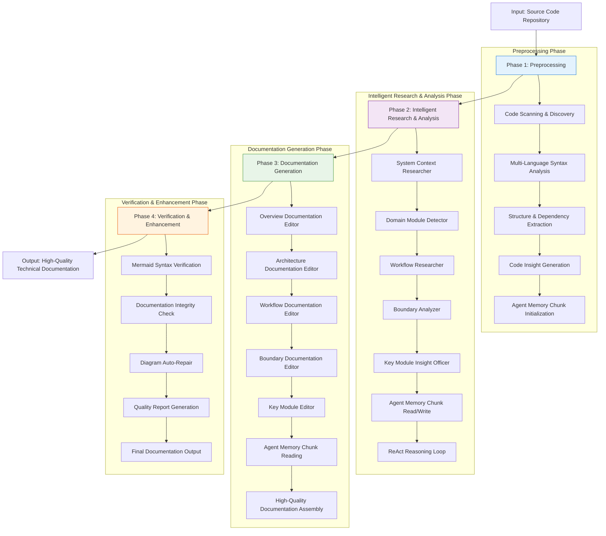
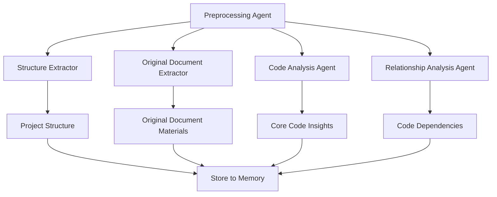
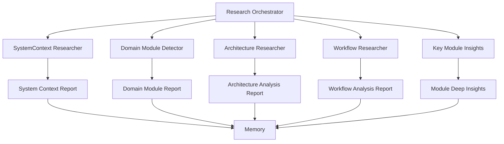
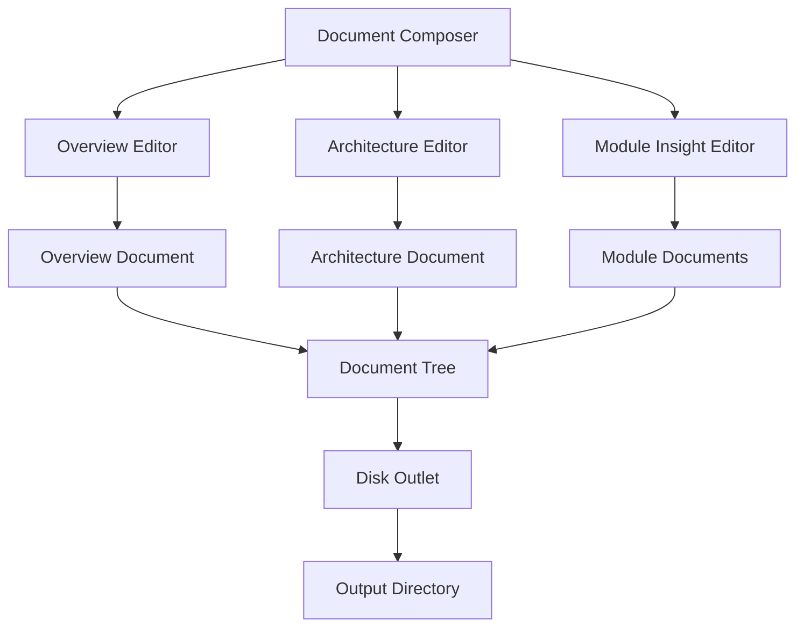
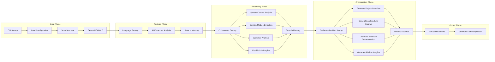
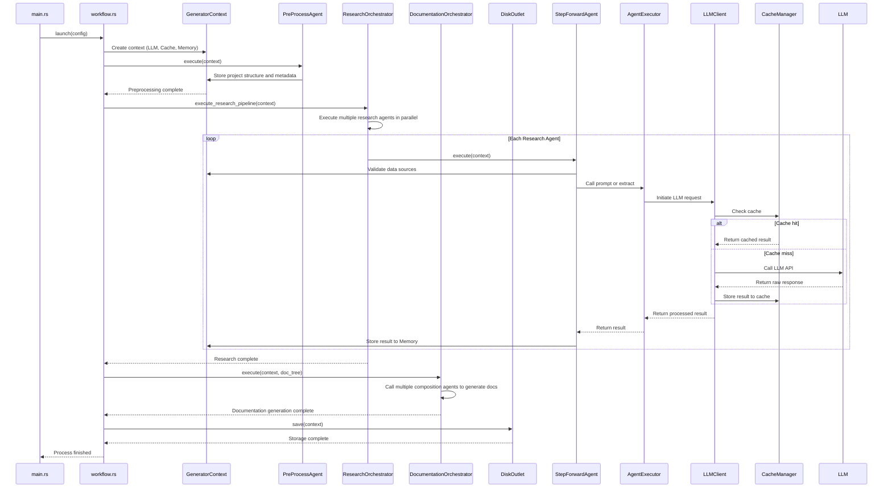

<p align="center">
  
</p>

<h3 align="center">Litho (deepwiki-rs)</h3>

<p align="center">
    <a href="./README.md">English</a>
    |
    <a href="./README_zh.md">中文</a>
</p>
<p align="center">💪🏻 High-performance <strong>AI-driven</strong> intelligent document generator (DeepWiki-like) built with <strong>Rust</strong></p>
<p align="center">📚 Automatically generates high quality <strong>Repo-Wiki</strong> for any codebase</p>

<p align="center">
  <a href="https://crates.io/crates/deepwiki-rs"></a>
  <a href="https://crates.io/crates/deepwiki-rs"></a>
  <a href="https://github.com/sopaco/deepwiki-rs/tree/main/docs/en"></a>
  <a href="https://github.com/sopaco/deepwiki-rs/tree/main/docs/zh"></a>
  
</p>

<hr />

# 👋 What's Litho

**Litho** is an AI-powered documentation generation engine that automatically analyzes your source code and generates comprehensive, professional architecture documentation in the C4 model format. No more manual documentation that falls behind code changes - Litho keeps your documentation perfectly in sync with your codebase.

Litho transforms raw code into beautifully structured documentation with context diagrams, container diagrams, component diagrams, and code-level documentation - all automatically generated from your source code.

Whether you're a developer, architect, or technical lead, Litho eliminates the burden of maintaining documentation and ensures your team always has accurate, up-to-date architectural information.

<p align="center">
  <strong>Transform your codebase into professional architecture documentation in minutes</strong>
</p>

<div style="text-align: center; margin: 30px 0;">
  <table style="width: 100%; border-collapse: collapse; margin: 0 auto;">
    <tr>
      <th style="width: 50%; padding: 15px; background-color: #f8f9fa; border: 1px solid #e9ecef; text-align: center; font-weight: bold; color: #495057;">Before Litho</th>
      <th style="width: 50%; padding: 15px; background-color: #f8f9fa; border: 1px solid #e9ecef; text-align: center; font-weight: bold; color: #495057;">After Litho</th>
    </tr>
    <tr>
      <td style="padding: 15px; border: 1px solid #e9ecef; vertical-align: top;">
        <p style="font-size: 14px; color: #6c757d; margin-bottom: 10px;"><strong>Manual Documentation</strong></p>
        <ul style="font-size: 13px; color: #6c757d; line-height: 1.6;">
          <li>Outdated, incomplete, or missing documentation</li>
          <li>Manual updates that fall behind code changes</li>
          <li>Inconsistent formatting and structure</li>
          <li>Time-consuming to maintain</li>
          <li>Hard to navigate and understand</li>
          <li>Usually just a few markdown files</li>
        </ul>
      </td>
      <td style="padding: 15px; border: 1px solid #e9ecef; vertical-align: top;">
        <p style="font-size: 14px; color: #6c757d; margin-bottom: 10px;"><strong>AI-Generated Documentation</strong></p>
        <ul style="font-size: 13px; color: #6c757d; line-height: 1.6;">
          <li>Automatically generated from codebase</li>
          <li>Always up-to-date with code changes</li>
          <li>Professional C4 model structure</li>
          <li>Consistent formatting and styling</li>
          <li>Easy to navigate and understand</li>
          <li>Complete with diagrams, context, and relationships</li>
        </ul>
      </td>
    </tr>
  </table>
</div>

<p align="center">
  <strong>🚀 Litho automatically transforms your messy codebase into beautiful, professional documentation</strong>
</p>

<hr />

# 😺 Why use Litho

- **Automatically keep documentation in sync** with codebase changes - no more outdated docs
- **Save hundreds of hours** on manual documentation creation and maintenance
- **Improve onboarding** for new team members with comprehensive, up-to-date documentation
- **Enhance code reviews** by providing clear architectural context
- **Meet compliance requirements** with auditable, automated documentation
- **Support for multiple programming languages** (Rust, Python, Java, Go, C#, JavaScript, etc.)
- **Generate professional C4 model diagrams** with context, containers, components, and code
- **Integrate with CI/CD pipelines** to automatically generate documentation on every commit

🌟 **For:**
- Development teams of all sizes
- Open source projects
- Enterprise software developers
- Anyone who hates maintaining outdated docs!

❤️ Like **Litho**? Star it 🌟 or [Sponsor Me](https://github.com/sponsors/sopaco)! ❤️

**Thanks to the kind people**

[](https://github.com/sopaco/deepwiki-rs/stargazers)

# 🌠 Features & Capabilities

### Core Capabilities
- AI-driven architecture documentation generation from codebase analysis
- Automatic C4 model diagram creation (Context, Container, Component, Code)
- Intelligent extraction of code comments, structures, and relationships
- Multi-language support for various programming languages
- Customizable template system for documentation output

### Advanced Features
- Git history analysis for tracking architectural evolution
- Cross-referencing between code elements and documentation
- Interactive documentation with embedded diagrams and examples
- Integration with CI/CD pipelines for automated documentation generation

## 💡 Problem Solved
Litho solves the common problem of outdated and incomplete technical documentation by automatically generating up-to-date architecture documentation from your source code. No more manual documentation that falls behind code changes - Litho keeps your documentation in sync with your codebase.

# 🌐 Litho Eco Ecosystem
Litho is part of a broader ecosystem of tools designed to enhance developer productivity and documentation quality. The Litho Eco ecosystem includes complementary tools that work seamlessly with Litho to provide a complete documentation workflow:

## 📘 Litho Book
**Litho Book** is a high-performance markdown reader built with Rust and Axum, specifically designed to provide an elegant interface for browsing documentation generated by Litho.

### Key Features
- Real-time markdown rendering with syntax highlighting
- Full Mermaid chart support for architectural diagrams
- Intelligent search with fuzzy matching for files and content
- High-performance architecture with low memory usage
- AI Intelligent Document Interpretation, Answering Questions

### 🌠 Snapshots
<div style="text-align: center;">
  <table style="width: 100%; margin: 0 auto;">
    <tr>
      <td style="width: 50%;"></td>
      <td style="width: 50%;"></td>
    </tr>
  </table>
</div>

### Integration with Litho
Litho Book serves as the ideal companion application for consuming documentation generated by Litho. The typical workflow is:
1. Use Litho to generate documentation from your codebase
2. Use Litho Book to browse and explore the generated documentation with an elegant interface

[Learn more about Litho Book](https://github.com/sopaco/litho-book)

## 🔧 Mermaid Fixer
**Mermaid Fixer** is a high-performance AI-driven tool that automatically detects and fixes syntax errors in Mermaid diagrams within Markdown files.

### Key Features
- Automated scanning of directories for Markdown files
- Precise detection of Mermaid syntax errors using JS sandbox validation
- AI-powered intelligent fixing with LLM integration
- Comprehensive reporting of before/after changes
- Flexible configuration with support for multiple LLM providers

### Integration with Litho
Mermaid Fixer enhances the quality of documentation generated by Litho by automatically fixing syntax errors in Mermaid diagrams. This ensures that all architectural diagrams in your documentation are valid and render correctly.

### 👀 Snapshots
<div style="text-align: center;">
  <table style="width: 100%; margin: 0 auto;">
    <tr>
      <td style="width: 50%;"></td>
      <td style="width: 50%;"></td>
    </tr>
  </table>
</div>

[Learn more about Mermaid Fixer](https://github.com/sopaco/mermaid-fixer)

## 🤖Agent Skills
Run in Smithery! [](https://smithery.ai/skills?ns=sopaco&utm_source=github&utm_medium=badge)

# 🧠 How it works
[![zread](https://img.shields.io/badge/Ask_Zread-_.svg?style=flat&color=00b0aa&labelColor=000000&logo=data%3Aimage%2Fsvg%2Bxml%3Bbase64%2CPHN2ZyB3aWR0aD0iMTYiIGhlaWdodD0iMTYiIHZpZXdCb3g9IjAgMCAxNiAxNiIgZmlsbD0ibm9uZSIgeG1sbnM9Imh0dHA6Ly93d3cudzMub3JnLzIwMDAvc3ZnIj4KPHBhdGggZD0iTTQuOTYxNTYgMS42MDAxSDIuMjQxNTZDMS44ODgxIDEuNjAwMSAxLjYwMTU2IDEuODg2NjQgMS42MDE1NiAyLjI0MDFWNC45NjAxQzEuNjAxNTYgNS4zMTM1NiAxLjg4ODEgNS42MDAxIDIuMjQxNTYgNS42MDAxSDQuOTYxNTZDNS4zMTUwMiA1LjYwMDEgNS42MDE1NiA1LjMxMzU2IDUuNjAxNTYgNC45NjAxVjIuMjQwMUM1LjYwMTU2IDEuODg2NjQgNS4zMTUwMiAxLjYwMDEgNC45NjE1NiAxLjYwMDFaIiBmaWxsPSIjZmZmIi8%2BCjxwYXRoIGQ9Ik00Ljk2MTU2IDEwLjM5OTlIMi4yNDE1NkMxLjg4ODEgMTAuMzk5OSAxLjYwMTU2IDEwLjY4NjQgMS42MDE1NiAxMS4wMzk5VjEzLjc1OTlDMS42MDE1NiAxNC4xMTM0IDEuODg4MSAxNC4zOTk5IDIuMjQxNTYgMTQuMzk5OUg0Ljk2MTU2QzUuMzE1MDIgMTQuMzk5OSA1LjYwMTU2IDE0LjExMzQgNS42MDE1NiAxMy43NTk5VjExLjAzOTlDNS42MDE1NiAxMC42ODY0IDUuMzE1MDIgMTAuMzk5OSA0Ljk2MTU2IDEwLjM5OTlaIiBmaWxsPSIjZmZmIi8%2BCjxwYXRoIGQ9Ik0xMy43NTg0IDEuNjAwMUgxMS4wMzg0QzEwLjY4NSAxLjYwMDEgMTAuMzk4NCAxLjg4NjY0IDEwLjM5ODQgMi4yNDAxVjQuOTYwMUMxMC4zOTg0IDUuMzEzNTYgMTAuNjg1IDUuNjAwMSAxMS4wMzg0IDUuNjAwMUgxMy43NTg0QzE0LjExMTkgNS42MDAxIDE0LjM5ODQgNS4zMTM1NiAxNC4zOTg0IDQuOTYwMVYyLjI0MDFDMTQuMzk4NCAxLjg4NjY0IDE0LjExMTkgMS42MDAxIDEzLjc1ODQgMS42MDAxWiIgZmlsbD0iI2ZmZiIvPgo8cGF0aCBkPSJNNCAxMkwxMiA0TDQgMTJaIiBmaWxsPSIjZmZmIi8%2BCjxwYXRoIGQ9Ik00IDEyTDEyIDQiIHN0cm9rZT0iI2ZmZiIgc3Ryb2tlLXdpZHRoPSIxLjUiIHN0cm9rZS1saW5lY2FwPSJyb3VuZCIvPgo8L3N2Zz4K&logoColor=ffffff)](https://zread.ai/sopaco/deepwiki-rs)

## Four-Stage Processing Pipeline
Litho's architecture is designed around a four-stage processing pipeline that transforms raw code into comprehensive documentation:



### Preprocessing Stage
Litho begins by scanning your entire codebase to identify source files, extract metadata, and analyze project structure. This stage:
- Discovers all source code files across multiple languages
- Parses file structures and identifies key components
- Extracts comments, documentation strings, and code annotations
- Identifies dependencies between modules and components
- Builds a comprehensive representation of your codebase



### Research Stage
In this AI-powered stage, Litho analyzes the code structure to understand the architectural intent:
- Applies machine learning models to identify patterns and relationships
- Infers architectural roles from code structure and naming conventions
- Determines component boundaries and service responsibilities
- Maps dependencies and data flow between components
- Identifies potential architectural smells and anti-patterns
- Generates context-aware documentation for each component



### Composition and Output Stage
Litho combines the analyzed information into a structured documentation format:
- Generates C4 model diagrams (Context, Container, Component, Code)
- Creates hierarchical documentation structure with clear navigation
- Embeds relevant code examples and explanations
- Applies consistent styling and formatting across all documentation
- Adds cross-references between related components and diagrams



### Validation and Enhancement Stage
The final stage ensures documentation quality and completeness:
- Validates diagram syntax and consistency
- Checks for completeness of documentation coverage
- Identifies gaps in documentation and suggests improvements
- Integrates with Mermaid Fixer to ensure all diagrams render correctly
- Generates statistics and reports on documentation coverage
- Creates an index and table of contents for easy navigation

# 🏗️ Architecture Overview

**Litho** features a sophisticated modular architecture designed for high performance, extensibility, and intelligent analysis. The system implements a multi-stage workflow with specialized AI agents and comprehensive caching mechanisms.



## Core Modules
Litho's architecture consists of several interconnected modules that work together to deliver seamless documentation generation:

- **Code Scanner**: Discovers and analyzes source code files across multiple languages
- **Language Parser**: Extracts structural information from code using language-specific parsers
- **Architecture Analyzer**: AI-powered component that infers architectural patterns and relationships
- **Diagram Generator**: Creates C4 model diagrams using Mermaid syntax
- **Documentation Formatter**: Structures content into organized, navigable documentation

## Core Process
The core processing flow follows a deterministic pipeline:
1. **Scan** - Discover and analyze source code files
2. **Parse** - Extract structural and semantic information
3. **Analyze** - Apply AI models to infer architecture and relationships
4. **Generate** - Create diagrams and documentation content
5. **Format** - Structure content into organized documentation
6. **Export** - Output in desired format(s)



# 🖥 Getting Started
### Prerequisites
- [**Rust**](https://www.rust-lang.org) (version 1.70 or later)
- [**Cargo**](https://doc.rust-lang.org/cargo/)

### Installation
#### Option 1: Install from crates.io (Recommended)
```sh
cargo install deepwiki-rs
```

#### Option 2: Build from Source
1. Clone the repository:
    ```sh
    git clone https://github.com/sopaco/deepwiki-rs.git
    ```
2. Navigate to the project directory:
    ```sh
    cd deepwiki-rs
    ```
3. Build the project:
    ```sh
    cargo build --release
    ```
4. The compiled binary will be available in the `target/release` directory.

# 🚀 Usage
**Litho** provides a simple command-line interface to generate documentation from your codebase. For more configuration parameters, refer to the [CLI Options Detail](https://github.com/sopaco/deepwiki-rs/blob/main/docs/5%E3%80%81%E8%BE%B9%E7%95%8C%E8%B0%83%E7%94%A8.md#litho).

### Basic Command
```sh
deepwiki-rs -p ./my-project -o ./docs

# Generate documentation in the target language.
deepwiki-rs --target-language en -p ./my-project

deepwiki-rs --target-language ja -p ./my-project
```

This command will:
- Scan all files in `./my-project`
- Analyze the code structure and relationships
- Generate comprehensive C4 architecture documentation
- Save the output to `./litho.docs` directory

### Documentation Generation
Litho supports several options for generating documentation:

```sh
# Generate documentation with default settings
deepwiki-rs skip certain processing stages in the generation workflow
deepwiki-rs --skip-preprocessing --skip-research
```

### Advanced Options
```sh
# Turn off ReAct Mode to avoid auto-scanning project files via tool-calls
deepwiki-rs -p ./src --disable-preset-tools --llm-api-base-url <your llm provider base-api> --llm-api-key <your api key> --model-efficient GPT-5-mini

# Set up both the efficient model and the powerful model simultaneously
deepwiki-rs -p ./src --model-efficient GPT-5-mini --model-poweruful GPT-5-Pro --llm-api-base-url <your llm provider base-api> --llm_api_key <your api key> --model-efficient GPT-5-mini
```

## 📁 Output Structure
Litho generates a well-organized documentation structure:

```
project-docs/
├── 1. Project Overview      # Project overview, core functionality, technology stack
├── 2. Architecture Overview # Overall architecture, core modules, module breakdown
├── 3. Workflow Overview     # Overall workflow, core processes
├── 4. Deep Dive/            # Detailed technical topic implementation documentation
│   ├── Topic1.md
│   ├── Topic2.md

```

# 🤝 Contribute
We welcome all forms of contributions! Report bugs or submit feature requests through [GitHub Issues](https://github.com/sopaco/deepwiki-rs/issues).

## Ways to Contribute
- **Language Support**: Add support for additional programming languages
- **Template Creation**: Design new documentation templates and styles
- **Diagram Enhancements**: Improve Mermaid diagram generation algorithms
- **Performance Optimization**: Enhance processing speed and memory usage
- **Test Coverage**: Add comprehensive test cases for various code patterns
- **Documentation**: Improve project documentation and usage guides
- **Bug Fixes**: Help identify and fix issues in the codebase

## Development Contribution Process
1. Fork this project
2. Create a feature branch (`git checkout -b feature/amazing-feature`)
3. Commit your changes (`git commit -m 'Add some amazing feature'`)
4. Push to the branch (`git push origin feature/amazing-feature`)
5. Create a Pull Request

# 🪪 License
**MIT**. A copy of the license is provided in the [LICENSE](LICENSE) file.

# 👨 About Me
> 🚀 Help me develop this software better by [sponsoring on GitHub](https://github.com/sponsors/sopaco)

An experienced internet veteran, having navigated through the waves of PC internet, mobile internet, and AI applications. Starting from an individual mobile application developer to a professional in the corporate world, I possess rich experience in product design and research and development. Currently, I am employed at [Kuaishou](https://en.wikipedia.org/wiki/Kuaishou), focusing on the R&D of universal front-end systems and AI exploration.

GitHub: [sopaco](https://github.com/sopaco)
