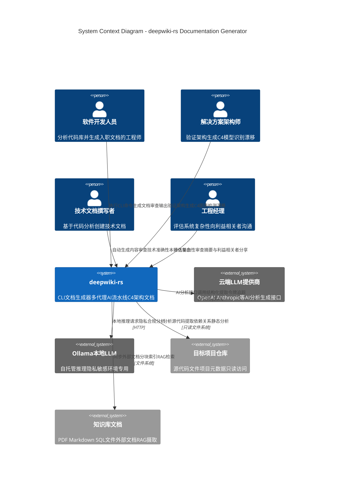

# Project Overview: deepwiki-rs System Context

**Document Version:** 1.0  
**Generation Date:** 2026-02-01 06:34:24 (UTC)  
**Classification:** Architecture Documentation (C4 System Context Level)  
**Confidence Score:** 92%

---

## 1. Executive Summary

**deepwiki-rs** is an intelligent, Rust-based Command-Line Interface (CLI) application designed to automate the generation of comprehensive C4 architecture documentation for software projects. By leveraging a sophisticated multi-agent AI pipeline, the system analyzes source code across 12+ programming languages and produces professional-grade architectural documentation, including system context diagrams, domain modules analysis, workflow documentation, and technical boundary specifications.

The system operates as a standalone documentation generation engine, bridging the gap between rapidly evolving codebases and often outdated manual documentation through automated static analysis and AI-powered insights.

---

## 2. System Overview

### 2.1 Core Objectives

The primary objectives of deepwiki-rs are:

- **Documentation Automation:** Eliminate manual documentation overhead by automatically analyzing codebases and generating C4-model-compliant architecture documents
- **Knowledge Preservation:** Capture institutional knowledge and architectural decisions before they are lost to team turnover or time
- **Accelerated Onboarding:** Enable software engineers to understand unfamiliar codebases without reading every source file
- **Architecture Validation:** Identify architectural drift between documented designs and actual implementations
- **Multi-Language Support:** Provide consistent documentation generation across heterogeneous technology stacks (Rust, Java, Python, JavaScript/TypeScript, C#, PHP, Swift, Kotlin, C++, Go, and modern frontend frameworks)

### 2.2 Business Value

deepwiki-rs delivers quantifiable value to engineering organizations:

| Value Dimension | Description |
|----------------|-------------|
| **Cost Reduction** | Reduces documentation maintenance effort through automation; minimizes API costs via intelligent caching of LLM responses |
| **Risk Mitigation** | Prevents documentation drift by deriving documentation directly from source code; preserves architectural context |
| **Developer Velocity** | Accelerates new developer onboarding from weeks to days through comprehensive, auto-generated system overviews |
| **Quality Assurance** | Enables architecture teams to validate implementations against documented patterns and identify technical debt |
| **Enterprise Flexibility** | Supports both cloud-based LLM APIs and local inference (Ollama), accommodating strict data privacy and security requirements |

### 2.3 Technical Characteristics

- **Architecture Pattern:** Modular, pipeline-based design following Domain-Driven Design (DDD) principles with clear bounded contexts
- **Processing Model:** Multi-stage AI pipeline (Preprocessing → Research → Composition → Output) utilizing 8 specialized research agents
- **Language Ecosystem:** Native Rust implementation with async/await concurrency, leveraging zero-cost abstractions and memory safety guarantees
- **AI Integration:** Dual-provider support (Cloud APIs + Local Ollama) with ReAct (Reasoning and Acting) tool-augmented execution
- **Scalability:** Parallel processing with controlled concurrency; hierarchical caching layer for performance optimization
- **Internationalization:** Full i18n support for 8 languages with localized output generation

---

## 3. Target Users and Stakeholders

The system serves four distinct user personas, each with specific interaction patterns and value propositions:

### 3.1 Software Developers
**Profile:** Individual contributors and senior engineers working with unfamiliar codebases or maintaining legacy systems.

**Usage Scenarios:**
- Onboarding to new teams or projects without extensive mentoring
- Understanding dependencies and architectural patterns in legacy code
- Generating "as-built" documentation for inherited projects
- Analyzing open-source libraries for integration feasibility

**Key Needs:**
- Rapid comprehension of project structure without exhaustive code reading
- Identification of critical modules and entry points
- Understanding of data flow and component relationships
- Up-to-date documentation synchronized with code changes

### 3.2 Architecture Teams
**Profile:** Solution architects, enterprise architects, and principal engineers responsible for cross-cutting concerns and standards.

**Usage Scenarios:**
- Validating implementation conformance to architectural blueprints
- Generating baseline C4 diagrams for architecture review boards
- Identifying architectural drift in long-running projects
- Standardizing documentation formats across organizational boundaries

**Key Needs:**
- Automated C4 model generation (Context, Container, Component, Code levels)
- Detection of unauthorized dependencies or boundary violations
- Consistent documentation structure across multiple repositories
- Integration with existing architecture governance workflows

### 3.3 Technical Writers
**Profile:** Documentation specialists supporting engineering teams who require technical accuracy without deep programming expertise in every codebase.

**Usage Scenarios:**
- Auto-generating initial drafts of API documentation
- Understanding system workflows for user guide creation
- Producing consistent technical content across diverse technology stacks
- Reducing time spent manually documenting CLI interfaces and configuration options

**Key Needs:**
- Human-readable narrative generation from technical source code
- Automatic extraction of interface boundaries and usage examples
- Structured output requiring minimal manual restructuring
- Support for multiple output languages to serve global audiences

### 3.4 Engineering Managers
**Profile:** Engineering leads, directors, and VPs requiring visibility into system complexity for resource planning and stakeholder communication.

**Usage Scenarios:**
- Assessing technical debt and refactoring priorities
- Communicating system scope to non-technical stakeholders
- Evaluating documentation coverage gaps across microservices
- Planning migration strategies for monolithic systems

**Key Needs:**
- High-level system boundary visualization
- Complexity metrics and module importance scoring
- Quick assessment of external dependencies and integration points
- Executive summaries suitable for stakeholder presentations

---

## 4. System Scope and Boundaries

### 4.1 System Definition

deepwiki-rs is a **read-only analysis and documentation generation tool**. It functions as a sophisticated compiler-like pipeline that ingests source code and metadata, performs multi-layered AI-enhanced analysis, and emits markdown documentation artifacts. The system operates strictly within the development environment and does not interact with runtime systems.

### 4.2 Included Components (In Scope)

The following capabilities constitute the core system boundary:

| Component Category | Specific Capabilities |
|-------------------|---------------------|
| **Interface Layer** | CLI argument parsing (20+ options), configuration management (TOML-based), environment-specific overrides |
| **Analysis Engine** | Multi-language static analyzers (12+ language processors), dependency extraction, interface parsing |
| **AI Pipeline** | Multi-agent research orchestration (8 specialized agents), ReAct tool execution, structured JSON extraction |
| **LLM Integration** | Multi-provider client (Cloud APIs + Ollama), fallback model configuration, token management |
| **Caching Infrastructure** | File-based response caching with MD5 keys, TTL expiration, performance monitoring |
| **Knowledge Integration** | RAG-style document chunking (Markdown/SQL-aware), external knowledge base synchronization |
| **Documentation Composition** | C4 model-compliant markdown generation, Mermaid diagram synthesis, 8-language i18n support |
| **Output Generation** | Disk persistence, directory structure creation, post-processing (Mermaid syntax fixing), summary reporting |

### 4.3 Excluded Components (Out of Scope)

The following are explicitly **outside** the system boundary:

- **Target Project Runtime:** The system does not execute, deploy, or interact with running instances of analyzed codebases
- **Development Environment Extensions:** No IDE plugins, editor extensions, or language server protocol (LSP) integrations
- **Documentation Hosting:** No web server, wiki platform, or document management system capabilities
- **Version Control Operations:** No Git integration, repository cloning, or version history analysis
- **CI/CD Pipeline Integration:** Beyond generating output artifacts suitable for pipeline consumption, no native Jenkins/GitHub Actions/GitLab CI integration
- **Collaborative Features:** No real-time editing, review workflows, or multi-user synchronization
- **Source Code Modification:** The system maintains a strict read-only policy; no refactoring, code generation, or "fix" suggestions are implemented

### 4.4 System Boundary Rationale

The boundary is defined to maintain **separation of concerns** between the documentation generation engine and the broader software development lifecycle toolchain. deepwiki-rs functions as a specialized compiler: input is source code, output is documentation. Integration with version control, CI/CD, or hosting platforms is the responsibility of external workflow orchestration tools that may invoke deepwiki-rs as a subprocess.

---

## 5. External System Interactions

The system interacts with four categories of external systems, each serving distinct functional requirements:

### 5.1 Cloud LLM Providers
**Systems:** OpenAI GPT-4, Claude, or compatible API providers  
**Interaction Type:** Synchronous HTTPS/JSON API calls with authentication  
**Data Flow:** 
- Outbound: Source code insights, compressed project context, structured prompts
- Inbound: AI-generated analysis results, architectural insights, natural language descriptions

**Criticality:** High - Core dependency for AI-powered analysis phases  
**Resilience:** Implemented via retry logic, exponential backoff, and fallback model configuration

### 5.2 Local LLM Inference (Ollama)
**System:** Self-hosted Ollama server  
**Interaction Type:** HTTP API to local/organizational server  
**Data Flow:**
- Outbound: Analysis prompts, code snippets (for privacy-sensitive environments)
- Inbound: Local inference results, architectural analysis

**Criticality:** High - Primary option for air-gapped or data-sovereign environments  
**Configuration:** Optional dual-model setup with cloud fallback

### 5.3 Target Project Files
**System:** File system containing source code to be analyzed  
**Interaction Type:** Read-only file system operations  
**Access Patterns:**
- Recursive directory traversal
- File content reading (source code, configuration files like Cargo.toml, package.json)
- Import/dependency resolution

**Constraints:** 
- Read-only access enforced (no write, modify, or delete operations)
- Respects .gitignore and custom exclusion patterns
- Symlink handling with cycle detection

### 5.4 Knowledge Base Documents
**System:** External documentation repositories (PDF, Markdown, SQL files, plain text)  
**Interaction Type:** File ingestion and chunked processing  
**Processing:**
- Change detection and cache invalidation
- Semantic chunking (Markdown header-aware, SQL statement-aware)
- RAG-style retrieval for context augmentation

**Use Cases:** 
- Integration of existing architecture decision records (ADRs)
- Incorporation of business domain knowledge not present in code
- Reference manual integration for accurate API documentation

---

## 6. System Context Diagram (C4 Level 1)

The following diagram illustrates the high-level context within which deepwiki-rs operates, showing users, the system, and external dependencies.

### 6.1 Key Interaction Flows

**Primary Flow - Documentation Generation:**
1. User (Developer/Architect) invokes CLI with target project path
2. System reads target repository files (static analysis)
3. System optionally synchronizes knowledge base documents
4. System executes multi-agent AI pipeline (leveraging Cloud LLM or Ollama)
5. System persists generated markdown documentation to local filesystem
6. User reviews generated C4 architecture documents

**Secondary Flow - Knowledge Integration:**
1. Technical Writer maintains external knowledge documents (ADRs, domain docs)
2. System ingests and chunks documents during sync phase
3. AI agents retrieve relevant context during research phase
4. Generated documentation incorporates external business context

---

## 7. Key Architectural Decisions

### 7.1 Multi-Agent AI Pipeline Architecture
**Decision:** Implement 8 specialized research agents operating at different C4 abstraction levels rather than a single monolithic AI model.

**Rationale:** Staged dependency pattern ensures high-level context (C1 System Context) informs detailed analysis (C3-C4 Module Insights), reducing hallucination and improving coherence.

### 7.2 Read-Only Analysis Constraint
**Decision:** Strict enforcement of read-only file system access to target projects.

**Rationale:** Ensures safety for production codebases; eliminates risk of documentation tool corrupting source code; supports "safe to run anywhere" deployment model.

### 7.3 Dual LLM Provider Support
**Decision:** Abstract LLM integration to support both cloud APIs and local Ollama inference with unified interface.

**Rationale:** Accommodates enterprise security requirements (air-gapped environments) while maintaining cloud flexibility; enables cost optimization through local inference for sensitive data.

### 7.4 Language-Agnostic Preprocessing
**Decision:** Trait-based language processor architecture supporting 12+ languages through pluggable modules.

**Rationale:** Maximizes reuse of core AI pipeline across heterogeneous technology stacks; allows domain-specific parsing (e.g., React component boundaries vs. Rust module hierarchies).

### 7.5 File-Based Caching Layer
**Decision:** Implement persistent MD5-based caching for LLM responses with performance monitoring.

**Rationale:** Significant cost reduction for iterative documentation generation; enables offline replay of previous analyses; provides audit trail of AI reasoning.

---

## 8. Data and Control Flow Summary

The system implements a **four-stage pipeline architecture** with clear data transformation boundaries:

| Stage | Input | Processing | Output |
|-------|-------|------------|--------|
| **Preprocessing** | Raw source files | Language-specific parsing, dependency extraction, AI-enhanced code classification | CodeInsight objects, Project Structure |
| **Research** | Preprocessing artifacts | 8-agent parallel analysis (System Context → Domain → Architecture → Boundaries) | Structured research reports (JSON) |
| **Composition** | Research data, Knowledge base | Template-based markdown generation, diagram synthesis, i18n localization | Markdown documents, Mermaid diagrams |
| **Output** | Generated documents | File persistence, syntax validation, summary statistics | Documentation directory, Performance report |

**Control Flow:** Orchestrated by the Core Generation Domain with thread-safe state management (Arc<RwLock<T>>), ensuring safe concurrent processing across the multi-agent pipeline while maintaining deterministic output ordering.

---

## 9. Compliance and Constraints

- **Privacy:** Local Ollama support ensures no source code leaves organizational boundaries when required
- **Security:** Read-only access model; no network ingress requirements; no privilege escalation
- **Scalability:** Horizontal scaling through project-level parallelism; bounded concurrency to prevent resource exhaustion
- **Maintainability:** Rust's memory safety guarantees; comprehensive error handling; structured logging throughout pipeline

---

**Document Owner:** Architecture Team  
**Review Cycle:** Per major release  
**Related Documents:** C4 Container Diagram, Domain Model Specification, Research Agent Architecture

*This document represents the C4 System Context (Level 1) view of deepwiki-rs, providing a strategic overview suitable for both technical and non-technical stakeholders.*