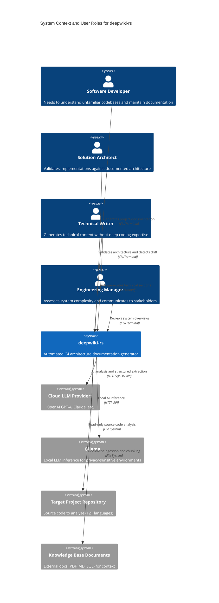
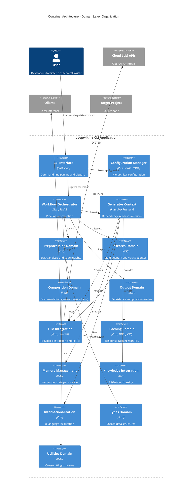
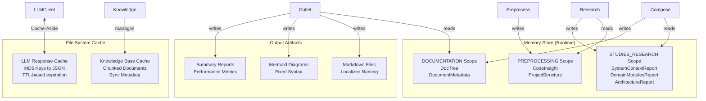
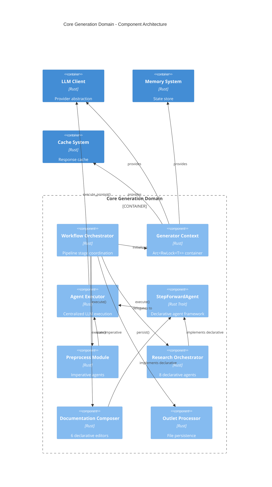
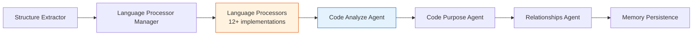
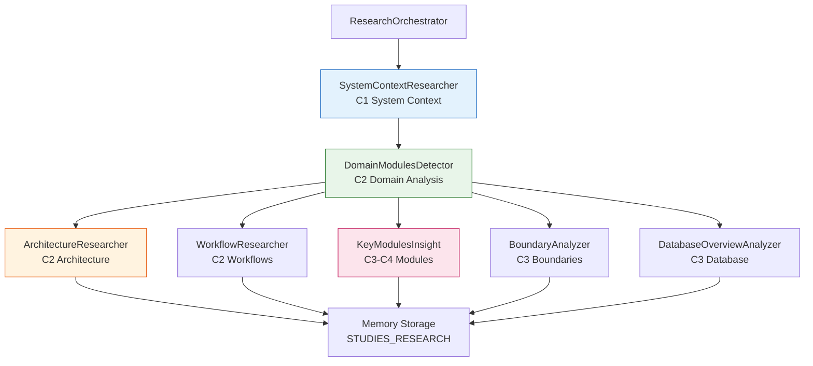
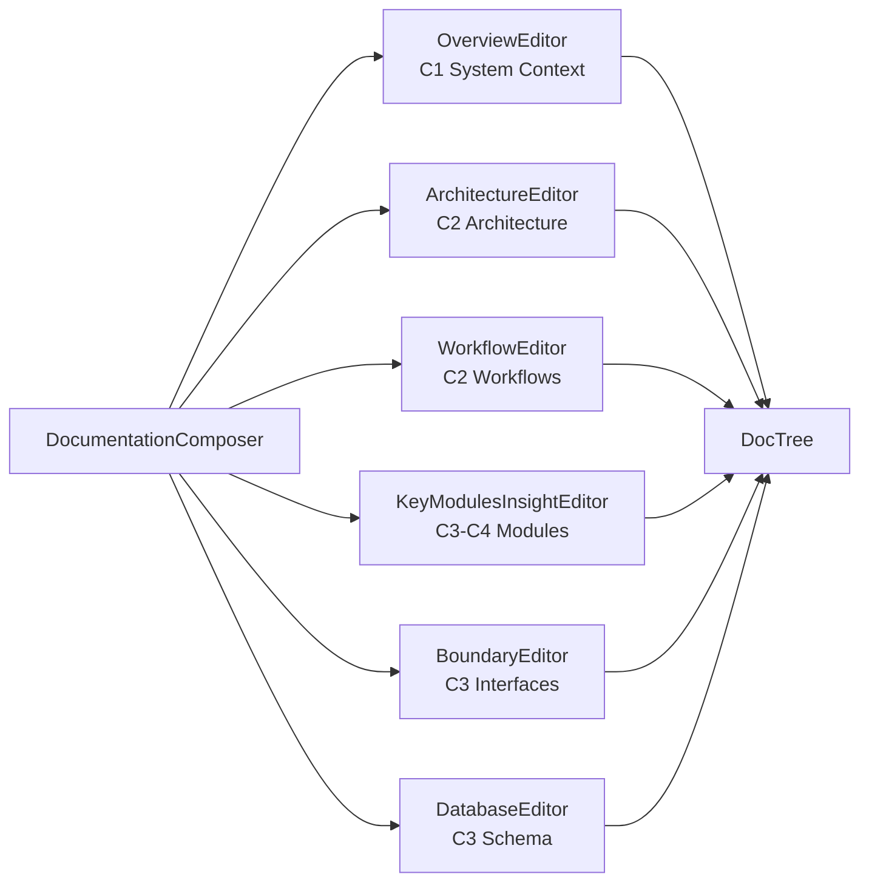
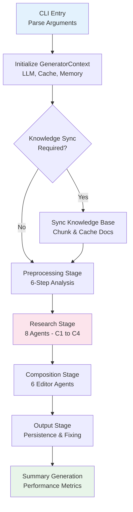
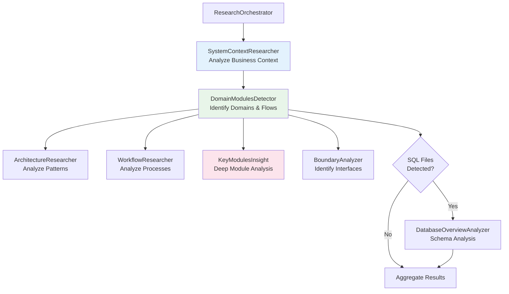
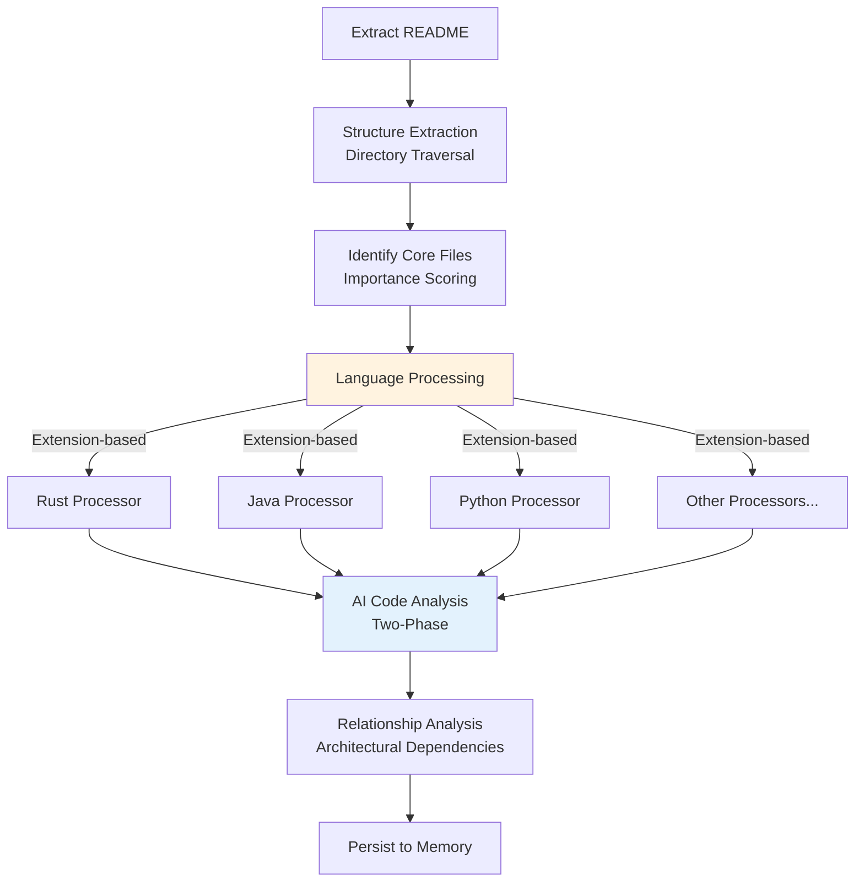

# System Architecture Documentation: deepwiki-rs

**Version:** 1.0  
**Classification:** Internal Architecture Documentation  
**Generated:** 2026-02-01 06:35:32 (UTC)

---

## 1. Architecture Overview

### 1.1 Design Philosophy

deepwiki-rs implements a **Multi-Agent AI Pipeline Architecture** designed to bridge the gap between source code repositories and comprehensive C4 architecture documentation. The system adheres to four fundamental design principles:

**1. Pipeline-Based Separation of Concerns**  
The architecture decomposes the complex documentation generation process into four discrete stages—Preprocessing, Research, Composition, and Output—each operating as a bounded context with well-defined inputs and outputs. This ensures unidirectional data flow and prevents circular dependencies.

**2. Declarative Agent Definition**  
Research and composition logic is encapsulated through the `StepForwardAgent` trait, enabling declarative agent configuration with data sources, prompt templates, and output schemas. This pattern separates *what* an agent does from *how* it executes, facilitating rapid agent development and testing.

**3. Language-Agnostic Analysis**  
Through the `LanguageProcessor` trait system, the architecture abstracts language-specific parsing behind a unified interface, supporting 12+ programming languages with consistent dependency extraction and complexity metrics.

**4. Context-Aware Intelligence**  
The system implements Retrieval-Augmented Generation (RAG) capabilities through external knowledge integration, allowing architectural decisions, domain knowledge, and existing documentation to inform AI analysis.

### 1.2 Core Architecture Patterns

| Pattern | Implementation | Purpose |
|---------|---------------|---------|
| **Pipeline Pattern** | `WorkflowOrchestrator` coordinates 4 sequential stages | Enforces processing order and stage isolation |
| **Multi-Agent System** | 8 specialized research agents + 6 composition editors | Parallel domain expertise application |
| **Strategy Pattern** | `LanguageProcessor` trait with 12+ implementations | Language-agnostic code analysis |
| **Context Pattern** | `GeneratorContext` with `Arc<RwLock<T>>` | Thread-safe dependency injection |
| **Template Method** | `StepForwardAgent` trait lifecycle | Standardized agent execution flow |
| **Cache-Aside** | LLM client with `CacheManager` integration | API cost optimization |
| **Circuit Breaker** | Stage-specific error boundaries | Graceful degradation and partial failure handling |

### 1.3 Technology Stack Overview

**Core Language & Runtime**
- **Rust (Edition 2021)**: Memory safety without garbage collection, zero-cost abstractions, and excellent async performance
- **Tokio**: Asynchronous runtime for non-blocking I/O operations across file system and network boundaries

**Key Libraries & Frameworks**
- **clap**: Declarative CLI argument parsing with derive macros
- **Serde + TOML**: Configuration serialization and structured data persistence
- **reqwest**: HTTP client for LLM API communication
- **Mermaid**: Diagram generation for C4 visualization outputs

**AI & LLM Integration**
- **ReAct Pattern**: Reasoning and Acting framework enabling tool-augmented LLM execution
- **Structured Extraction**: JSON schema validation for type-safe AI outputs
- **Dual Provider Support**: Cloud APIs (OpenAI, Anthropic) and local inference (Ollama)

---

## 2. System Context (C4 Level 1)

### 2.1 System Positioning and Value Proposition

deepwiki-rs operates as a **standalone CLI tool** that automates the creation of C4 architecture documentation. It serves as an intelligent documentation engineer, capable of analyzing software projects across multiple programming languages and generating professional architecture documentation that includes system context diagrams, container views, component hierarchies, and code-level insights.

**Business Value:**
- **Documentation Drift Elimination**: Automatically synchronizes documentation with codebase changes
- **Knowledge Preservation**: Captures institutional knowledge through AI analysis of implementation patterns
- **Onboarding Acceleration**: Reduces time for new developers to understand unfamiliar architectures
- **Enterprise Flexibility**: Supports both cloud and air-gapped (local LLM) deployment scenarios

### 2.2 Target User Roles



**User Requirements Analysis:**

1. **Software Developers**: Require rapid codebase comprehension without exhaustive file reading; need API documentation and dependency visualization
2. **Architecture Teams**: Require C4 model compliance, architectural drift detection, and standards enforcement across organizational portfolios
3. **Technical Writers**: Require automated content generation from source code, reducing manual API documentation effort
4. **Engineering Managers**: Require high-level complexity metrics, critical path identification, and stakeholder communication artifacts

### 2.3 External System Interactions

| External System | Interaction Type | Data Exchange | Security Considerations |
|----------------|-----------------|---------------|------------------------|
| **Cloud LLM Providers** | HTTPS REST API with Bearer Token auth | Source code snippets, prompts (compressed), structured JSON outputs | API keys stored in config files; no persistent logs of source code |
| **Ollama** | HTTP API to localhost (configurable) | Same as cloud providers | Suitable for air-gapped environments; no external data transmission |
| **Target Project Files** | Read-only file system access | Source code, configuration files, documentation | Respects `.gitignore`; explicit exclusion patterns supported |
| **Knowledge Base Documents** | File ingestion (PDF, MD, SQL, YAML) | Chunked document content with metadata | Local processing only; no cloud upload of knowledge base |

### 2.4 System Boundary Definition

**Included Within Boundaries:**
- CLI argument parsing and configuration hierarchy management
- Multi-language static code analyzers (Rust, Java, Python, JavaScript, TypeScript, C#, PHP, Swift, Kotlin, React, Vue, Svelte)
- AI agent orchestration system with 8 specialized research agents
- LLM client with caching, retry logic, and ReAct capabilities
- Documentation composition engine following C4 model standards
- File-based caching infrastructure with MD5-based keys
- Internationalization framework supporting 8 languages
- External knowledge base synchronization and chunking
- Markdown output generation with Mermaid diagram syntax

**Explicitly Excluded:**
- Target project's runtime environment or deployment infrastructure
- IDE extensions, editor plugins, or Language Server Protocol (LSP) implementations
- Web-based documentation hosting or content management systems
- Version control operations (Git commands) beyond reading repository files
- Continuous Integration/Continuous Deployment pipeline integrations
- Real-time collaboration or multi-user editing features

---

## 3. Container View (C4 Level 2)

### 3.1 Domain-Driven Architecture Layers

The system is organized into **12 bounded contexts** arranged in layered architecture following Domain-Driven Design (DDD) principles:



### 3.2 Domain Module Responsibilities

**Primary Business Domains (Core)**

| Domain | Responsibility | Key Abstractions |
|--------|--------------|------------------|
| **Core Generation** | Pipeline orchestration and context management | `WorkflowOrchestrator`, `GeneratorContext` |
| **Preprocessing** | Static code analysis across 12+ languages | `LanguageProcessor` trait, `CodeInsight` |
| **Research** | Multi-agent architectural analysis (C1-C4) | `StepForwardAgent`, 8 research agents |
| **Composition** | Documentation synthesis from research | Documentation Composer, 6 editor agents |
| **Output** | Artifact persistence and post-processing | `Outlet` trait, `DiskOutlet`, Mermaid fixing |

**Supporting Domains**

| Domain | Responsibility | Key Abstractions |
|--------|--------------|------------------|
| **LLM Integration** | Provider abstraction and ReAct execution | `LLMClient`, `AgentBuilder`, Tool system |
| **Knowledge Integration** | External document ingestion and RAG | `KnowledgeSync`, chunking strategies |

**Infrastructure Domains**

| Domain | Responsibility | Key Abstractions |
|--------|--------------|------------------|
| **Configuration Management** | Hierarchical config and CLI parsing | `Config`, `CliArgs`, project inference |
| **Caching** | LLM response optimization | `CacheManager`, `PerformanceMonitor` |
| **Memory Management** | Inter-agent state transfer | `Memory`, scoped key-value store |
| **Internationalization** | Multi-language support | `TargetLanguage`, localized templates |
| **Types** | Shared domain models | `CodeInsight`, `DocTree`, research reports |
| **Utilities** | Cross-cutting technical functions | `PromptCompressor`, `TokenEstimator` |

### 3.3 Storage Architecture

The system employs a **hybrid storage strategy** combining in-memory state management with persistent caching:



**Storage Characteristics:**
- **Memory Scopes**: Three distinct lifecycles aligned with pipeline stages, cleared after consumption to manage memory footprint
- **Cache Keys**: MD5 hash of prompt content + model configuration ensuring deterministic lookup
- **Persistence Format**: JSON with Serde serialization, human-readable for debugging
- **No External Database**: System operates entirely on file system and in-memory stores, simplifying deployment

---

## 4. Component View (C4 Level 3)

### 4.1 Core Generation Engine

The Core Generation Domain implements the application's architectural backbone through four primary components:



**Component Responsibilities:**

**WorkflowOrchestrator**
- Implements the Template Method pattern for pipeline execution
- Manages stage transitions and timing metrics collection
- Handles error boundaries allowing partial pipeline success (e.g., continue if knowledge sync fails)

**GeneratorContext**
- Aggregates all infrastructure dependencies (`Arc<LLMClient>`, `Arc<RwLock<CacheManager>>`, etc.)
- Provides thread-safe access to shared resources across concurrent agents
- Implements the dependency injection container pattern

**AgentExecutor**
- Centralized facility for LLM invocation with three execution modes:
  1. Simple prompt execution
  2. Tool-augmented execution (ReAct pattern)
  3. Structured extraction with JSON schema validation
- Implements cache-aside pattern for automatic response caching
- Handles retry logic and fallback model configuration

**StepForwardAgent Trait**
- Declarative framework for agent definition specifying:
  - **Data Sources**: Input data retrieval from memory or file system
  - **Prompt Templates**: Dynamic prompt construction with variable substitution
  - **Output Schemas**: Structured output types with validation
  - **Memory Scopes**: Target storage for results
- Enables research and composition agents to focus on domain logic rather than boilerplate

### 4.2 Preprocessing Pipeline Components



**Language Processor Architecture:**
Implements the Strategy pattern where each language provides concrete implementations of:
- `extract_dependencies()`: Parse import statements and module references
- `complexity_metrics()`: Calculate cyclomatic complexity and cognitive complexity
- `parse_interfaces()`: Extract public APIs, structs, and traits/classes

Supported languages: Rust, Java, Python, JavaScript, TypeScript, C#, PHP, Swift, Kotlin, React (JSX/TSX), Vue (SFC), Svelte.

### 4.3 Research Agent Ecosystem

The Research Domain implements a **staged multi-agent system** with eight specialized agents operating at different C4 abstraction levels:



**Agent Specialization:**

1. **SystemContextResearcher (C1)**: Generates high-level system context including business value, user roles, and external system boundaries
2. **DomainModulesDetector (C2)**: Applies Domain-Driven Design principles to identify bounded contexts and domain relationships
3. **ArchitectureResearcher (C2)**: Analyzes architectural patterns, technology stack, and generates container/component diagrams
4. **WorkflowResearcher (C2)**: Identifies business processes, execution paths, and orchestration mechanisms
5. **KeyModulesInsight (C3-C4)**: Performs deep-dive analysis on individual modules to extract implementation details and code-level insights
6. **BoundaryAnalyzer (C3)**: Identifies system interfaces including CLI commands, API endpoints, and configuration structures
7. **DatabaseOverviewAnalyzer (C3)**: Analyzes SQL schemas, tables, views, and stored procedures (conditional execution)

### 4.4 Composition Layer Components

The Composition Domain transforms research outputs into structured documentation through six specialized editors:



Each editor retrieves specific research reports from the Memory system's `STUDIES_RESEARCH` scope and generates localized Markdown content with Mermaid diagrams.

---

## 5. Key Processes

### 5.1 Primary Documentation Generation Workflow

The end-to-end documentation generation process orchestrates all domains through an 8-step pipeline:



**Stage Details:**

**Stage 1: Preprocessing** (Imperative Pattern)
1. README extraction for project metadata
2. Recursive directory traversal with `.gitignore` respect
3. Core file identification via importance scoring
4. Language-specific processing (12+ processors)
5. AI-enhanced code analysis (parallel execution)
6. Architectural relationship analysis
7. Persistence to `PREPROCESSING` memory scope

**Stage 2: Research** (Declarative Pattern)
- Sequential C1 → C2 → C3/C4 execution ensures context availability
- SystemContextResearcher provides foundation for DomainModulesDetector
- Parallel execution where dependencies permit (Architecture, Workflow, Modules, Boundaries)
- Results stored in `STUDIES_RESEARCH` scope

**Stage 3: Composition**
- Sequential editor execution to maintain documentation coherence
- Each editor consumes specific research reports and produces markdown sections
- DocTree construction with localized file naming
- Storage in `DOCUMENTATION` scope

**Stage 4: Output**
- DiskOutlet persists DocTree to file system with internationalized paths
- MermaidFixer post-processes diagrams for syntax validation
- SummaryGenerator compiles performance metrics and research statistics

### 5.2 Multi-Agent Research Pipeline

This workflow implements the core AI analysis capability through staged abstraction levels:



**Execution Strategy:**
- **C1 Level**: System context establishes business vocabulary and boundaries
- **C2 Level**: Domain and architecture analysis operate in parallel once C1 completes
- **C3-C4 Level**: Detailed module analysis consumes domain context to provide technical depth
- **Conditional Logic**: Database analysis only executes for SQL-heavy projects

### 5.3 Static Code Analysis Workflow

The preprocessing stage implements sophisticated language-agnostic analysis:



**Two-Phase Analysis:**
1. **Static Analysis**: Rule-based extraction of dependencies, interfaces, and complexity metrics
2. **AI Enhancement**: LLM-powered classification of functional purpose and architectural role
3. **Parallel Execution**: Controlled parallelism via semaphore to prevent resource exhaustion

---

## 6. Technical Implementation

### 6.1 Key Architectural Patterns

**Dual Agent Execution Model**
The system implements two complementary agent patterns:

```rust
// Imperative Pattern (Preprocessing)
// Direct control of execution flow
let insights = agent_executor
    .execute_tool_augmented(prompt, tools)
    .await?;

// Declarative Pattern (Research/Composition)  
// Framework-driven execution
impl StepForwardAgent for ArchitectureResearcher {
    fn data_sources(&self) -> Vec<DataSource> { ... }
    fn prompt_template(&self) -> String { ... }
    fn output_schema(&self) -> JsonSchema { ... }
}
```

**Context Pattern Implementation**
Thread-safe dependency management through Arc and RwLock:

```rust
pub struct GeneratorContext {
    pub config: Arc<Config>,
    pub llm_client: Arc<LLMClient>,
    pub cache_manager: Arc<RwLock<CacheManager>>,
    pub memory: Arc<RwLock<Memory>>,
    pub knowledge_base: Option<Arc<KnowledgeBase>>,
    // Thread-safe sharing across concurrent agents
}
```

**Staged State Management**
Unidirectional data flow through memory scopes:

```rust
// Stage 1: Preprocessing → PREPROCESSING scope
memory.set("PREPROCESSING", "code_insights", insights).await?;

// Stage 2: Research reads PREPROCESSING, writes STUDIES_RESEARCH
let insights: Vec<CodeInsight> = memory.get("PREPROCESSING", "code_insights").await?;
memory.set("STUDIES_RESEARCH", "architecture_report", report).await?;

// Stage 3: Composition reads STUDIES_RESEARCH
```

### 6.2 Data Structures

**Core Domain Types**

| Structure | Purpose | Key Fields |
|-----------|---------|------------|
| **CodeInsight** | Rich code analysis result | file_path, dependencies, complexity, functional_purpose, ai_analysis |
| **SystemContextReport** | C1 level documentation | business_value, target_users, external_systems, confidence_score |
| **DomainModule** | DDD bounded context | name, description, sub_modules, business_flows, importance_score |
| **DocTree** | Hierarchical documentation | sections, file_paths, metadata, cross_references |
| **CacheEntry** | LLM response cache | key_hash, response, token_usage, timestamp |

### 6.3 Concurrency and Parallelism

**Parallel Execution Strategy:**
- **Preprocessing**: Parallel file analysis with semaphore-limited concurrency (default: 5 concurrent files)
- **Research**: Parallel agent execution where dependencies permit (C2 agents run concurrently after C1)
- **Composition**: Sequential editor execution to maintain narrative coherence, but parallel module processing within KeyModulesInsightEditor

**Synchronization Mechanisms:**
- `Arc<RwLock<T>>` for shared mutable state (Cache, Memory)
- `tokio::sync::Semaphore` for limiting concurrent LLM calls and file operations
- Channel-based communication for streaming progress updates (future extension point)

### 6.4 Performance Optimizations

**Caching Strategy:**
- **LLM Response Caching**: MD5-based keys eliminate redundant API calls; tracks hit rates and estimated cost savings
- **Knowledge Base Caching**: Timestamp-based change detection prevents re-chunking unchanged documents
- **Prompt Compression**: Automatic truncation and compression for large codebases to fit LLM context windows

**Resource Management:**
- **Streaming Processing**: Large projects processed in batches to control memory footprint
- **Lazy Loading**: Knowledge base documents loaded only when referenced by agents
- **TTL-based Expiration**: Configurable cache expiration (default: persistent) with automatic cleanup

---

## 7. Deployment Architecture

### 7.1 Runtime Environment

**System Requirements:**
- **Operating System**: Linux, macOS, Windows (via cross-compilation)
- **Rust Runtime**: None required (statically linked binary)
- **External Dependencies**: 
  - Network access (for cloud LLM providers) or local Ollama instance
  - File system access to target project and output directory
  - Optional: Node.js (for Mermaid diagram fixing via external tool)

**Deployment Model:**
deepwiki-rs deploys as a **standalone CLI binary** with no server components, databases, or external services required beyond LLM APIs.

### 7.2 Configuration Hierarchy

Configuration applies in the following precedence (highest to lowest):
1. CLI arguments (e.g., `--llm-provider`, `--output-path`)
2. Environment variables (e.g., `DEEPWIKI_API_KEY`)
3. Local configuration file (`./deepwiki.toml`)
4. User configuration file (`~/.config/deepwiki/config.toml`)
5. Default values

### 7.3 Scalability Considerations

**Horizontal Scaling:**
- **Project Sharding**: Large monorepos can be analyzed by invoking multiple instances on subdirectories
- **Parallel Execution**: Internal parallelism controlled via configuration to prevent resource exhaustion

**Vertical Scaling:**
- **Memory Usage**: Proportional to project size; large projects (10k+ files) may require 8GB+ RAM
- **Token Limits**: Automatic prompt compression handles projects exceeding LLM context windows by prioritizing important files

**Extension Points:**
- **New Language Processors**: Implement `LanguageProcessor` trait and register in processor manager
- **Custom Research Agents**: Implement `StepForwardAgent` for domain-specific analysis (security, performance)
- **Alternative Outputs**: Implement `Outlet` trait for custom persistence (e.g., Confluence, Notion API)

### 7.4 Monitoring and Observability

**Built-in Metrics:**
- **PerformanceMonitor**: Tracks cache hit rates, inference time saved, token usage, and estimated cost savings
- **Timing Metrics**: Per-stage execution time logged at workflow completion
- **File Statistics**: Processed file counts, language distribution, complexity aggregates

**Logging Strategy:**
- **Structured Logging**: Bilingual support (English/Chinese) via internationalization framework
- **Progress Indicators**: Real-time console output showing current pipeline stage and agent activity
- **Debug Mode**: Verbose logging of LLM prompts and responses (configurable)

**Operational Considerations:**
- **Graceful Degradation**: Pipeline continues if individual files fail analysis or external knowledge sync fails
- **Idempotency**: Re-running the tool with identical configuration produces consistent results (deterministic caching)
- **Resource Cleanup**: Memory scopes automatically cleared after consumption; temporary files cleaned on exit

### 7.5 Security Architecture

**Data Privacy Controls:**
- **Local LLM Support**: Ollama integration enables air-gapped environments with zero external data transmission
- **Read-Only Guarantee**: System architecture prevents write operations to source code; analysis is strictly observational
- **No Code Execution**: Static analysis only; no dynamic evaluation or sandboxed execution of target code
- **Cache Encryption**: Optional encryption at rest for cached LLM responses (implementation-dependent)

**Access Control:**
- **File System**: Respects OS-level permissions; runs with user privileges only
- **Knowledge Base**: Agent-based access control allows restricting sensitive documents to specific analysis phases

---

## Appendix A: Architectural Decision Records (ADRs)

**ADR 1: Rust as Implementation Language**
- **Decision**: Use Rust for memory safety, performance, and deployment simplicity (single binary)
- **Consequences**: Steeper learning curve for contributors; excellent performance for file system operations

**ADR 2: File-Based Caching vs. Database**
- **Decision**: Implement MD5-based file caching rather than SQLite or Redis
- **Consequences**: Zero deployment dependencies; potential performance degradation at massive scale (>1M cached responses)

**ADR 3: Dual Agent Patterns (Imperative vs. Declarative)**
- **Decision**: Maintain both patterns—imperative for preprocessing (data transformation), declarative for research (knowledge synthesis)
- **Consequences**: Cognitive overhead for developers; optimal fit for each domain's requirements

**ADR 4: In-Memory State Transfer**
- **Decision**: Use scoped in-memory storage vs. message queues or event buses for inter-stage communication
- **Consequences**: Simplifies deployment; limits scalability to single-node execution (acceptable for CLI tool)

---

**End of Document**
