# Core Workflows

## 1. Workflow Overview

### 1.1 System Architecture and Workflow Philosophy

The **deepwiki-rs** system implements a sophisticated multi-agent AI pipeline for automated software documentation generation. The workflow architecture follows a **staged pipeline pattern** with clear separation of concerns across four primary execution phases: **Preprocessing**, **Research**, **Composition**, and **Output**. 

The system employs a **C4 Model abstraction hierarchy** to ensure architectural analysis progresses from high-level system context (C1) through containers and components (C2) to detailed code-level analysis (C3-C4). This hierarchical approach ensures that detailed technical analysis is always informed by broader architectural context.

### 1.2 Core Execution Paths

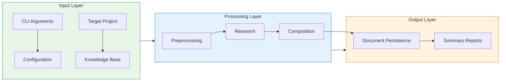

### 1.3 Key Process Nodes

| Process Node | Domain | Responsibility | Output |
|-------------|--------|---------------|---------|
| **CLI Entry** | Configuration Management | Argument parsing, config hierarchy resolution | Config, GeneratorContext |
| **PreProcessAgent** | Preprocessing Domain | 6-step analysis pipeline | CodeInsights, ProjectStructure |
| **ResearchOrchestrator** | Research Domain | 8-agent architectural analysis | Research Reports (C1-C4) |
| **DocumentationComposer** | Composition Domain | 6-editor documentation generation | Markdown Sections |
| **DiskOutlet** | Output Domain | Persistence and post-processing | Documentation Artifacts |

### 1.4 Process Coordination Mechanisms

The system utilizes three primary coordination mechanisms:

1. **Hierarchical Memory Scopes**: Typed storage across `PREPROCESSING`, `STUDIES_RESEARCH`, and `DOCUMENTATION` scopes enables stateful inter-agent communication
2. **Dependency-Aware Orchestration**: Agents execute following a directed acyclic graph (DAG) of data dependencies
3. **Resource-Constrained Parallelism**: CPU-bound and IO-bound operations utilize `do_parallel_with_limit` to respect LLM rate limits and system resources

---

## 2. Main Workflows

### 2.1 End-to-End Documentation Generation Workflow

This is the primary business process orchestrating the complete lifecycle from project ingestion to documentation delivery.

#### 2.1.1 Process Flow

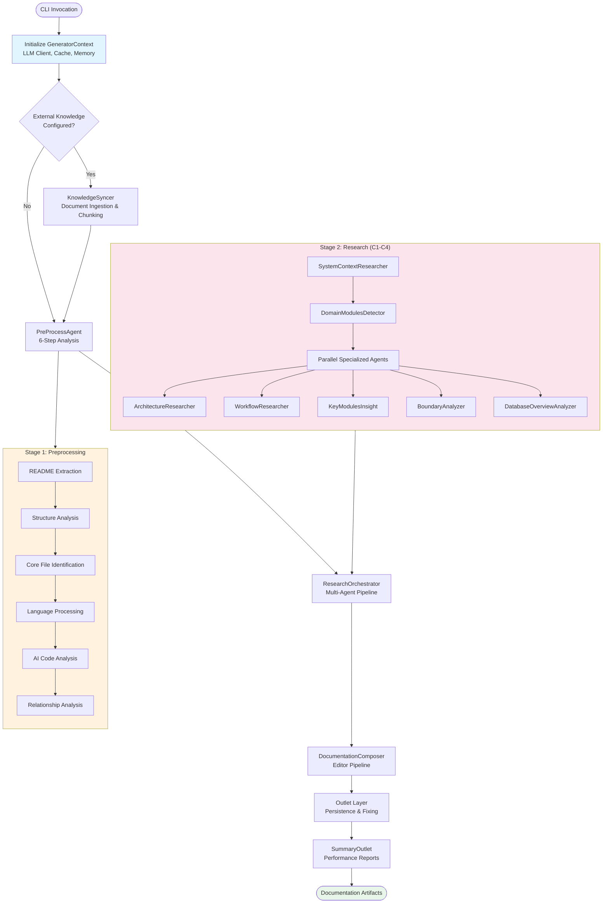

#### 2.1.2 Detailed Process Steps

**Step 1: Context Initialization**
- **Input**: CLI arguments, configuration files (`litho.toml`), environment variables
- **Process**: 
  - `Config` resolution with multi-format project name inference (Cargo.toml, package.json, pom.xml, .csproj)
  - `GeneratorContext` construction aggregating LLM client, CacheManager, Memory system
  - Token estimator and performance monitor initialization
- **Output**: Initialized `GeneratorContext` with `Arc<RwLock<T>>` protected shared state

**Step 2: Knowledge Synchronization**
- **Trigger**: Conditional execution based on `knowledge_base` configuration
- **Process**:
  - Change detection via file mtime comparison and HashSet symmetric difference
  - Multi-format document processing (PDF, Markdown, SQL, YAML, JSON)
  - Intelligent chunking: Semantic (Markdown/SQL-aware), Paragraph-based, or Fixed-size with overlap
  - Category organization (architecture, database, API, ADR)
- **Output**: Cached, chunked documents available for RAG-style retrieval

**Step 3: Preprocessing Pipeline**
- **Process**: Six sequential sub-steps:
  1. **Original Document Extraction**: README.md discovery and content extraction
  2. **Structure Extraction**: Recursive directory traversal with intelligent filtering (excludes build artifacts, node_modules, .git)
  3. **Core File Identification**: Importance scoring algorithm identifying "core" code files vs. boilerplate
  4. **Language Processing**: Extension-based dispatch to 12+ `LanguageProcessor` implementations
  5. **AI Code Analysis**: Two-phase analysis (static extraction → AI enhancement) with controlled parallelism
  6. **Relationship Analysis**: Project-level architectural dependency analysis with prompt compression
- **Output**: `PreprocessingResult` containing `Vec<CodeInsight>`, `ProjectStructure`, `RelationshipAnalysis`

**Step 4: Multi-Agent Research**
- **Process**: Three-layer C4 analysis pipeline (detailed in section 2.2)
- **Key Characteristic**: Staged execution ensuring C1 context informs C2 analysis, which informs C3-C4 deep dives

**Step 5: Documentation Composition**
- **Process**: Sequential execution of specialized editors:
  1. `OverviewEditor`: C4 System Context documentation
  2. `ArchitectureEditor`: C4 Container/Component/Code views with Mermaid diagrams
  3. `WorkflowEditor`: Process documentation (the output of this current analysis)
  4. `KeyModulesInsightEditor`: Concurrent module deep-dives
  5. `BoundaryEditor`: CLI/API/Router interface documentation
  6. `DatabaseEditor`: Conditional SQL schema documentation (executes only if `.sql` files detected)
- **Output**: Populated `DocTree` with file paths mapped to generated content

**Step 6: Output and Persistence**
- **Process**:
  - Directory structure creation with internationalized naming (`4.Deep-Exploration` vs `4、深入探索`)
  - Content retrieval from `MemoryScope::DOCUMENTATION`
  - Mermaid diagram syntax fixing via external `mermaid-fixer` tool
  - Summary report generation (Full and Brief modes)
- **Output**: Markdown files on disk, performance metrics report

### 2.2 Multi-Agent Research Pipeline

This workflow implements the core intellectual property of the system—AI-powered architectural analysis following C4 model abstraction levels.

#### 2.2.1 C4 Abstraction Levels

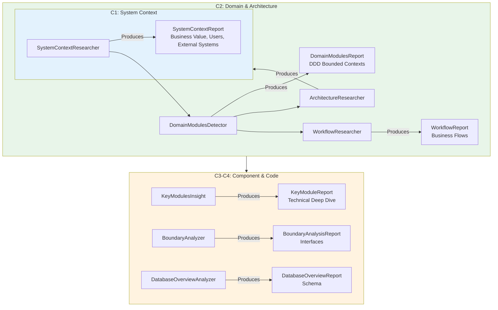

#### 2.2.2 Agent Dependencies and Data Flow

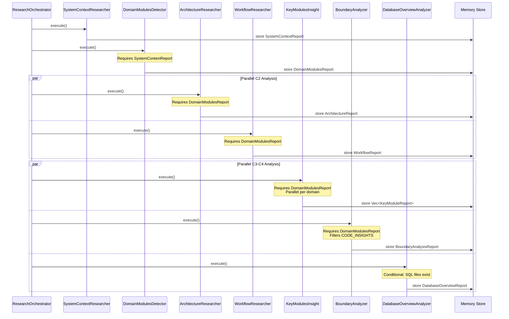

#### 2.2.3 Agent Specializations

| Agent | C4 Level | Input Data Sources | Output | Key Function |
|-------|----------|-------------------|--------|--------------|
| **SystemContextResearcher** | C1 | ProjectStructure, CodeInsights, README | SystemContextReport | Identifies business value, stakeholders, external dependencies |
| **DomainModulesDetector** | C2 | SystemContextReport, CodeInsights | DomainModulesReport | DDD domain decomposition, bounded contexts |
| **ArchitectureResearcher** | C2 | DomainModulesReport, External Knowledge | ArchitectureReport | C4 diagrams, architectural patterns, drift detection |
| **WorkflowResearcher** | C2 | DomainModulesReport, CodeInsights | WorkflowReport | Business process flows, execution paths |
| **KeyModulesInsight** | C3-C4 | DomainModulesReport, filtered CodeInsights | Vec<KeyModuleReport> | Parallel technical deep-dive per domain |
| **BoundaryAnalyzer** | C3-C4 | CodeInsights (Entry/Api/Controller) | BoundaryAnalysisReport | CLI, API, Router interface extraction |
| **DatabaseOverviewAnalyzer** | C3-C4 | SQL files, DAO code | DatabaseOverviewReport | Schema, procedures, ER diagrams |

### 2.3 Static Code Analysis Workflow

This workflow transforms raw source code into structured `CodeInsight` objects through language-agnostic processing and AI enhancement.

#### 2.3.1 Two-Phase Analysis Architecture

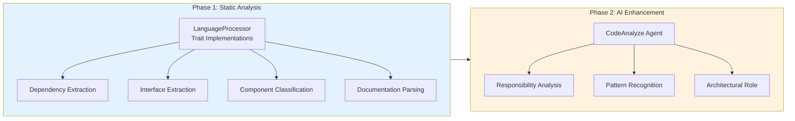

#### 2.3.2 Language Processing Matrix

The `LanguageProcessorManager` dispatches files based on extensions to specialized processors:

| Language/Framework | Processor | Key Capabilities |
|-------------------|-----------|------------------|
| Rust | `RustProcessor` | use/mod statements, unsafe blocks, trait/impl analysis |
| Java | `JavaProcessor` | Import/package extraction, Javadoc parsing, annotation detection |
| Python | `PythonProcessor` | Import analysis, docstring extraction, type annotation parsing |
| JavaScript/TypeScript | `TypeScriptProcessor` | ES6/CommonJS imports, JSDoc, async/await detection |
| C# | `CsharpProcessor` | Namespace/usings, XML documentation, attribute analysis |
| PHP | `PhpProcessor` | Namespace/use, DocBlock, Composer dependency detection |
| Swift | `SwiftProcessor` | Import attributes, optionals, generic type parsing |
| Kotlin | `KotlinProcessor` | Android-specific detection (Activity/ViewModel), coroutine support |
| React | `ReactProcessor` | Hook detection, JSX analysis, component hierarchy |
| Vue | `VueProcessor` | `<script>` extraction, Composition API detection |
| Svelte | `SvelteProcessor` | Reactive statements, store subscriptions |

#### 2.3.3 Parallel Processing Control

The `CodeAnalyze` agent implements controlled concurrency:

```rust
// Conceptual workflow based on code analysis
do_parallel_with_limit(
    files_to_analyze,
    max_parallels,  // From config.llm.max_concurrent_requests
    |file| async {
        // 1. Static analysis via LanguageProcessor
        let static_insight = processor.analyze(file);
        
        // 2. Build context-aware prompt
        let prompt = build_prompt(project_context, static_insight);
        
        // 3. LLM extraction
        let ai_insight = agent_executor::extract::<CodeInsight>(prompt).await;
        
        // 4. Merge static + AI results
        merge_insights(static_insight, ai_insight)
    }
).await;
```

**Token Management Strategy**:
- **Truncation**: Large files truncated to prevent prompt overflow (DatabaseOverviewAnalyzer limits to 50 most important files)
- **Compression**: `PromptCompressor` utility reduces content size while preserving semantic meaning
- **Filtering**: Importance score thresholding (0.6) filters low-value files from relationship analysis

### 2.4 Documentation Composition Workflow

Transforms structured research data into human-readable Markdown following C4 model standards.

#### 2.4.1 Editor Agent Pipeline

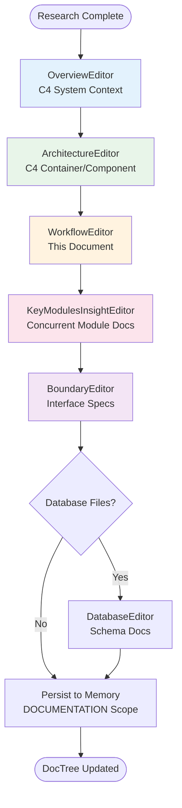

#### 2.4.2 KeyModulesInsightEditor Concurrency Model

This editor implements a two-level architecture for parallel documentation generation:

1. **Orchestrator Level** (`KeyModulesInsightEditor` plural): 
   - Retrieves all `KeyModuleReport` objects from research memory
   - Creates concurrent tasks for each module
   - Uses `do_parallel_with_limit` to control LLM concurrency

2. **Agent Level** (`KeyModuleInsightEditor` singular):
   - Implements `StepForwardAgent` trait
   - Generates individual module documentation
   - Updates `DocTree` with localized file paths

---

## 3. Flow Coordination and Control

### 3.1 Centralized Context Management

The `GeneratorContext` serves as a dependency container and resource manager, implementing the **Context Pattern** to avoid parameter proliferation across async boundaries.

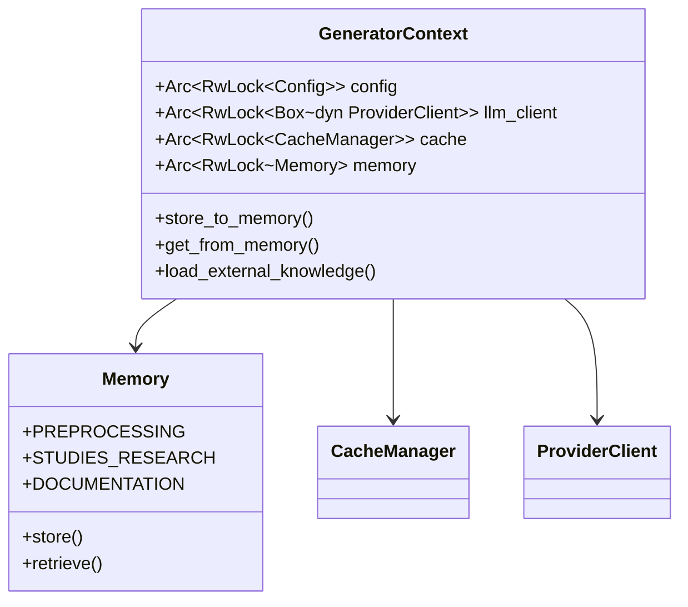

**Thread Safety Model**:
- All mutable shared state protected by `Arc<RwLock<T>>`
- Lock granularity at the service level (coarse-grained) rather than operation level
- Async-aware locking via `tokio::sync::RwLock`

### 3.2 Memory Scopes and Data Sharing

```mermaid
flowchart LR
    subgraph Preprocess["PREPROCESSING Scope"]
        P1[CodeInsights]
        P2[ProjectStructure]
        P3[RelationshipAnalysis]
        P4[README Content]
    end
    
    subgraph Research["STUDIES_RESEARCH Scope"]
        R1[SystemContextReport]
        R2[DomainModulesReport]
        R3[ArchitectureReport]
        R4[WorkflowReport]
        R5[KeyModuleReports]
        R6[BoundaryAnalysis]
        R7[DatabaseOverview]
    end
    
    subgraph Compose["DOCUMENTATION Scope"]
        C1[Overview Markdown]
        C2[Architecture Markdown]
        C3[Workflow Markdown]
        C4[Module Markdowns]
        C5[Boundary Markdown]
        C6[Database Markdown]
    end
    
    Preprocess --> Research --> Compose
    
    style Preprocess fill:#e3f2fd
    style Research fill:#e8f5e9
    style Compose fill:#fff3e0
```

**Data Retrieval Patterns**:
- **Required Data**: Hard dependencies validated by `AgentDataConfig` (e.g., DomainModulesDetector requires SystemContextResearcher output)
- **Optional Data**: Soft dependencies via `ExternalKnowledgeByCategory` (e.g., Architecture documents from knowledge base)
- **Source Data**: Raw code insights filtered by path patterns for domain-specific analysis

### 3.3 Execution Scheduling and Parallelism

The system implements three concurrency strategies:

1. **Pipeline Parallelism**: Stages execute sequentially (Preprocess → Research → Compose), but data flows asynchronously between them
2. **Data Parallelism**: Independent agents execute concurrently (ArchitectureResearcher || WorkflowResearcher || BoundaryAnalyzer)
3. **Task Parallelism**: File-level parallel processing within agents (CodeAnalyze, KeyModulesInsight)

**Resource Limits**:
- `max_parallels` from LLM configuration controls concurrent API calls
- `do_parallel_with_limit` utility provides backpressure and prevents resource exhaustion

### 3.4 State Transitions and Lifecycle

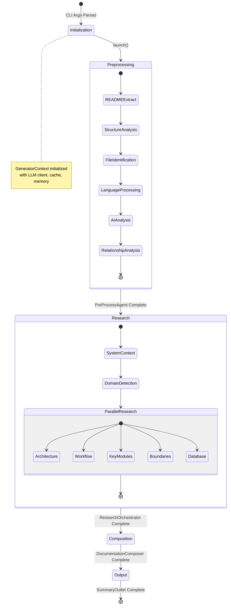

---

## 4. Exception Handling and Recovery

### 4.1 Error Handling Architecture

The system employs **anyhow** for ergonomic error propagation with context, implementing a **Fail-Fast** strategy for critical errors and **Graceful Degradation** for non-critical components.

#### 4.1.1 Error Classification and Strategy

| Error Category | Strategy | Implementation |
|---------------|----------|----------------|
| **Configuration Errors** | Fail Fast | `?` propagation in `main.rs`, user-friendly messages via i18n |
| **LLM API Errors** | Retry with Exponential Backoff | Built into `ProviderClient` with configurable retries |
| **Cache Errors** | Degrade to Direct Execution | Cache errors logged but don't block execution |
| **Agent Analysis Errors** | Partial Success | `KeyModulesInsight` continues if individual domain fails |
| **File System Errors** | Fail Fast | `DiskOutlet` propagates IO errors immediately |

### 4.2 Resilience Patterns

#### 4.2.1 Circuit Breaker (Implicit)
The caching layer acts as a circuit breaker for LLM calls:
- Cache hit → Skip API call (reduces load during outages)
- Cache miss → Attempt API call with timeout
- API failure → Propagate error (no fallback to stale data for analysis)

#### 4.2.2 Graceful Degradation in Parallel Processing

```rust
// From KeyModulesInsight analysis
let results: Vec<_> = futures::future::join_all(tasks).await
    .into_iter()
    .filter_map(|result| {
        match result {
            Ok(report) => Some(report),
            Err(e) => {
                log::warn!("Domain analysis failed: {}", e);
                None // Continue with partial results
            }
        }
    })
    .collect();
```

#### 4.2.3 Token Overflow Protection

The `DatabaseOverviewAnalyzer` implements defensive truncation:
1. Filters to top 50 most important SQL files
2. Applies truncation to individual large files
3. Uses `PromptCompressor` for emergency content reduction
4. Falls back to directory-only view if compression fails

### 4.3 Recovery Mechanisms

**Partial Pipeline Recovery**:
- Preprocessing results cached in memory; research can resume without re-preprocessing if previous stage intact
- Research reports persisted to `STUDIES_RESEARCH` scope; composition can re-run without re-research
- Generated documents in `DOCUMENTATION` scope allow re-output without regeneration

**Mermaid Diagram Recovery**:
- `MermaidFixer` post-processes generated diagrams using external tool
- Syntax errors fixed automatically without user intervention
- If fixing fails, original content preserved with warning logs

### 4.4 Monitoring and Observability

**Performance Monitoring**:
- `CachePerformanceMonitor` tracks hit rates, cost savings, and inference time saved
- `TimingScope` records duration for each pipeline phase
- Summary reports include efficiency ratios (cost-per-second, improvement multipliers)

**Error Context**:
- All errors include the agent type and operation context via `anyhow::Context`
- Bilingual logging (English/Chinese) via `TargetLanguage` ensures accessibility

---

## 5. Key Process Implementation

### 5.1 StepForwardAgent Framework

The `StepForwardAgent` trait provides a **Template Method Pattern** for standardized agent execution, ensuring consistent data validation, prompt construction, and result storage.

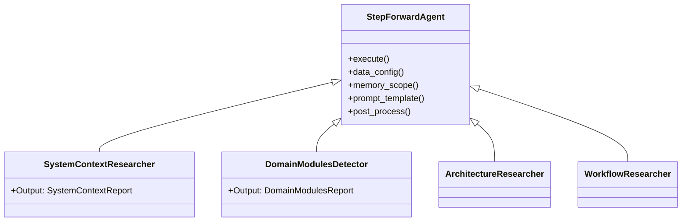

**Lifecycle Hooks**:
1. **Data Configuration**: Declares required/optional data sources via `AgentDataConfig`
2. **Data Collection**: Retrieves from memory scopes or external knowledge
3. **Content Formatting**: `DataFormatter` applies hierarchical formatting and compression
4. **Prompt Engineering**: `GeneratorPromptBuilder` constructs multilingual prompts
5. **LLM Invocation**: Supports `Extract` (JSON), `Prompt` (Free text), `PromptWithTools` (ReAct)
6. **Post-Processing**: Validation, side effects, and localized logging

### 5.2 Language Processor Architecture

The `LanguageProcessor` trait implements the **Strategy Pattern** for polyglot code analysis:

```rust
// Conceptual trait structure
trait LanguageProcessor {
    fn extensions(&self) -> &[&str];
    fn extract_dependencies(&self, content: &str) -> Vec<Dependency>;
    fn extract_interfaces(&self, content: &str) -> Vec<InterfaceInfo>;
    fn determine_type(&self, file: &FileInfo) -> ComponentType;
    fn calculate_complexity(&self, content: &str) -> ComplexityMetrics;
}
```

**Regex-Based Parsing Strategy**:
- Uses pre-compiled regex patterns for performance (avoids AST parsing overhead)
- Handles language-specific constructs (Swift optionals, Python decorators, Rust lifetimes)
- Falls back to generic patterns for unsupported constructs
- Trade-off: Speed vs. perfect accuracy for complex nested generics

### 5.3 Caching Strategy (Cache-Aside Pattern)

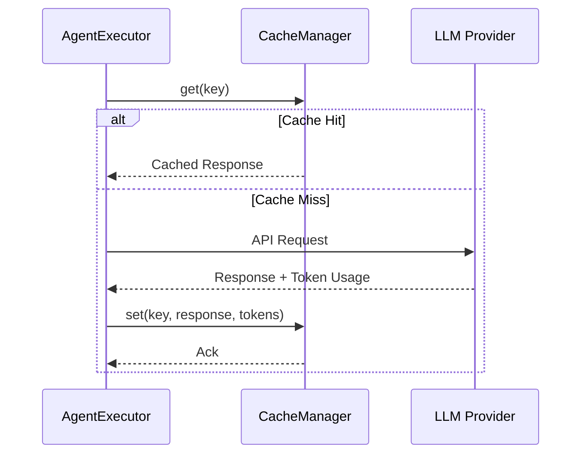

**Cache Key Generation**:
- Composite key: MD5 hash of `system_prompt + user_prompt + operation_type`
- Ensures isolation between different execution modes (Extract vs Prompt)
- Category-based directory structure for cache organization

**Token Preservation**:
- Cache entries store input/output token counts
- Enables accurate cost analysis even on cache hits
- Supports cache performance monitoring metrics

### 5.4 Prompt Engineering and Compression

**Template Structure**:
1. **System Instructions**: Role definition and output constraints
2. **Opening Instruction**: Task framing and context setting
3. **Research Materials**: Structured data from previous stages
4. **Closing Instruction**: Specific analysis requirements and format enforcement

**Compression Algorithm**:
```rust
// Hierarchical compression strategy
1. Content sorting by importance score (descending)
2. Truncation of low-importance items
3. Semantic compression (removing boilerplate, preserving semantics)
4. Emergency truncation (hard character limits)
```

**Multilingual Support**:
- `TargetLanguage` enum injection into prompts
- 8 supported languages with native script display names
- AI instruction templates guide LLM to generate documentation in target language

### 5.5 Internationalization (i18n) Integration

The system maintains **locale awareness** throughout the workflow:

- **File System**: Localized directory names (`1.Overview` vs `1、项目概述`)
- **Console Output**: 16+ message templates translated across 8 languages
- **Documentation Content**: LLM prompted to generate in target language
- **Error Messages**: Bilingual error context for debugging

**Implementation**:
- Exhaustive match expressions on `TargetLanguage` enum (8 variants)
- High cyclomatic complexity (54) accepted for compile-time exhaustiveness guarantees
- Emoji indicators provide visual feedback regardless of language

---

## Appendix: Workflow Performance Characteristics

| Workflow Phase | Time Complexity | Bottleneck | Optimization Strategy |
|---------------|----------------|------------|---------------------|
| **Preprocessing** | O(n) where n=files | AI Code Analysis | Parallel processing with `max_parallels` limit |
| **Research** | O(d) where d=domains | KeyModulesInsight (parallel per domain) | Concurrent agent execution |
| **Composition** | O(s) where s=sections | Sequential editor dependency | N/A (inherently sequential) |
| **Output** | O(docs) | MermaidFixer external tool | Async I/O with tokio |
| **Overall** | O(n + d + s) | LLM API latency | Caching, retry logic, token optimization |

**Resource Utilization**:
- **CPU**: High during regex parsing and file I/O
- **Network**: LLM API calls with configurable concurrency
- **Memory**: Scales with project size (CodeInsights stored in memory)
- **Disk**: Cache storage proportional to unique prompt count