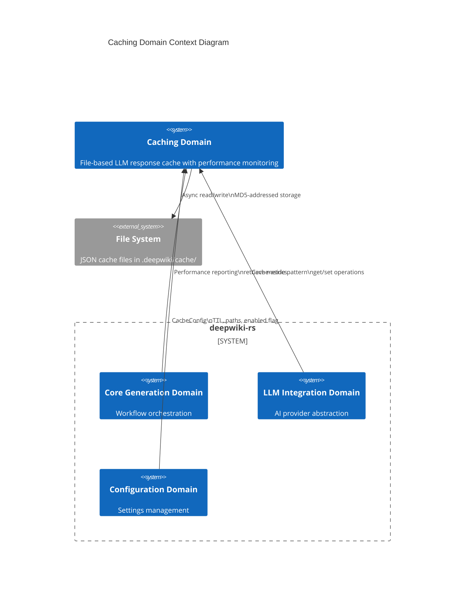
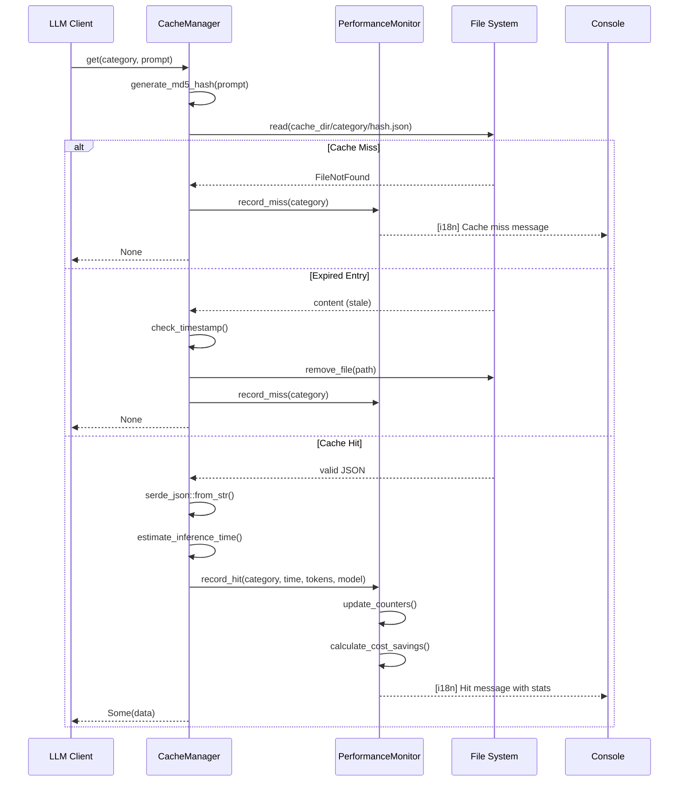
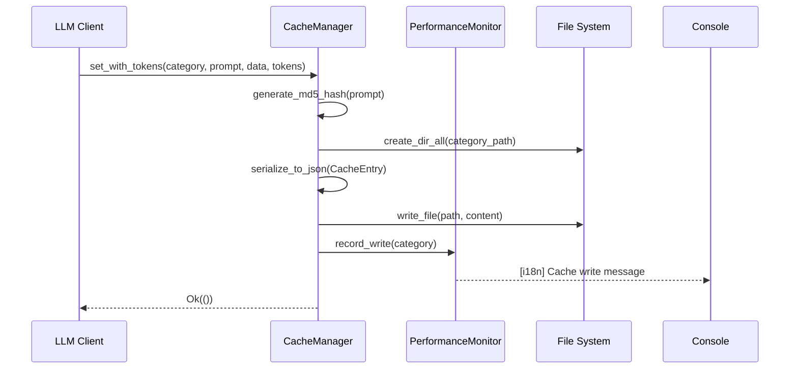

**Caching Domain Technical Documentation**

**Version:** 1.0  
**Last Updated:** 2024  
**Domain Type:** Infrastructure Domain  
**Confidence Score:** 0.92 (High)

---

## 1. Executive Summary

The **Caching Domain** provides a high-performance, file-based persistence layer designed to optimize Large Language Model (LLM) API usage through intelligent response caching. This domain eliminates redundant API calls by storing serialized LLM responses with deterministic key generation, time-based expiration policies, and comprehensive cost-tracking capabilities.

The domain implements a **Cache-Aside Pattern** with async file I/O, supporting generic data serialization while maintaining thread-safe performance metrics. It delivers measurable business value by reducing API costs, minimizing inference latency for repeated queries, and providing detailed analytics on cache efficiency and cost savings.

---

## 2. Architectural Positioning

### 2.1 System Context
The Caching Domain operates as critical infrastructure within the LLM Integration layer, serving as a persistent store for AI-generated outputs across the documentation generation pipeline.



### 2.2 Domain Dependencies
- **Upstream Dependencies:** Configuration Management Domain (cache settings, TTL policies)
- **Downstream Consumers:** LLM Integration Domain (primary consumer), Core Generation Domain (metrics retrieval)
- **Cross-Cutting:** Internationalization Domain (bilingual logging), Types Domain (TokenUsage structures)

---

## 3. Component Architecture

The domain consists of two primary components operating in concert to provide caching capabilities with observability.

### 3.1 CacheManager
**Responsibility:** Core caching operations including key generation, storage retrieval, and TTL management.

**Key Capabilities:**
- **Deterministic Key Generation:** MD5 hash-based addressing (32-character hexadecimal) ensuring identical prompts resolve to consistent storage locations
- **Hierarchical Storage:** Category-scoped directory organization (`{cache_dir}/{category}/{hash}.json`)
- **TTL Enforcement:** Configurable expiration based on Unix epoch timestamps with automatic stale entry cleanup
- **Generic Serialization:** Type-safe storage via Serde with JSON pretty-printing for debuggability
- **Token-Aware Caching:** Specialized support for LLM token usage metadata to enable accurate cost accounting

### 3.2 CachePerformanceMonitor
**Responsibility:** Thread-safe metrics collection and reporting for cache efficiency analysis.

**Key Capabilities:**
- **Atomic Counters:** Lock-free concurrency using `Arc<AtomicUsize>` and `AtomicU64` for hit/miss/write/error tracking
- **Cost Analytics:** Real-time calculation of inference time saved and estimated cost savings based on model-specific token pricing
- **Localized Reporting:** Bilingual console output (English/Chinese) via integration with the Internationalization Domain
- **Per-Category Metrics:** Granular tracking allowing analysis of cache efficiency by operation type (research, composition, preprocessing)

---

## 4. Data Model & Storage Format

### 4.1 Cache Entry Schema
```rust
pub struct CacheEntry<T> {
    pub data: T,                    // Generic payload (JSON-serializable)
    pub timestamp: u64,             // Unix epoch seconds (creation time)
    pub prompt_hash: String,        // MD5 verification hash
    pub token_usage: Option<TokenUsage>,  // Input/output tokens + cost
    pub model_name: Option<String>, // LLM model identifier
}
```

### 4.2 File System Layout
```
.deepwiki/
└── cache/
    ├── research/              # Category: Research agents
    │   ├── a1b2c3d4...json   # MD5 hash of prompt
    │   └── e5f6g7h8...json
    ├── composition/           # Category: Documentation editors
    ├── preprocess/            # Category: Code analysis
    └── compression/           # Category: Prompt compression
```

### 4.3 Performance Metrics Structure
```rust
pub struct CacheMetrics {
    hits: AtomicUsize,          // Successful retrievals
    misses: AtomicUsize,        // Cache misses
    writes: AtomicUsize,        // Successful stores
    errors: AtomicUsize,        // I/O or deserialization failures
    inference_time_saved_ms: AtomicU64,  // Cumulative time saved
    tokens_saved: AtomicUsize,  // Total tokens not re-processed
}
```

---

## 5. Operational Flows

### 5.1 Cache Retrieval Flow (Cache-Aside Pattern)


### 5.2 Cache Storage Flow


---

## 6. Technical Implementation Details

### 6.1 Key Generation Strategy
The domain uses **MD5 cryptographic hashing** (via the `md5` crate) to generate deterministic cache keys. This approach provides:
- **Determinism:** Identical prompts produce identical hashes across sessions
- **Uniform Distribution:** Minimizes directory clustering
- **Collision Resistance:** 32-character hex space (16^32 combinations) suitable for non-security use cases

**Hash Composition:** For specialized caching scenarios (e.g., prompt compression), composite keys combine multiple input parameters: `hash(format!("{}-{}", prompt, compression_params))`

### 6.2 Concurrency Model
- **Async I/O:** All file operations use `tokio::fs` to prevent blocking the async runtime
- **Thread-Safe Metrics:** `CachePerformanceMonitor` uses atomic operations to allow concurrent updates from parallel agents without mutex contention
- **Lock-Free Reads:** Cache retrieval operations are fully parallelizable with no locking mechanisms

### 6.3 Expiration Policy
- **TTL Basis:** Unix epoch timestamps stored in entry metadata
- **Lazy Expiration:** Entries are validated at retrieval time; expired entries trigger deletion rather than background cleanup
- **Configuration:** TTL hours specified in `CacheConfig.expire_hours` (0 = no expiration)

### 6.4 Error Handling Strategy
- **Graceful Degradation:** File I/O errors or deserialization failures are logged as metrics but do not fail the calling operation
- **Fallback Behavior:** On any cache error, the system returns `None` (cache miss), forcing a fresh LLM call
- **Metrics Capture:** All error conditions increment the atomic error counter for operational visibility

---

## 7. Configuration & Integration

### 7.1 Configuration Schema
```rust
pub struct CacheConfig {
    pub enabled: bool,           // Master switch for caching
    pub cache_dir: PathBuf,      // Base directory (default: .deepwiki/cache)
    pub expire_hours: u64,       // TTL in hours (0 = infinite)
}
```

### 7.2 Public Interface
**Primary Methods:**
- `async fn get<T>(&self, category: &str, prompt: &str) -> Result<Option<T>>`  
  Generic retrieval with automatic deserialization and TTL validation
  
- `async fn set<T>(&self, category: &str, prompt: &str, data: T) -> Result<()>`  
  Basic storage without token tracking
  
- `async fn set_with_tokens<T>(&self, category: &str, prompt: &str, data: T, usage: TokenUsage)`  
  Storage with cost-tracking metadata
  
- `fn generate_performance_report(&self) -> CachePerformanceReport`  
  Snapshot of current metrics including hit rate and estimated savings

### 7.3 Integration Points
1. **LLM Integration Domain:** Primary consumer implementing cache-aside logic; checks cache before API calls, stores responses with token usage
2. **Core Generation Domain:** Retrieves performance reports for final summary generation
3. **Internationalization Domain:** Localized message templates for cache operations (hit/miss/write/error)
4. **Configuration Domain:** Hierarchical settings management for cache paths and policies

---

## 8. Performance Characteristics

### 8.1 Throughput
- **Read Latency:** ~1-5ms for cache hits (file system dependent)
- **Write Latency:** ~2-10ms (async, non-blocking)
- **Concurrency:** Supports hundreds of concurrent cache operations via Tokio's thread pool

### 8.2 Efficiency Metrics
The domain tracks four key performance indicators:
1. **Hit Rate:** `hits / (hits + misses)` - Target >60% for cost optimization
2. **Time Savings:** Cumulative milliseconds of avoided LLM inference latency
3. **Cost Savings:** Calculated from `(tokens_input * price_input + tokens_output * price_output) * hits`
4. **Error Rate:** `errors / total_operations` - Should remain <0.1%

### 8.3 Storage Overhead
- **Per-Entry Overhead:** ~200 bytes (JSON structure + metadata)
- **Disk Usage:** Linear with unique prompt count; no automatic compaction (manual cleanup of cache directory required if needed)

---

## 9. Operational Considerations

### 9.1 Cache Invalidation
- **Automatic:** TTL-based expiration removes stale entries on access
- **Manual:** Deletion of `{cache_dir}` subdirectories for category-wide invalidation
- **Knowledge Sync:** External knowledge base updates trigger selective cache invalidation via the Knowledge Integration Domain

### 9.2 Monitoring & Observability
- **Console Output:** Real-time bilingual logging of cache operations during workflow execution
- **Summary Reports:** End-of-run statistics showing total API costs saved and efficiency metrics
- **Debuggability:** Pretty-printed JSON cache files allow manual inspection of stored responses

### 9.3 Security & Privacy
- **Local Storage:** All cached data persists to local filesystem only (no remote storage)
- **No PII Processing:** Cache keys are hashed; original prompts are not stored in filenames
- **Access Control:** Standard filesystem permissions apply; no additional encryption at rest

---

## 10. Design Decisions & Trade-offs

| Decision | Rationale | Trade-off |
|----------|-----------|-----------|
| **File-based vs. In-Memory** | Persistence across process restarts; shared state between runs | Higher latency than Redis/Memcached; simpler deployment |
| **MD5 vs. SHA-256** | Speed of hash generation; collision risk acceptable for non-security use | Lower collision resistance than cryptographic hashes |
| **JSON vs. Binary (bincode)** | Human-readable for debugging; schema evolution flexibility | Larger file sizes; slower serialization |
| **Lazy vs. Active Expiration** | Reduced background CPU usage; simpler implementation | Disk space occupied by expired entries until accessed |
| **Atomic Counters vs. Mutex** | Lock-free concurrency; higher throughput | Eventual consistency for metrics (acceptable for analytics) |

---

## 11. Appendix: Glossary

| Term | Definition |
|------|------------|
| **Cache-Aside Pattern** | Application code manages cache population/retrieval; cache does not interact directly with primary store |
| **MD5 Hash** | 128-bit hash function producing 32-character hexadecimal digest used for cache addressing |
| **TokenUsage** | Structure tracking LLM input/output token counts for cost calculation |
| **TTL** | Time-To-Live; expiration duration for cached entries |
| **Atomic Operations** | CPU instructions guaranteeing thread-safe counter increments without locks |

---

**Document Control:**  
- **Author:** System Architecture Team  
- **Review Cycle:** Per major release or cache strategy changes  
- **Related Documents:** LLM Integration Domain Spec, Configuration Management Domain Spec