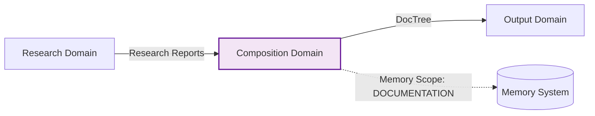
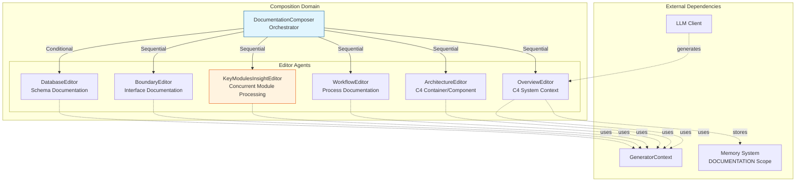

**Composition Domain Technical Documentation**

**Version:** 1.0  
**Module:** `src/generator/compose/`  
**Classification:** Core Business Domain  
**Complexity Score:** 8.0/10  
**Criticality:** High (Importance: 9.0/10)

---

## 1. Overview

The **Composition Domain** is the third stage of the documentation generation pipeline, responsible for transforming architectural research outputs into comprehensive, structured C4 architecture documentation. It operates as a sophisticated multi-agent documentation synthesis system that converts raw analysis data (CodeInsights, Research Reports) into professional markdown documentation with Mermaid diagrams.

### 1.1 Purpose
- **Primary Function:** Generate C4-compliant architecture documentation from research artifacts
- **Processing Model:** Sequential pipeline with selective concurrent execution
- **Output Format:** Structured markdown with embedded Mermaid diagrams
- **Target Audience:** Software developers, architects, and technical writers

### 1.2 Architectural Position
Situated between the Research Domain (input) and Output Domain (persistence), the Composition Domain acts as the "documentation factory," implementing the transformation layer that converts machine-readable research data into human-readable technical documentation.



---

## 2. System Architecture

### 2.1 Core Design Patterns

**Trait-Based Agent Architecture**
All documentation editors implement the `StepForwardAgent` trait, providing a standardized interface for declarative agent definition. This enables polymorphic execution while maintaining type safety and consistent lifecycle management.

**Orchestration Pipeline Pattern**
The `DocumentationComposer` serves as a central orchestrator implementing the Chain of Responsibility pattern. It executes a five-stage sequential pipeline ensuring each documentation section builds upon previously generated context.

**Dual Execution Strategy**
The domain employs two distinct execution modes:
- **LLM-Powered Generation:** For creative synthesis requiring architectural interpretation (Overview, Architecture, Workflow, Key Modules)
- **Deterministic Code Generation:** For structured data transformation (Database, Boundary documentation)

### 2.2 Component Hierarchy



---

## 3. Core Components

### 3.1 DocumentationComposer (`mod.rs`)
The central orchestrator coordinating the documentation generation workflow.

**Responsibilities:**
- Pipeline stage sequencing and dependency management
- Conditional execution logic (database file detection)
- DocTree initialization and management
- Error handling and result aggregation

**Execution Flow:**
1. Retrieves code insights to detect database files (`has_database_files()`)
2. Sequentially invokes editor agents in dependency order
3. Manages DocTree updates for generated file paths
4. Handles conditional DatabaseEditor execution

### 3.2 Editor Agents

#### OverviewEditor (`agents/overview_editor.rs`)
**Scope:** C4 System Context (Level 1)  
**Execution Mode:** LLM-Powered  
**Data Sources:**
- SystemContextResearcher results
- DomainModulesDetector results
- Project metadata and README

**Output:** Project overview including business value, user roles, system boundaries, and external system interactions with System Context diagrams.

#### ArchitectureEditor (`agents/architecture_editor.rs`)
**Scope:** C4 Container/Component Views (Levels 2-3)  
**Execution Mode:** LLM-Powered  
**Data Sources:**
- ArchitectureResearcher results
- DomainModulesDetector results
- Code insights and relationships

**Output:** Comprehensive architecture documentation including container diagrams, component hierarchies, technology stack descriptions, and architectural decision records.

#### WorkflowEditor (`agents/workflow_editor.rs`)
**Scope:** Business Process Documentation  
**Execution Mode:** LLM-Powered  
**Data Sources:**
- WorkflowResearcher results
- SystemContextResearcher results

**Output:** Execution path documentation, process coordination mechanisms, exception handling strategies, and sequence diagrams for critical business flows.

#### KeyModulesInsightEditor (`agents/key_modules_insight_editor.rs`)
**Scope:** Detailed Module Analysis (C4 Code Level)  
**Execution Mode:** Concurrent LLM-Powered  
**Architecture:** Two-level hierarchy
- **Orchestrator Level:** Retrieves insight reports, manages concurrency limits, aggregates results
- **Execution Level:** Individual `KeyModuleInsightEditor` agents per domain module

**Concurrency Control:** Utilizes `do_parallel_with_limit()` based on LLM configuration limits to prevent resource exhaustion while maximizing throughput.

**Output:** Individual markdown files for each key module stored in `deep_exploration/` directory with technical implementation details.

#### BoundaryEditor (`agents/boundary_editor.rs`)
**Scope:** Interface Documentation  
**Execution Mode:** Deterministic Code Generation (Custom `execute()`)  
**Data Sources:**
- BoundaryAnalyzer results (BoundaryAnalysisReport)

**Implementation:** Bypasses LLM calls; directly transforms structured boundary analysis into formatted markdown using template methods.

**Output:** CLI command documentation, API endpoint specifications, router definitions, and configuration structure documentation.

#### DatabaseEditor (`agents/database_editor.rs`)
**Scope:** Database Schema Documentation  
**Execution Mode:** Deterministic Code Generation (Conditional)  
**Trigger Condition:** `has_database_files()` returns true (detects Database purpose code insights or `.sql`/`.sqlproj` extensions)

**Data Sources:**
- DatabaseOverviewAnalyzer results (DatabaseOverviewReport)

**Implementation:** Direct formatter-based generation creating ER diagrams, table documentation, and stored procedure descriptions.

---

## 4. Data Flow & Integration

### 4.1 Input Interfaces
The domain consumes research artifacts from the Memory System (Scope: `STUDIES_RESEARCH`):

| Editor | Required Research Inputs | Optional Context |
|--------|-------------------------|------------------|
| OverviewEditor | SystemContextResearcher, DomainModulesDetector | README, Project Structure |
| ArchitectureEditor | ArchitectureResearcher, DomainModulesDetector | Code Insights, Relationships |
| WorkflowEditor | WorkflowResearcher, SystemContextResearcher | Business Flow Definitions |
| KeyModulesInsightEditor | KeyModulesInsight | Domain Module Metadata |
| BoundaryEditor | BoundaryAnalyzer | N/A |
| DatabaseEditor | DatabaseOverviewAnalyzer | N/A |

### 4.2 Output Interfaces
Generated documentation persists to:
- **Memory System:** Scope `DOCUMENTATION` for temporary storage during pipeline execution
- **DocTree:** Hierarchical file path registry for Output Domain consumption
- **File System:** Final persistence handled by Output Domain (Outlet)

### 4.3 External Knowledge Integration
Editors optionally integrate external knowledge base categories:
- **Architecture:** ADRs and design patterns
- **Database:** SQL schema definitions and migrations
- **API:** OpenAPI specifications and endpoint documentation
- **Deployment:** Infrastructure and DevOps documentation

---

## 5. Technical Implementation Details

### 5.1 StepForwardAgent Trait Implementation
All LLM-powered editors implement the `StepForwardAgent` trait with associated type `Output = String`:

```rust
pub trait StepForwardAgent {
    type Output;
    fn agent_type(&self) -> AgentType;
    fn memory_scope_key(&self) -> MemoryScope;
    fn data_config(&self) -> AgentDataConfig;
    fn prompt_template(&self) -> PromptTemplate;
    fn execute(&self, context: &GeneratorContext) -> Result<Self::Output>;
}
```

**Key Configurations:**
- **AgentDataConfig:** Defines required and optional data sources (research results, project structure, knowledge categories)
- **PromptTemplate:** System prompts, opening instructions, closing instructions, and formatter configuration
- **LLMCallMode:** Configuration for Prompt-only or PromptWithTools execution

### 5.2 Prompt Engineering Framework
Standardized prompt architecture ensures consistent output quality:

1. **System Prompt:** Defines professional role (Expert Technical Writer) and C4 modeling standards
2. **Opening Instructions:** Analysis guidelines, research data integration, and diagram requirements
3. **Content Body:** Injected research data and code insights
4. **Closing Instructions:** Output format requirements, document structure templates, and quality constraints

### 5.3 Memory Management Strategy
**Read Operations:** Agents retrieve research data via `GeneratorContext::get_research::<T>()`  
**Write Operations:** Results stored via `store_to_memory()` into `MemoryScope::DOCUMENTATION`  
**State Isolation:** Each agent operates on immutable research inputs, producing immutable documentation outputs

### 5.4 Concurrency Architecture
The KeyModulesInsightEditor implements controlled parallelism:

```rust
// Pseudo-code representation
let tasks = insight_reports.into_iter().map(|report| {
    let editor = KeyModuleInsightEditor::new(report);
    async move { editor.execute(context).await }
});

do_parallel_with_limit(tasks, llm_config.concurrency_limit).await
```

**Safety Mechanisms:**
- Concurrency limits derived from LLM provider rate limits
- Individual error isolation (failure of one module doesn't cascade)
- Result aggregation with error reporting

---

## 6. Configuration & Extension

### 6.1 Agent Extension Points
New documentation sections can be added by:
1. Implementing `StepForwardAgent` trait for LLM-powered sections
2. Implementing custom `execute()` for deterministic sections
3. Registering in `DocumentationComposer::execute()` pipeline

### 6.2 Conditional Execution Logic
Database documentation generation depends on:
- **Static Analysis:** CodePurpose::Database detection in preprocessing
- **File Extension:** Presence of `.sql`, `.sqlproj`, or `.db` files
- **Configuration:** Future support for force-enable/disable flags

### 6.3 Internationalization Support
All generated documentation respects the `TargetLanguage` configuration:
- Directory naming localization
- Filename localization
- AI prompt language injection for non-English outputs

---

## 7. Performance Characteristics

| Metric | Value | Notes |
|--------|-------|-------|
| **Sequential Stages** | 5-6 | Overview → Architecture → Workflow → Key Modules → Boundary → [Database] |
| **Concurrent Tasks** | N modules | KeyModulesInsightEditor parallelizes by domain module count |
| **LLM Call Efficiency** | High | Template-based prompts with compressed research data |
| **Memory Footprint** | Medium | Stores full documentation tree in memory during execution |
| **Typical Execution Time** | 30-120s | Depending on project size and LLM latency |

---

## 8. Error Handling & Resilience

**Graceful Degradation:**
- Missing research data results in placeholder sections rather than pipeline failure
- LLM timeouts fall back to cached responses or simplified templates
- Individual module failures in KeyModulesInsightEditor don't abort other modules

**Validation:**
- JSON schema validation for structured research inputs
- Markdown linting compatibility for generated outputs
- File path collision detection in DocTree

---

## 9. Dependencies

**Upstream Dependencies:**
- Research Domain (STUDIES_RESEARCH memory scope)
- GeneratorContext (LLM Client, Memory, Config)
- Knowledge Integration Domain (optional external docs)

**Downstream Dependencies:**
- Output Domain (consumes DocTree and DOCUMENTATION scope)
- Mermaid Fixer (post-processing of generated diagrams)

---

## 10. Code Map

```
src/generator/compose/
├── mod.rs                      # DocumentationComposer orchestrator
└── agents/
    ├── mod.rs                  # Agent exports
    ├── overview_editor.rs      # C4 System Context generation
    ├── architecture_editor.rs  # C4 Container/Component generation
    ├── workflow_editor.rs      # Process documentation
    ├── key_modules_insight_editor.rs  # Concurrent module docs
    ├── boundary_editor.rs      # Interface documentation
    └── database_editor.rs      # SQL schema documentation
```

---

**End of Document**