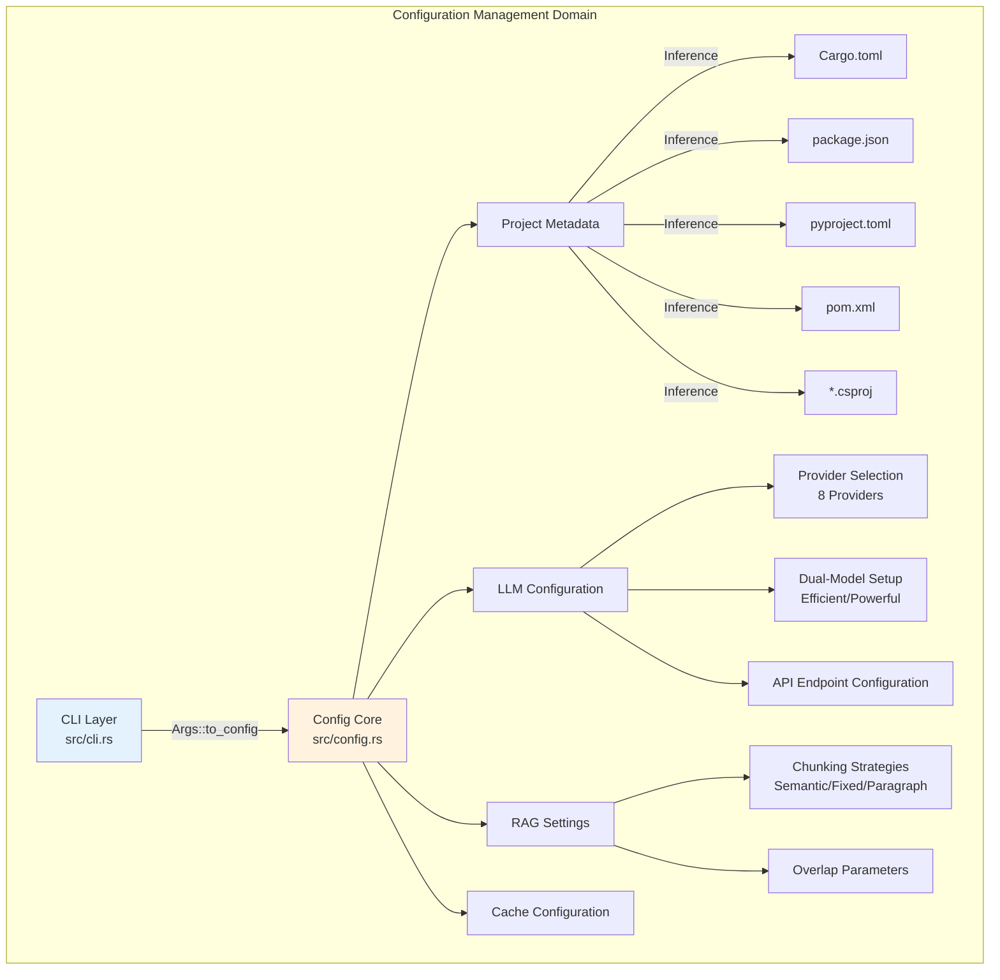
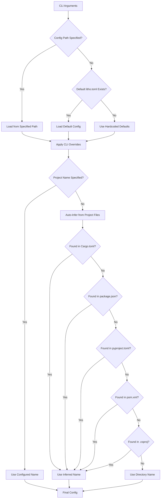
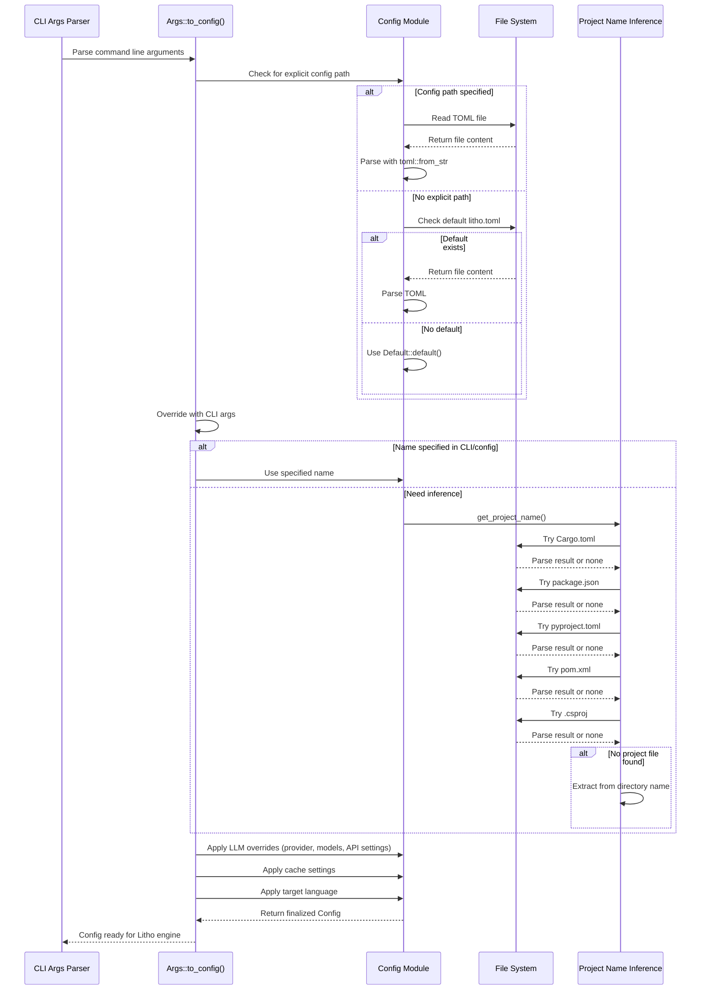

**Configuration Management Domain**

**Version:** 1.0  
**Last Updated:** 2026-02-01 06:37:27 (UTC)  
**System:** deepwiki-rs

---

## 1. Overview

The Configuration Management Domain serves as the central configuration hub for the deepwiki-rs documentation generation engine. This domain is responsible for aggregating, validating, and normalizing configuration settings from multiple sources, including TOML configuration files, command-line interface (CLI) arguments, environment variables, and auto-inferred project metadata.

The domain implements a hierarchical configuration system that balances flexibility with sensible defaults, enabling users to override specific settings through CLI arguments while maintaining persistent configuration via project-level TOML files.

---

## 2. Architecture & Design Principles

### 2.1 Design Goals
- **Hierarchy & Precedence**: Establish clear configuration precedence to resolve conflicts between sources
- **Type Safety**: Leverage Rust's type system to prevent invalid configuration states at compile time
- **Multi-Language Support**: Auto-detect project metadata across diverse technology stacks (Rust, Node.js, Python, Java, C#)
- **Extensibility**: Support pluggable LLM providers with standardized configuration interfaces
- **Fail-Safe Defaults**: Provide comprehensive default implementations ensuring the tool operates out-of-the-box

### 2.2 Component Structure
The domain comprises two primary sub-modules:



---

## 3. Configuration Hierarchy & Precedence

The system resolves configuration values using a strict priority hierarchy to ensure predictable behavior:

```
Priority (Highest to Lowest):
1. CLI Arguments (explicit overrides)
2. Explicit Configuration File (specified via --config)
3. Default Configuration File (litho.toml in project root)
4. Hardcoded Defaults (Default trait implementations)
```

### 3.1 Resolution Flow



### 3.2 Implementation Strategy
- **Serde Integration**: Uses `serde` with TOML deserialization for type-safe configuration parsing
- **Path Safety**: Employs `std::path::PathBuf` for all filesystem paths, ensuring cross-platform compatibility
- **Error Context**: Utilizes `anyhow::Context` to enrich error messages with file paths and configuration keys
- **Optional Fields**: Implements `Option<T>` for non-mandatory settings, allowing granular override detection

---

## 4. Core Configuration Structures

### 4.1 Main Configuration (`Config` Struct)
The top-level configuration aggregate encapsulating all domain settings:

```rust
pub struct Config {
    // Project metadata
    pub project_name: Option<String>,
    pub project_path: PathBuf,
    
    // LLM Integration
    pub llm_provider: LLMProvider,
    pub model_efficient: String,
    pub model_powerful: String,
    pub api_key: Option<String>,
    pub api_base_url: Option<String>,
    pub temperature: f32,
    pub max_tokens: Option<u32>,
    
    // Analysis Parameters
    pub analysis_depth: AnalysisDepth,
    pub include_patterns: Vec<String>,
    pub exclude_patterns: Vec<String>,
    
    // Caching
    pub cache_enabled: bool,
    pub cache_path: PathBuf,
    pub cache_ttl_hours: Option<u64>,
    
    // RAG / Knowledge Integration
    pub knowledge_base_path: Option<PathBuf>,
    pub chunking_strategy: ChunkingStrategy,
    pub chunk_size: usize,
    pub chunk_overlap: usize,
    
    // Internationalization
    pub target_language: TargetLanguage,
}
```

### 4.2 LLM Provider Enumeration
Supports eight provider backends with standardized interface:

| Provider | Type | Configuration Notes |
|----------|------|-------------------|
| **OpenAI** | Cloud | GPT-4/GPT-3.5 models, standard API key auth |
| **Anthropic** | Cloud | Claude models, x-api-key header auth |
| **Gemini** | Cloud | Google AI Studio models |
| **Moonshot** | Cloud | Chinese-optimized models |
| **DeepSeek** | Cloud | Cost-efficient reasoning models |
| **Mistral** | Cloud | European AI models |
| **OpenRouter** | Cloud | Multi-provider aggregation |
| **Ollama** | Local | Self-hosted inference, default URL: `http://localhost:11434` |

**Implementation Details**:
- Enum implements `Display` and `FromStr` for string serialization/deserialization
- Special handling for Ollama default URL detection when `api_base_url` is unspecified
- Dual-model configuration allows cost optimization: `model_efficient` for routine tasks, `model_powerful` for complex inference with automatic fallback

---

## 5. Project Name Inference Engine

The system implements intelligent project name detection to eliminate manual configuration for standard project layouts.

### 5.1 Supported Project Formats
The inference engine performs targeted parsing of standard configuration files:

| Language | File | Parsing Strategy | Field Extracted |
|----------|------|-----------------|-----------------|
| **Rust** | `Cargo.toml` | Manual line-by-line | `[package].name` |
| **Node.js** | `package.json` | JSON parsing | `"name"` field |
| **Python** | `pyproject.toml` | TOML parsing | `[project].name` or `[tool.poetry].name` |
| **Java (Maven)** | `pom.xml` | XML parsing | `<name>` or `<artifactId>` |
| **C# (.NET)** | `*.csproj` | XML parsing | `<AssemblyName>` or filename |

### 5.2 Fallback Resolution
If no project file is detected, the system extracts the project name from the parent directory name of the analyzed codebase.

### 5.3 Implementation Pattern
```rust
impl Config {
    pub fn get_project_name(&self) -> String {
        // Priority 1: Explicit configuration
        if let Some(name) = &self.project_name {
            return name.clone();
        }
        
        // Priority 2: Auto-inference chain
        Self::infer_from_cargo_toml()
            .or_else(Self::infer_from_package_json)
            .or_else(Self::infer_from_pyproject)
            .or_else(Self::infer_from_pom_xml)
            .or_else(Self::infer_from_csproj)
            // Priority 3: Directory name fallback
            .unwrap_or_else(|| Self::extract_dir_name())
    }
}
```

---

## 6. RAG & Document Chunking Configuration

The domain provides sophisticated configuration for Retrieval-Augmented Generation (RAG) systems, enabling integration of external knowledge bases.

### 6.1 Chunking Strategies
Three complementary strategies support different document types:

| Strategy | Description | Use Case |
|----------|-------------|----------|
| **Semantic** | Markdown/SQL-aware splitting preserving structure headers and code blocks | Technical documentation, SQL schemas |
| **Paragraph** | Natural language paragraph boundaries | Prose documentation, specifications |
| **Fixed** | Fixed token/character size with configurable overlap | Generic documents, configuration files |

### 6.2 Configuration Parameters
- `chunk_size`: Maximum size of each chunk (tokens/characters depending on strategy)
- `chunk_overlap`: Overlap between consecutive chunks to maintain context continuity
- `knowledge_base_path`: Root directory for external documentation ingestion

---

## 7. CLI Interface (`cli.rs`)

The CLI layer utilizes `clap` derive macros for declarative argument definition with compile-time validation.

### 7.1 Argument Categories
The 20+ CLI options are organized into functional categories:

**Project Configuration:**
- `--config`, `-c`: Explicit configuration file path
- `--project-path`: Target codebase directory
- `--project-name`: Override auto-inferred project name
- `--include` / `--exclude`: File filtering patterns

**LLM Configuration:**
- `--llm-provider`: Provider selection (openai, anthropic, ollama, etc.)
- `--model-efficient`: Model for routine analysis
- `--model-powerful`: Model for complex inference
- `--api-key`: Authentication credential
- `--api-base-url`: Custom endpoint (essential for Ollama or proxies)
- `--temperature`: Sampling temperature (creativity control)
- `--max-tokens`: Output limit

**Execution Control:**
- `--analysis-depth`: Shallow/Standard/Deep analysis modes
- `--cache-enabled`: Toggle response caching
- `--target-language`: Output localization (en, zh, ja, de, fr, es, ru, ko)

**Knowledge Integration:**
- `--knowledge-sync`: Trigger external knowledge base synchronization
- `--chunking-strategy`: Document splitting approach
- `--chunk-size`: Size parameter for chunking

### 7.2 Subcommand Architecture
The `Commands` enum supports distinct operational modes:
- **Default (Generate)**: Standard documentation generation workflow
- **SyncKnowledge**: External knowledge base synchronization without full generation

### 7.3 Configuration Merge Logic
The `Args::to_config()` method implements the merge strategy:
1. Load base configuration (file or defaults)
2. Apply CLI overrides for primitive fields (non-None values)
3. Handle special logic:
   - Ollama default URL injection
   - Model fallback validation
   - Target language parsing and validation

---

## 8. Error Handling & Validation

### 8.1 Validation Strategy
- **Compile-time**: Type system ensures valid LLM provider selections and path formats
- **Runtime**: File existence checks, TOML parsing validation, API connectivity verification
- **Graceful Degradation**: Missing optional configuration falls back to defaults rather than failing

### 8.2 Error Context
Error messages include contextual information to facilitate debugging:
```rust
let config = std::fs::read_to_string(&path)
    .with_context(|| format!("Failed to read configuration file: {}", path.display()))?;
    
let parsed: Config = toml::from_str(&config)
    .with_context(|| format!("Invalid TOML syntax in configuration: {}", path.display()))?;
```

---

## 9. Integration with Other Domains

### 9.1 Downstream Dependencies
The Configuration Management Domain serves as the foundation for:

| Domain | Integration Point | Configuration Used |
|--------|------------------|-------------------|
| **LLM Integration** | `LLMClient` initialization | Provider, API keys, models, temperature |
| **Caching Domain** | `CacheManager` setup | Cache path, TTL, enabled flag |
| **Knowledge Integration** | `KnowledgeSyncer` | Document paths, chunking parameters |
| **Internationalization** | `TargetLanguage` selection | Output language code |
| **Core Generation** | `GeneratorContext` | All aggregated settings |

### 9.2 Configuration Flow


---

## 10. Usage Examples

### 10.1 Basic Configuration File (`litho.toml`)
```toml
# Project metadata
project_name = "my-awesome-service"
project_path = "./src"

# LLM Configuration - Using OpenAI with fallbacks
llm_provider = "openai"
model_efficient = "gpt-3.5-turbo"
model_powerful = "gpt-4-turbo"
api_key = "${OPENAI_API_KEY}"  # Environment variable interpolation
temperature = 0.1

# Analysis settings
analysis_depth = "standard"
exclude = ["tests/", "vendor/", "*.generated.rs"]

# RAG Knowledge Integration
[knowledge_base]
path = "./docs/architecture"
chunking_strategy = "semantic"
chunk_size = 2000
chunk_overlap = 200

# Internationalization
target_language = "en"
```

### 10.2 CLI Usage Patterns
```bash
# Basic generation with auto-detection
deepwiki-rs ./my-project

# Explicit configuration with override
deepwiki-rs ./my-project --config ./custom.toml --model-powerful gpt-4

# Local LLM usage (Ollama)
deepwiki-rs ./my-project --llm-provider ollama --model-efficient llama3 --model-powerful llama3:70b

# Sync external knowledge only
deepwiki-rs ./my-project --knowledge-sync

# Non-English output
deepwiki-rs ./my-project --target-language zh
```

---

## 11. Best Practices

1. **Version Control**: Commit `litho.toml` to version control to ensure consistent documentation generation across team members
2. **Environment Variables**: Use environment variable interpolation for sensitive API keys rather than hardcoding in configuration files
3. **Exclusion Patterns**: Leverage `exclude_patterns` to prevent analysis of generated code, third-party dependencies, and test fixtures
4. **Dual-Model Optimization**: Configure `model_efficient` for cost-effective routine tasks while reserving `model_powerful` for complex architectural analysis
5. **Chunking Tuning**: For large knowledge bases, adjust `chunk_size` and `chunk_overlap` based on the complexity of architectural decisions documented in external files

---

## 12. Extension Points

To add support for additional LLM providers:
1. Extend the `LLMProvider` enum with the new provider variant
2. Implement `Display` and `FromStr` traits for string serialization
3. Add provider-specific default URL logic in `Args::to_config()`
4. Update the LLM Integration Domain to handle the new provider's API specifics

To support additional project formats for name inference:
1. Extend the inference chain in `get_project_name()`
2. Implement format-specific parsing logic following the existing pattern of targeted field extraction
3. Maintain the priority order: Rust → Node.js → Python → Java → C# → Directory name

---

**End of Document**