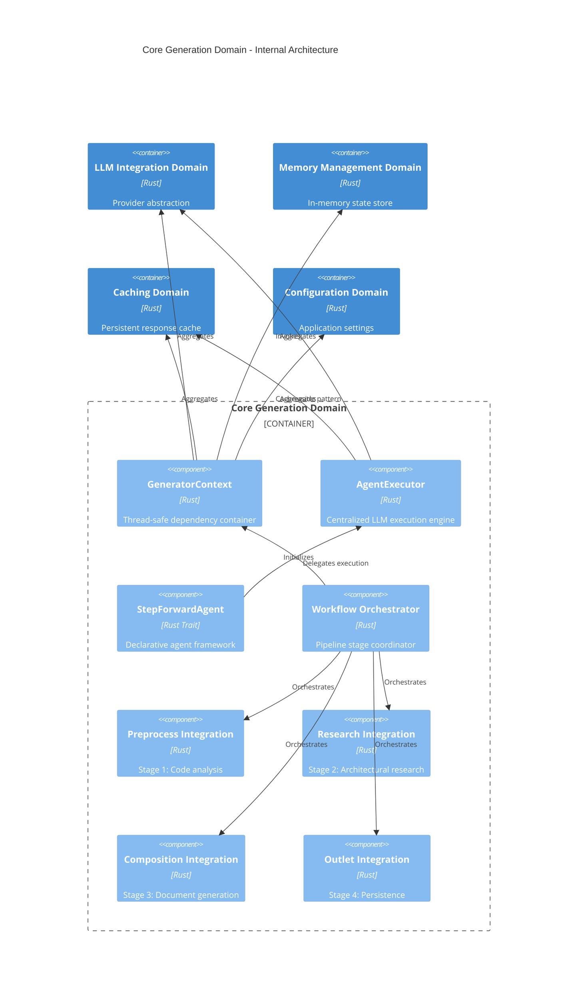
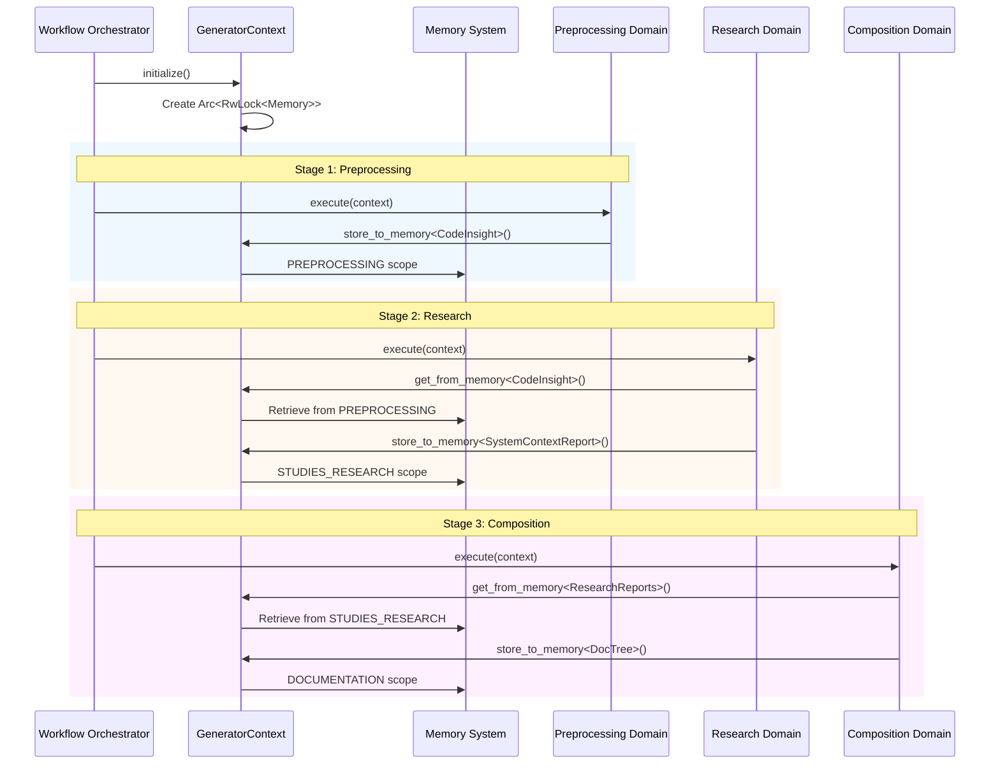

**Technical Documentation: Core Generation Domain**

**Document Information**
- **Module**: `generator` (Core Generation Domain)
- **Version**: 1.0
- **Last Updated**: 2026-02-01 06:42:05 (UTC)
- **Classification**: Architecture Documentation

---

## 1. Executive Overview

The **Core Generation Domain** serves as the central nervous system of the deepwiki-rs documentation generation engine. Located within `src/generator/`, this domain implements the orchestration layer that coordinates the end-to-end AI-powered documentation pipeline, from initial code analysis to final markdown generation.

As a **Core Business Domain** in the system's Domain-Driven Design (DDD) architecture, it bridges infrastructure concerns (LLM providers, caching, configuration) with domain-specific processing stages (Preprocessing, Research, Composition, Output). The domain implements sophisticated patterns including the **Context Pattern** for dependency injection, the **StepForwardAgent Trait Framework** for declarative AI agent definition, and the **Pipeline Orchestrator** for stage coordination.

### Key Architectural Characteristics
- **Thread-Safe Resource Management**: Uses `Arc<RwLock<T>>` patterns for concurrent access to shared resources across async boundaries
- **Dual Execution Models**: Supports both imperative (Preprocessing) and declarative (Research/Composition) agent execution patterns
- **Type-Safe Agent Framework**: Compile-time guarantees for agent outputs through associated types and JSON Schema validation
- **Intelligent Caching**: Cache-aside pattern implementation with token usage tracking and cost optimization
- **Multilingual Support**: Integrated internationalization with 8-language prompt generation capabilities

---

## 2. System Architecture

### 2.1 Component Structure

The Core Generation Domain consists of four primary submodules organized around specific responsibilities:



### 2.2 Design Patterns

#### Context Pattern Implementation
The `GeneratorContext` (defined in `src/generator/context.rs`) implements the **Context Pattern** to provide a unified, thread-safe dependency container:

```rust
pub struct GeneratorContext {
    pub config: Config,
    pub llm_client: Arc<LLMClient>,
    pub cache_manager: Arc<RwLock<CacheManager>>,
    pub memory: Arc<RwLock<Memory>>,
    pub knowledge_base: Option<Arc<KnowledgeBase>>,
}
```

**Key Design Decisions:**
- **Arc<RwLock<T>>**: Enables shared ownership with interior mutability, critical for concurrent agent execution
- **Aggregation over Inheritance**: Explicitly composes infrastructure services rather than inheriting behavior
- **Type-Safe Memory Operations**: Provides generic `store_to_memory<T>` and `get_from_memory<T>` methods ensuring compile-time type safety for inter-agent communication

#### Dual Agent Execution Model
The domain supports two distinct agent execution paradigms:

1. **Imperative Pattern** (Preprocessing): Direct utilization of `AgentExecutor` for data transformation tasks requiring fine-grained control over execution flow
2. **Declarative Pattern** (Research/Composition): Implementation of `StepForwardAgent` trait for research and synthesis tasks, enabling data-source-driven agent configuration with configurable prompts and memory scopes

---

## 3. Core Components

### 3.1 GeneratorContext (Dependency Container)

**Location**: `src/generator/context.rs`  
**Classification**: Infrastructure Adapter + Dependency Injection Container

**Responsibilities:**
- Aggregates and provides thread-safe access to infrastructure services (LLM, Cache, Memory)
- Implements memory operation facade with typed storage/retrieval
- Loads and integrates external knowledge bases via `KnowledgeSyncer`
- Provides configuration access for runtime parameters

**Thread Safety Model:**
All shared resources utilize `Arc<RwLock<T>>` to support concurrent agent execution while preventing data races:
- `Arc` enables multiple agents to share ownership of expensive resources (LLM client, cache)
- `RwLock` allows multiple concurrent readers (agent queries) while ensuring exclusive write access (cache updates, memory writes)

**External Knowledge Integration:**
```rust
pub async fn load_external_knowledge_by_categories(
    &self,
    categories: &[&str],
    target_agent: Option<&str>
) -> Option<String>
```
This method enables RAG-style (Retrieval-Augmented Generation) context injection, allowing research agents to query synchronized documentation repositories by category (architecture, database, API, ADR).

### 3.2 StepForwardAgent Framework

**Location**: `src/generator/step_forward_agent.rs`  
**Classification**: Trait-Based Abstraction Layer

The **StepForwardAgent** trait provides a complete infrastructure for defining LLM-powered agents through declarative configuration rather than imperative code. This framework enables rapid development of new research and composition agents.

**Core Trait Definition:**
```rust
#[async_trait]
pub trait StepForwardAgent {
    type Output: JsonSchema + Deserialize + Serialize + Send + Sync + 'static;
    
    fn agent_type(&self) -> String;
    fn agent_type_enum(&self) -> Option<AgentType>;
    fn data_config(&self) -> AgentDataConfig;
    fn prompt_template(&self, lang: TargetLanguage) -> String;
    fn llm_call_mode(&self) -> LLMCallMode;
    fn post_process(&self, result: &Self::Output) -> anyhow::Result<()>;
    fn should_include_timestamp(&self) -> bool;
    fn provide_custom_prompt_content(&self) -> Option<String>;
    
    async fn execute(&self, ctx: Arc<GeneratorContext>) -> anyhow::Result<Self::Output>;
}
```

**Key Architectural Elements:**

#### DataSource Abstraction
The `DataSource` enum decouples agents from specific data retrieval mechanisms:
- `MemoryData`: Retrieves preprocessing results (CodeInsights, ProjectStructure) from memory scopes
- `ResearchResult`: Accesses previous research outputs (SystemContextReport, DomainModulesReport)
- `ExternalKnowledgeByCategory`: Queries external documentation repositories

#### Intelligent DataFormatter
Automates content preparation for LLM consumption:
- **Hierarchical Formatting**: Structures complex data types (Vec<CodeInsight>, HashMap dependencies) into LLM-optimized text representations
- **Adaptive Truncation**: Applies intelligent truncation when content exceeds token limits, preserving critical structural information
- **Smart Compression**: Utilizes `PromptCompressor` to optimize content density while maintaining semantic meaning

#### GeneratorPromptBuilder
Constructs multilingual prompts with:
- Template-based prompt construction using Tera-style syntax
- Automatic timestamp injection (when `should_include_timestamp()` returns true)
- Language-specific instruction sets based on `TargetLanguage` configuration
- Dynamic content injection via `provide_custom_prompt_content()`

#### LLMCallMode Strategy Pattern
Controls invocation strategy:
- `Extract`: Structured JSON extraction with schema validation (for research agents)
- `Prompt`: Simple text generation (for composition editors)
- `PromptWithTools`: ReAct pattern execution with tool access (for analysis requiring file system exploration)

**Execution Lifecycle (7-Step Process):**
1. **Validation**: Verify required data sources availability
2. **Collection**: Gather data from memory, external knowledge, or preprocessing results
3. **Formatting**: Apply DataFormatter to prepare content for prompt context
4. **Prompt Building**: Construct final prompt with templates and metadata
5. **LLM Invocation**: Delegate to AgentExecutor based on LLMCallMode
6. **Result Storage**: Persist structured output to appropriate memory scope
7. **Post-Processing**: Execute side effects (logging, metrics, validation)

### 3.3 AgentExecutor (Execution Engine)

**Location**: `src/generator/agent_executor.rs`  
**Classification**: Infrastructure Service

The **AgentExecutor** provides centralized, optimized execution of LLM operations with three distinct execution modes:

#### 1. Simple Prompt Execution
```rust
pub async fn prompt(&self, sys_prompt: &str, user_prompt: &str, ...) -> Result<String>
```
Direct text generation with automatic caching and token estimation.

#### 2. Tool-Augmented Execution (ReAct)
```rust
pub async fn prompt_with_tools(
    &self,
    sys_prompt: &str,
    user_prompt: &str,
    tools: Vec<ToolDefinition>,
    ...

) -> Result<String>
```
Implements the ReAct (Reasoning and Acting) pattern, enabling agents to:
- Invoke file exploration tools (`FileExplorerTool`, `FileReaderTool`)
- Execute time-aware operations
- Perform multi-step reasoning with tool feedback loops

#### 3. Structured Extraction
```rust
pub async fn extract<T>(
    &self,
    sys_prompt: &str,
    user_prompt: &str,
    max_retries: u32,
    ...
) -> Result<T>
```
Type-safe JSON extraction with schema validation using `JsonSchema` derive macros.

**Cache-Aside Pattern Implementation:**
```rust
// Pseudocode of execution flow
async fn execute_with_cache(&self, params: AgentExecuteParams) -> Result<Response> {
    let cache_key = generate_md5_key(&params);
    
    // Check cache
    if let Some(cached) = self.cache.get(&cache_key).await {
        return Ok(cached);
    }
    
    // Execute LLM call
    let response = self.llm_client.call(params).await?;
    
    // Store with token metadata
    self.cache.set_with_tokens(cache_key, response).await?;
    Ok(response)
}
```

**Performance Optimizations:**
- **Token Estimation**: Pre-flight token counting using `estimate_token_usage()` to prevent API quota exhaustion
- **Multilingual Feedback**: Console output respects `config.target_language` for localized progress indicators
- **Retry Logic**: Automatic retry with exponential backoff for transient failures

### 3.4 Workflow Orchestrator

**Location**: `src/generator/workflow.rs`  
**Classification**: Process Coordinator

The **Workflow Orchestrator** implements the **Pipeline Pattern** to coordinate the four-stage documentation generation process:

**Pipeline Stages:**
1. **Knowledge Synchronization** (Optional): Sync external documentation repositories
2. **Preprocessing**: Static code analysis and AI-powered classification
3. **Research**: Multi-agent architectural analysis (C1-C4 abstraction levels)
4. **Composition**: Markdown documentation generation
5. **Output**: File persistence and summary generation

**Timing Metrics Collection:**
```rust
struct TimingScope {
    key: TimingKeys,  // Preprocess, Research, Analysis, Document, Outlet
    start: Instant,
}
```
Collects performance metrics for each stage, storing results in memory for final summary generation.

**Error Boundaries:**
Each stage operates as an independent unit of work with:
- Stage-specific error contexts
- Partial failure handling (skipping individual files vs. failing entire pipeline)
- Graceful degradation (continuing without external knowledge if sync fails)

---

## 4. Data Flow Architecture

The Core Generation Domain implements a **unidirectional data flow** with explicit state transitions between pipeline stages:

### 4.1 Memory Scope Management

Data flows through three distinct memory scopes, ensuring clean separation between processing stages:

| Scope | Producer | Consumer | Data Types | Lifecycle |
|-------|----------|----------|------------|-----------|
| **PREPROCESSING** | PreProcessAgent | Research Agents | `Vec<CodeInsight>`, `ProjectStructure` | Cleared after Research |
| **STUDIES_RESEARCH** | ResearchOrchestrator | DocumentationComposer | `SystemContextReport`, `DomainModulesReport`, `ArchitectureReport` | Cleared after Composition |
| **DOCUMENTATION** | DocumentationComposer | DiskOutlet | `DocTree`, `MarkdownContent` | Cleared after Output |

### 4.2 Inter-Domain Communication Sequence



**Data Integrity Mechanisms:**
- **Type Safety**: Generic memory operations ensure compile-time verification of stored/retrieved types
- **Scope Isolation**: Each scope acts as a logical boundary preventing accidental cross-stage data pollution
- **Explicit Contracts**: Agents declare required data sources through `AgentDataConfig`, validated before execution

---

## 5. Integration Patterns

### 5.1 Dependency Relationships

The Core Generation Domain sits at the center of the architecture, depending on infrastructure domains while orchestrating business domains:

**Upstream Dependencies (Infrastructure):**
- **Configuration Management**: Project settings, LLM provider credentials, execution parameters
- **LLM Integration**: AI model abstraction, API client, ReAct capabilities
- **Caching Domain**: Response caching with MD5-based keys and TTL management
- **Memory Management**: In-memory state persistence across async boundaries
- **Internationalization**: Multilingual console output and prompt generation
- **Knowledge Integration**: External document ingestion and RAG retrieval

**Downstream Orchestration (Business Domains):**
- **Preprocessing Domain**: Receives execution context, triggers 6-step analysis pipeline
- **Research Domain**: Coordinates 8 specialized agents with staged execution
- **Composition Domain**: Orchestrates 6 editor agents for documentation generation
- **Output Domain**: Triggers final persistence and post-processing

### 5.2 Extension Points

The architecture provides several extension mechanisms for customizing behavior:

#### Custom Agent Development
To implement a new research agent:
1. Implement `StepForwardAgent` trait with associated `Output` type
2. Define `AgentDataConfig` specifying required memory inputs
3. Provide prompt templates for supported languages
4. Select appropriate `LLMCallMode` (Extract for structured data, Prompt for text)
5. Implement `post_process()` for validation or side effects

#### Workflow Customization
The pipeline supports conditional execution:
- **Knowledge Sync**: Skipped if no external knowledge base configured
- **Database Analysis**: Conditional execution based on presence of SQL files
- **Language-Specific Processing**: Dynamic dispatch based on project file extensions

---

## 6. Implementation Details

### 6.1 Concurrency Model

**Async Runtime**: Built on Tokio, utilizing `async/await` for non-blocking I/O operations.

**Concurrency Control**:
- **Seamaphore-Based Limiting**: Preprocessing and Research stages use `utils::threads` for controlled parallelism, preventing resource exhaustion when analyzing large codebases
- **Read-Write Locking**: Memory and Cache use `RwLock` to allow concurrent reads during research while ensuring exclusive write access

**Safety Guarantees**:
- **Send + Sync Bounds**: All types crossing thread boundaries implement required marker traits
- **Arc for Shared State**: Prevents use-after-free when multiple agents reference the same context

### 6.2 Type Safety and Validation

**JSON Schema Validation**:
All agent outputs implementing `StepForwardAgent` must satisfy:
```rust
type Output: JsonSchema + Deserialize + Serialize + Send + Sync + 'static;
```
This ensures:
- Runtime validation against JSON Schema during LLM extraction
- Type-safe deserialization with Serde
- Compile-time thread safety verification

**Cache Key Generation**:
Uses MD5 hashing of prompt content + operation type to generate deterministic cache keys, with collision resistance suitable for the expected volume of operations.

### 6.3 Error Handling Strategy

**Layered Error Context**:
- **anyhow**: Used for error propagation with context (e.g., `context("Failed to execute research agent")?`)
- **thiserror**: Domain-specific error enums for recoverable failures
- **Graceful Degradation**: External knowledge sync failures don't halt the pipeline; the system continues with code-only analysis

---

## 7. Usage Examples

### 7.1 Defining a Custom Research Agent

```rust
use crate::generator::step_forward_agent::{
    StepForwardAgent, AgentDataConfig, DataSource, LLMCallMode
};
use crate::types::research::SecurityAnalysisReport;
use schemars::JsonSchema;

pub struct SecurityAnalyzer;

#[async_trait]
impl StepForwardAgent for SecurityAnalyzer {
    type Output = SecurityAnalysisReport;
    
    fn agent_type(&self) -> String {
        "security_analyzer".to_string()
    }
    
    fn data_config(&self) -> AgentDataConfig {
        AgentDataConfig {
            required_sources: vec![
                DataSource::MemoryData(DataSource::CODE_INSIGHTS),
                DataSource::MemoryData(DataSource::PROJECT_STRUCTURE),
            ],
            optional_sources: vec![],
        }
    }
    
    fn llm_call_mode(&self) -> LLMCallMode {
        LLMCallMode::Extract  // Structured JSON output
    }
    
    fn prompt_template(&self, lang: TargetLanguage) -> String {
        format!(
            "Analyze the following code for security vulnerabilities...\n\
             Language: {}\n\
             Context: {{source_0}}\n\
             Structure: {{source_1}}",
            lang.as_str()
        )
    }
    
    async fn execute(&self, ctx: Arc<GeneratorContext>) -> anyhow::Result<Self::Output> {
        // Framework handles data loading, prompt construction, and LLM invocation
        self.run_standard_execution(ctx).await
    }
}
```

### 7.2 Executing the Workflow

```rust
use crate::generator::workflow::Workflow;
use crate::config::Config;

async fn generate_documentation(config: Config) -> anyhow::Result<()> {
    // Initialize workflow with configuration
    let workflow = Workflow::new(config);
    
    // Execute full pipeline
    workflow.execute().await?;
    
    Ok(())
}
```

---

## 8. Performance Considerations

### 8.1 Optimization Strategies

**Intelligent Caching**:
- LLM responses cached at the `AgentExecutor` level using MD5 keys
- Cache-aside pattern minimizes redundant API calls for identical prompts
- Token usage tracking enables cost analysis and budget planning

**Prompt Compression**:
- `DataFormatter` applies `PromptCompressor` when content approaches token limits
- Hierarchical truncation preserves structural relationships while reducing size
- Compression results themselves cached to avoid reprocessing

**Parallel Execution**:
- Research agents execute with controlled parallelism where dependencies permit
- Preprocessing uses parallel file analysis with semaphore-based throttling
- Composition editors process independent sections concurrently

### 8.2 Resource Management

**Memory Scopes**:
Explicit clearing of memory scopes after stage completion prevents unbounded memory growth during long-running pipelines:
```rust
// After Research stage completes
memory.clear_scope(MemoryScope::PREPROCESSING).await?;
```

**Connection Pooling**:
The `LLMClient` maintains connection pools for HTTP-based providers (OpenAI, Ollama), reducing connection establishment overhead.

---

## 9. Best Practices

### 9.1 Extending the Framework

When implementing new agents:
1. **Prefer Declarative**: Use `StepForwardAgent` for research/composition tasks; reserve imperative `AgentExecutor` use for preprocessing data transformation
2. **Type Safety**: Always define concrete `Output` types with `JsonSchema` derive to enable automatic validation
3. **Error Context**: Use `.context()` from anyhow to provide meaningful error messages indicating which agent failed
4. **Data Minimization**: Specify only required data sources in `AgentDataConfig` to minimize context window usage and costs

### 9.2 Debugging and Observability

**Logging Integration**:
The framework provides structured logging at each lifecycle step:
- Data source retrieval status
- Prompt compression ratios
- Cache hit/miss statistics
- LLM API latency

**Performance Profiling**:
Use the built-in `TimingScope` to measure custom operations:
```rust
let _timing = TimingScope::new(TimingKeys::CustomOperation);
// ... your code ...
// Automatically records duration on drop
```

---

## 10. Conclusion

The Core Generation Domain represents a sophisticated orchestration layer that balances **flexibility** (through trait-based agent definitions) with **reliability** (through type-safe execution and comprehensive error handling). By abstracting LLM interactions behind the `AgentExecutor`, standardizing agent definitions via `StepForwardAgent`, and managing complex state through `GeneratorContext`, the domain enables rapid development of new documentation generation capabilities while maintaining system integrity.

The architecture's emphasis on **unidirectional data flow**, **explicit memory scopes**, and **declarative agent configuration** makes it particularly well-suited for long-running, multi-stage AI pipelines where intermediate results must be preserved and shared across different processing contexts.

**Key Takeaways:**
- The Context Pattern with `Arc<RwLock<T>>` provides thread-safe dependency injection suitable for concurrent AI agent execution
- The StepForwardAgent trait framework enables declarative agent definition with compile-time type safety
- Cache-aside pattern at the AgentExecutor level significantly reduces API costs and improves performance
- Memory scopes provide clean data boundaries between pipeline stages, preventing state pollution

---

**Document Maintenance:**
- **Review Cycle**: Quarterly or upon major feature addition
- **Stakeholders**: Architecture Team, Core Contributors, Platform Engineers
- **Validation**: Ensure alignment with `src/generator/*.rs` source code

**End of Document**