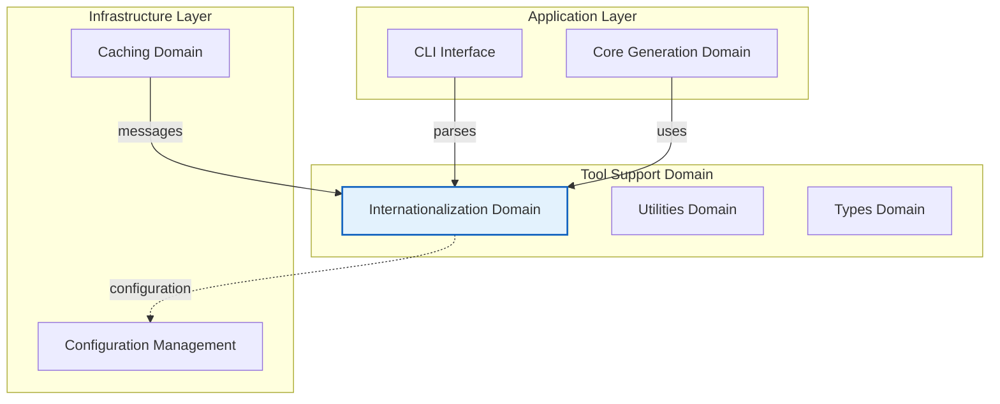
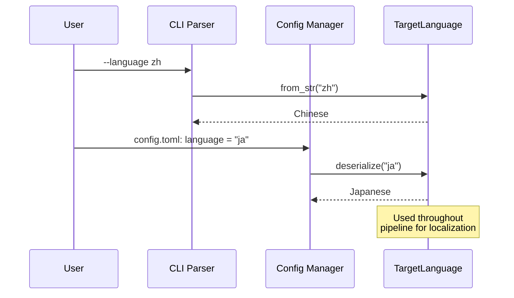

**Internationalization Domain Technical Documentation**

**Version:** 1.0  
**Domain Type:** Tool Support Domain  
**Confidence Score:** 0.92 (High)  
**Classification:** Internal Documentation

---

## 1. Executive Summary

The **Internationalization Domain** (i18n) serves as the central localization hub for the deepwiki-rs documentation generation system. Implemented as a compact, single-file module (`src/i18n.rs`), it provides comprehensive multi-language support across **8 languages** through a strongly-typed Rust enum architecture.

The domain delivers three primary categories of functionality: (1) **Language Metadata Management** for AI prompt localization and display rendering; (2) **File System Localization** for generating culturally-appropriate directory structures and document filenames; and (3) **Console Message Internationalization** providing standardized, emoji-indicated user feedback across all supported locales.

By leveraging Rust's type system and Serde serialization, the domain ensures compile-time guarantees for language coverage while maintaining zero-cost abstractions for runtime performance.

---

## 2. Architectural Positioning

### 2.1 Domain Context

Within the system's Domain-Driven Design architecture, the Internationalization Domain resides in the **Tool Support Domain** layer, providing cross-cutting localization capabilities to higher-level business domains.



### 2.2 Domain Dependencies

The Internationalization Domain maintains minimal dependencies, functioning as a shared kernel component:

**Consumers of this Domain:**
- **Core Generation Domain**: Uses for localized output paths and AI prompt language injection
- **Configuration Management Domain**: Depends on for parsing language codes from config files
- **Caching Domain**: Uses for bilingual performance monitoring messages
- **CLI Interface**: Uses for language argument parsing and console output

**Dependencies:**
- **Serde**: For bidirectional serialization/deserialization
- **Standard Library**: `std::fmt::Display`, `std::str::FromStr`, `std::default::Default`

---

## 3. Core Design & Implementation

### 3.1 Type System Architecture

The domain centers on a single exhaustive enum `TargetLanguage` implementing multiple Rust traits for seamless integration across the application stack.

```rust
#[derive(Debug, Deserialize, Serialize, Clone, PartialEq)]
pub enum TargetLanguage {
    #[serde(rename = "zh")]
    Chinese,
    #[serde(rename = "en")]
    English,
    #[serde(rename = "ja")]
    Japanese,
    #[serde(rename = "ko")]
    Korean,
    #[serde(rename = "de")]
    German,
    #[serde(rename = "fr")]
    French,
    #[serde(rename = "ru")]
    Russian,
    #[serde(rename = "vi")]
    Vietnamese,
}
```

### 3.2 Trait Implementations

| Trait | Purpose | Implementation Detail |
|-------|---------|---------------------|
| **Default** | Fallback language | Returns `English` as system default |
| **Display** | String serialization | Outputs ISO 639-1 codes (e.g., "zh", "en") |
| **FromStr** | Parsing flexibility | Accepts language codes, English names, or native names case-insensitively |
| **Serialize/Deserialize** | Configuration integration | Uses Serde rename attributes for JSON/TOML mapping |

### 3.3 Language Support Matrix

| Language | Code | Native Display | Prompt Instruction Support |
|----------|------|----------------|---------------------------|
| Chinese | `zh` | 中文 | Yes |
| English | `en` | English | Yes |
| Japanese | `ja` | 日本語 | Yes |
| Korean | `ko` | 한국어 | Yes |
| German | `de` | Deutsch | Yes |
| French | `fr` | Français | Yes |
| Russian | `ru` | Русский | Yes |
| Vietnamese | `vi` | Tiếng Việt | Yes |

---

## 4. Functional Capabilities

### 4.1 Language Metadata Services

**Display Name Localization**
```rust
pub fn display_name(&self) -> &'static str
```
Returns the language name in its native script (e.g., "日本語" for Japanese) for UI rendering and user selection interfaces.

**AI Prompt Localization**
```rust
pub fn prompt_instruction(&self) -> &'static str
```
Provides language-specific instructions injected into LLM prompts to ensure documentation generation respects the target language's grammatical structure and technical writing conventions.

### 4.2 File System Localization

The domain generates culturally-appropriate directory structures and filenames that follow localized naming conventions:

**Directory Name Generation**
```rust
pub fn get_directory_name(&self, dir_type: &str) -> String
```

**Localized Directory Examples:**

| Directory Type | English | Chinese | Japanese |
|----------------|---------|---------|----------|
| Overview | `1.Overview` | `1、项目概述` | `1.プロジェクト概要` |
| Architecture | `2.System-Architecture` | `2、系统架构` | `2.システムアーキテクチャ` |
| Deep Exploration | `4.Deep-Exploration` | `4、深入探索` | `4.詳細分析` |

**Document Filename Generation**
```rust
pub fn get_doc_filename(&self, doc_type: &str) -> String
```

Generates localized filenames for documentation artifacts:
- **English**: `1.Overview.md`, `2.Architecture.md`
- **Chinese**: `1、项目概述.md`, `2、系统架构.md`
- **Japanese**: `1-プロジェクト概要.md`, `2-システムアーキテクチャ.md`

### 4.3 Console Message System

The domain provides **16+ standardized message templates** for system operations, ensuring consistent user experience across all supported languages. Each message includes appropriate emoji indicators for visual feedback.

**Message Categories:**

1. **Cache Operations**
   - `msg_cache_hit()`: "✅ Using cached AI analysis results"
   - `msg_cache_miss()`: "⌛ Cache miss, performing AI analysis"
   - `msg_cache_write()`: "💾 Caching AI analysis results"
   - `msg_cache_error()`: "❌ Cache operation failed"

2. **AI Analysis Status**
   - `msg_analyzing()`: "🤖 AI analyzing: {filename}"
   - `msg_ai_insights()`: "🤖 AI research insights"

3. **Configuration & Warnings**
   - `msg_config_not_found()`: "⚠️ Configuration file not found, using defaults"
   - `msg_mermaid_fixer_not_found()`: "⚠️ Mermaid fixer not found"

4. **File Operations**
   - `msg_file_read_error()`: "❌ Error reading file: {path}"
   - `msg_reading_file()`: "📄 Reading file: {filename}"

**Implementation Pattern:**
```rust
pub fn msg_cache_hit(&self) -> &'static str {
    match self {
        TargetLanguage::Chinese => "   ✅ 使用缓存的AI分析结果: {}",
        TargetLanguage::English => "   ✅ Using cached AI analysis result: {}",
        TargetLanguage::Japanese => "   ✅ キャッシュされたAI分析結果を使用: {}",
        // ... exhaustive match for all 8 languages
    }
}
```

---

## 5. Integration Patterns

### 5.1 Configuration Integration

The `FromStr` implementation enables flexible language specification through CLI arguments and configuration files:

```rust
// Accepts multiple input formats:
"zh" | "chinese" | "中文" → TargetLanguage::Chinese
"en" | "english" | "english" → TargetLanguage::English
"ja" | "japanese" | "日本語" → TargetLanguage::Japanese
```

**Configuration Flow:**


### 5.2 AI Service Integration

The `prompt_instruction()` method injects language directives into LLM prompts:

```rust
impl TargetLanguage {
    pub fn prompt_instruction(&self) -> &'static str {
        match self {
            TargetLanguage::Chinese => "请使用中文编写文档...",
            TargetLanguage::English => "Please write documentation in English...",
            TargetLanguage::Japanese => "日本語でドキュメントを作成してください...",
            // ...
        }
    }
}
```

### 5.3 Output Generation Integration

The Core Generation Domain and Output Domain utilize filesystem localization methods to create language-specific documentation trees:

```rust
// Example: Generating localized output structure
let lang = TargetLanguage::Chinese;
let dir = lang.get_directory_name("architecture"); // "2、系统架构"
let filename = lang.get_doc_filename("overview");  // "1、项目概述.md"
```

---

## 6. Technical Characteristics

### 6.1 Complexity Analysis

**Cyclomatic Complexity:** 54 (High)  
The high complexity stems from exhaustive `match` expressions across 8 language variants for 16+ message methods. This is an intentional trade-off favoring:

- **Compile-time exhaustiveness checking**: Rust compiler ensures all languages are handled
- **Zero runtime overhead**: Static string literals with no heap allocation
- **Type safety**: Invalid language states are unrepresentable

### 6.2 Performance Characteristics

| Metric | Value | Notes |
|--------|-------|-------|
| **Memory Footprint** | ~10KB | Static string literals only |
| **Runtime Cost** | O(1) | Enum variant matching |
| **Allocation** | Zero | Returns `&'static str` references |
| **Serialization** | O(1) | Serde derive macros |

### 6.3 Maintenance Considerations

**Adding New Languages:**
1. Add variant to `TargetLanguage` enum with `#[serde(rename = "code")]`
2. Implement match arm in **all** message methods (enforced by compiler)
3. Add parsing logic to `FromStr` implementation
4. Update display name and prompt instruction methods

**Adding New Messages:**
1. Define new `msg_*` method
2. Implement exhaustive match expression for all 8 languages
3. Include appropriate emoji indicator for visual consistency

### 6.4 Constraints & Limitations

1. **Static Compilation**: Languages are compile-time constants; runtime language addition is not supported
2. **String Literals Only**: All translations must be known at compile time (no external i18n files)
3. **High Cyclomatic Complexity**: Changes require modifying multiple match arms, increasing PR complexity
4. **No Pluralization**: Current design does not handle complex plural rules for languages with multiple plural forms

---

## 7. Usage Examples

### 7.1 CLI Argument Parsing

```rust
use std::str::FromStr;

let lang = TargetLanguage::from_str("ja")
    .unwrap_or_default(); // Falls back to English if invalid

println!("Selected language: {}", lang.display_name()); // "日本語"
```

### 7.2 Configuration File Deserialization

```rust
use serde::Deserialize;

#[derive(Deserialize)]
struct Config {
    language: TargetLanguage, // Automatically handles "zh", "en", etc.
}

// TOML: language = "de" → TargetLanguage::German
```

### 7.3 Localized File Path Generation

```rust
fn generate_doc_path(lang: &TargetLanguage, doc_type: &str) -> PathBuf {
    let dir = lang.get_directory_name("deep_exploration");
    let filename = lang.get_doc_filename("key_modules");
    
    PathBuf::from(dir).join(filename)
}

// Chinese: "4、深入探索/4、核心模块.md"
// English: "4.Deep-Exploration/4.Key-Modules.md"
// Japanese: "4.詳細分析/4-主要モジュール.md"
```

### 7.4 Console Output with Localization

```rust
impl GeneratorContext {
    pub fn log_cache_hit(&self, key: &str) {
        let msg = self.config.language.msg_cache_hit();
        println!(msg, key); // Automatically localized with emoji
    }
}
```

---

## 8. Testing Strategy

Given the exhaustive nature of the enum, testing focuses on:

1. **Serialization Round-trip**: Ensure `serialize(deserialize(x)) == x` for all 8 languages
2. **FromStr Parsing**: Verify case-insensitive parsing of codes, English names, and native names
3. **Filename Generation**: Validate filename format compliance for each language's conventions
4. **Message Completeness**: Static analysis to ensure all `msg_*` methods handle all variants

---

## 9. Appendix: Glossary

| Term | Definition |
|------|-----------|
| **TargetLanguage** | Central enum representing supported localization targets |
| **Static String** | Compile-time string literal stored in binary read-only data segment |
| **Serde** | Rust serialization framework (Serialize/Deserialize traits) |
| **Emoji Indicator** | Visual prefix (⚠️, ✅, 🤖) providing immediate status recognition |
| **Prompt Instruction** | Language directive injected into LLM system prompts |

---

**Document Control:**
- **Module Path:** `src/i18n.rs`
- **Domain Classification:** Tool Support Domain
- **Confidence Score:** 0.92 (High)
- **Review Cycle:** Upon addition of new supported languages or message templates

**End of Document**