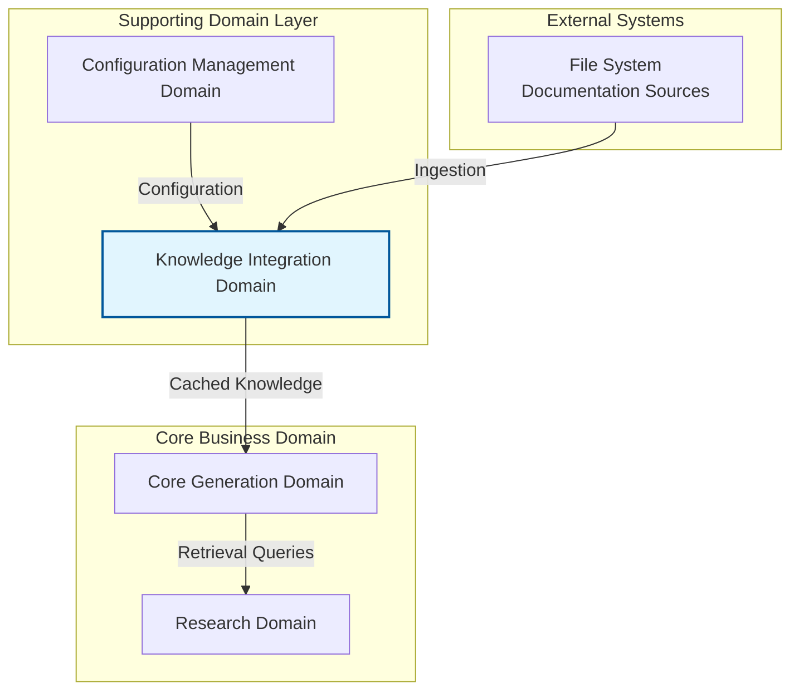
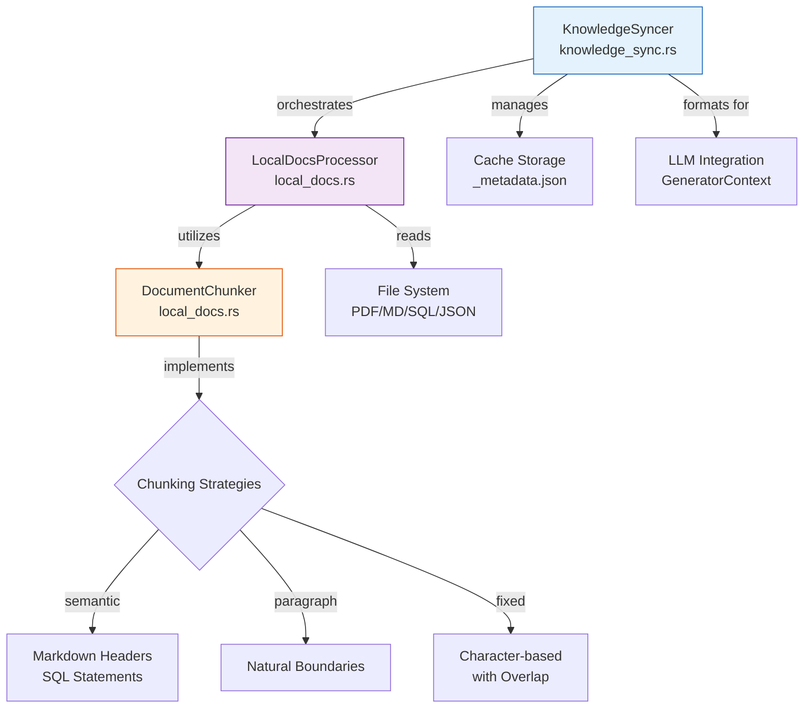
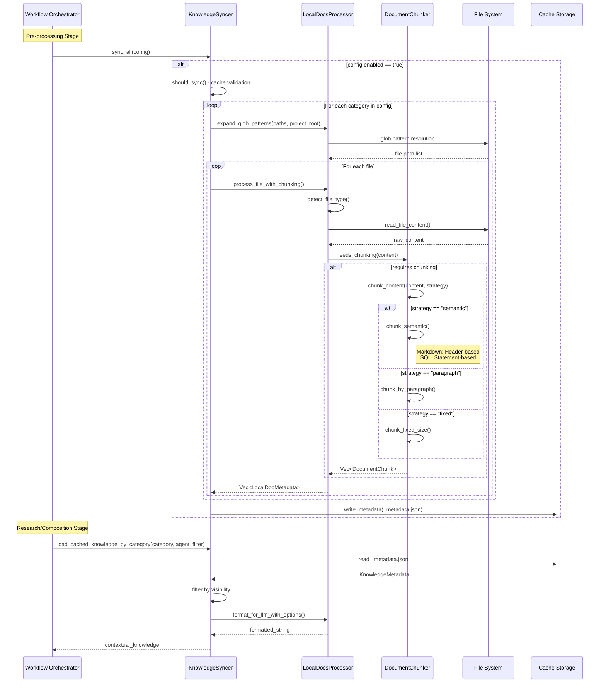

**Knowledge Integration Domain Technical Documentation**

**Version:** 1.0  
**Last Updated:** 2026-02-01 06:40:13 (UTC)  
**System:** deepwiki-rs  
**Classification:** Tool Support Domain

---

## 1. Executive Overview

The **Knowledge Integration Domain** provides a comprehensive external knowledge ingestion and retrieval system that bridges local documentation sources with AI/LLM consumption within the deepwiki-rs architecture. Operating as a **Tool Support Domain**, this module implements a Retrieval-Augmented Generation (RAG) style pipeline that enables the documentation generation system to leverage existing technical documentation, architecture decision records (ADRs), API specifications, and database schemas.

### 1.1 Primary Capabilities

| Capability | Description | Business Value |
|------------|-------------|----------------|
| **Multi-Format Ingestion** | Processes PDF, Markdown, SQL, YAML, JSON, and plain text files | Leverages existing documentation assets without format conversion |
| **Intelligent Chunking** | Semantic, paragraph, and fixed-size chunking strategies | Prevents LLM context window overflow while maintaining document coherence |
| **Incremental Synchronization** | File modification time tracking and HashSet-based change detection | Minimizes API costs by avoiding unnecessary reprocessing |
| **Agent-Based Access Control** | Fine-grained document targeting to specific AI agents | Enables secure knowledge compartmentalization |
| **Categorized Organization** | Taxonomy-based document classification (architecture, database, API, ADR, workflow, deployment, general) | Context-aware retrieval for specialized research agents |

### 1.2 System Position

Within the Domain-Driven Design architecture of deepwiki-rs, the Knowledge Integration Domain resides in the **Supporting Domain Layer**, providing infrastructure capabilities to the **Core Generation Domain**. It interfaces with the Configuration Management Domain for path resolution and the Memory Management Domain for cached knowledge retrieval during agent execution.



---

## 2. Architecture & Components

The domain follows a modular pipeline architecture consisting of three primary components that orchestrate the flow from raw documentation files to LLM-optimized knowledge segments.

### 2.1 Component Architecture



### 2.2 Core Components

#### 2.2.1 KnowledgeSyncer
Central orchestrator responsible for the synchronization lifecycle:
- **Change Detection**: Compares file modification times (`mtime`) against `last_synced` timestamps and detects file additions/removals via HashSet symmetric difference
- **Metadata Persistence**: Manages `KnowledgeMetadata` JSON serialization to `_metadata.json`
- **Agent Filtering**: Implements `doc_visible_to_agent()` for access control based on `target_agents` configuration
- **Categorized Retrieval**: Provides `load_cached_knowledge_by_category()` for domain-specific knowledge injection

#### 2.2.2 LocalDocsProcessor
Static utility struct handling file system operations and content transformation:
- **Glob Resolution**: Expands glob patterns relative to project base paths using `fs::canonicalize` for path normalization
- **Multi-Format Extraction**: 
  - PDF processing via `pdf_extract` crate
  - Text-based formats (Markdown, SQL, YAML, JSON, Text) via standard file I/O
- **LLM Formatting**: `format_for_llm_with_options()` generates structured output with headers, timestamps, and chunk metadata optimized for context window consumption

#### 2.2.3 DocumentChunker
Encapsulates content segmentation strategies to manage LLM token constraints:
- **Configuration-Driven**: Accepts `ChunkingConfig` specifying size, overlap, and strategy parameters
- **Content-Aware Processing**: File type detection triggers specialized parsing:
  - **Markdown**: Hierarchical splitting by H1/H2/H3 headers
  - **SQL**: Statement boundary detection (CREATE, ALTER, DROP, INSERT, UPDATE, DELETE)
  - **Generic Text**: Fallback to paragraph or fixed-size strategies

---

## 3. Data Model

The domain maintains structured metadata to enable incremental synchronization and precise retrieval.

### 3.1 Core Data Structures

```rust
// KnowledgeMetadata: Top-level synchronization state
struct KnowledgeMetadata {
    last_synced: DateTime<Utc>,
    categories: HashMap<String, Vec<LocalDocMetadata>>
}

// LocalDocMetadata: Individual document tracking
struct LocalDocMetadata {
    file_path: PathBuf,
    file_type: String,
    modified_at: SystemTime,
    content: String,
    category: String,
    target_agents: Vec<String>,
    chunk_info: Vec<ChunkInfo>
}

// ChunkInfo: Segmentation metadata
struct ChunkInfo {
    chunk_index: usize,
    total_chunks: usize,
    section_context: Option<String>
}

// ChunkingConfig: Processing parameters
struct ChunkingConfig {
    strategy: ChunkingStrategy,  // Semantic | Paragraph | Fixed
    chunk_size: usize,
    chunk_overlap: usize
}
```

### 3.2 Storage Layout

```
{internal_cache_dir}/
└── knowledge/
    └── local_docs/
        ├── _metadata.json           # KnowledgeMetadata serialization
        ├── architecture/
        │   └── [document_chunks]
        ├── database/
        ├── api/
        └── ...
```

---

## 4. Processing Pipeline

### 4.1 Knowledge Synchronization Workflow

The synchronization process executes as an optional initial stage in the Documentation Generation Workflow, prior to Preprocessing.



### 4.2 Chunking Strategies

The system implements three distinct chunking algorithms tailored to content characteristics:

| Strategy | Use Case | Implementation Details |
|----------|----------|------------------------|
| **Semantic** | Structured documents (Markdown, SQL) | • Markdown: Splits at H1/H2/H3 headers preserving hierarchy<br/>• SQL: Splits at statement boundaries (CREATE/ALTER/DROP/INSERT/UPDATE/DELETE)<br/>• Context preservation via section headers |
| **Paragraph** | Natural language text | Splits on double newlines (`\n\n`) maintaining paragraph boundaries |
| **Fixed-Size** | Arbitrary binary or text content | Character-based segmentation with configurable overlap to maintain continuity |

---

## 5. Configuration Interface

The domain consumes configuration through the `LocalDocsConfig` structure, typically defined in the main application configuration TOML file.

### 5.1 Configuration Schema

```toml
[local_docs]
enabled = true
cache_dir = "target/.deepwiki/knowledge"
watch_for_changes = true

[[local_docs.categories]]
name = "architecture"
patterns = ["docs/arch/**/*.md", "docs/adr/*.md"]
target_agents = ["ArchitectureResearcher", "OverviewEditor"]

[[local_docs.categories]]
name = "database"
patterns = ["schema/*.sql", "migrations/**/*.sql"]
target_agents = ["DatabaseOverviewAnalyzer"]

[local_docs.chunking_config]
strategy = "semantic"
chunk_size = 4000
chunk_overlap = 200
```

### 5.2 Configuration Parameters

| Parameter | Type | Description | Default |
|-----------|------|-------------|---------|
| `enabled` | Boolean | Master toggle for knowledge integration | `false` |
| `cache_dir` | Path | Persistent storage location for processed documents | `{internal_path}/knowledge/local_docs/` |
| `watch_for_changes` | Boolean | Enable file system monitoring for incremental sync | `true` |
| `categories` | Array | Document taxonomies with glob patterns and agent targeting | Required |
| `chunking_config.strategy` | Enum | `semantic` \| `paragraph` \| `fixed` | `semantic` |
| `chunking_config.chunk_size` | Integer | Maximum characters per chunk | 4000 |
| `chunking_config.chunk_overlap` | Integer | Character overlap between chunks | 200 |

---

## 6. Integration Patterns

### 6.1 External Interfaces

**File System Interface**
- **Read Operations**: `fs::read_to_string`, `fs::metadata` for `mtime` tracking, `pdf_extract::extract_text_from_mem` for PDF binary processing
- **Path Resolution**: `fs::canonicalize` ensures consistent path comparison across platforms
- **Glob Expansion**: Pattern matching against project-relative paths

**LLM Integration Interface**
- **Retrieval API**: `load_cached_knowledge_by_category(category, agent_filter)` returns formatted strings optimized for prompt injection
- **Formatting**: Markdown headers include category display names, synchronization timestamps, and document counts to provide temporal context
- **Agent Scoping**: Documents filtered by `target_agents` vector to restrict sensitive or irrelevant knowledge

### 6.2 Internal Communication

| Source | Target | Interface | Purpose |
|--------|--------|-----------|---------|
| **KnowledgeSyncer** | **LocalDocsProcessor** | `process_file_with_chunking()` | File ingestion and segmentation |
| **KnowledgeSyncer** | **LocalDocsProcessor** | `expand_glob_patterns()` | Path resolution |
| **KnowledgeSyncer** | **Cache Storage** | JSON Serde serialization | Metadata persistence |
| **LocalDocsProcessor** | **DocumentChunker** | `ChunkingConfig` | Chunking parameter propagation |
| **Core Generation** | **KnowledgeSyncer** | `sync_all()`, `load_cached_*()` | Workflow coordination |

---

## 7. Implementation Specifications

### 7.1 Change Detection Algorithm

The system minimizes redundant processing through multi-layer change detection:

1. **Timestamp Comparison**: File `mtime` compared against `KnowledgeMetadata.last_synced`
2. **Set Difference Analysis**: Current file paths compared against cached paths using HashSet symmetric difference to detect additions/removals
3. **Path Normalization**: `fs::canonicalize` resolves symbolic links and relative paths for consistent comparison

### 7.2 File Type Detection

Auto-detection based on file extensions:
- `.pdf` → PDF processing pipeline
- `.md`, `.markdown` → Markdown semantic chunking
- `.sql` → SQL statement chunking
- `.yaml`, `.yml`, `.json` → Structured text with paragraph chunking
- `.txt` and others → Plain text processing

### 7.3 Concurrency & Safety

- **Thread Safety**: The `KnowledgeSyncer` operates within the `Arc<RwLock<T>>` context pattern of the Core Generation Domain
- **I/O Bound**: File processing is generally I/O bound; chunking operations are CPU-bound but operate on small text segments
- **Consistency**: Metadata writes are atomic (write-then-rename) to prevent corruption during interruption

---

## 8. Usage Examples

### 8.1 Synchronization Trigger

```rust
// Within Workflow Orchestrator
if config.local_docs.enabled {
    let syncer = KnowledgeSyncer::new(config.internal_path.clone());
    syncer.sync_all(&config.local_docs).await?;
}
```

### 8.2 Knowledge Retrieval for Agents

```rust
// Within Research Agent execution
let knowledge_base = context.knowledge_base.as_ref()?;
let architecture_context = knowledge_base
    .load_cached_knowledge_by_category("architecture", Some(agent_name))
    .await?;

let prompt = format!("{}\n\nContext:\n{}", base_prompt, architecture_context);
```

---

## 9. Performance Considerations

| Metric | Optimization Strategy | Impact |
|--------|---------------------|--------|
| **API Costs** | Aggressive caching of processed chunks; mtime-based invalidation | Reduces LLM token usage by reusing processed documentation |
| **Memory Usage** | Streaming file read for large PDFs; chunked processing | Prevents OOM errors with large document repositories |
| **Startup Time** | Parallel glob expansion and file processing | Amortized across documentation generation workflow |
| **Storage** | JSON compression; selective category sync | Configurable cache retention policies |

---

## 10. Appendix

### 10.1 Glossary

| Term | Definition |
|------|-----------|
| **RAG** | Retrieval-Augmented Generation; technique combining external knowledge retrieval with generative AI |
| **Semantic Chunking** | Content-aware splitting that respects document structure (headers, statements) |
| **Target Agent** | Specific AI agent authorized to access a particular knowledge category |
| **HashSet Symmetric Difference** | Mathematical operation identifying elements unique to either of two sets (used for file addition/removal detection) |

### 10.2 Dependencies

- `pdf_extract`: PDF text extraction
- `serde`: JSON serialization for metadata persistence
- `chrono`: UTC timestamp management
- Standard library: `std::fs`, `std::path`, `std::collections::HashSet`

---

**End of Document**