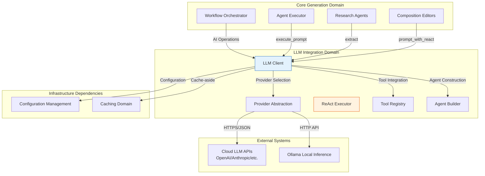
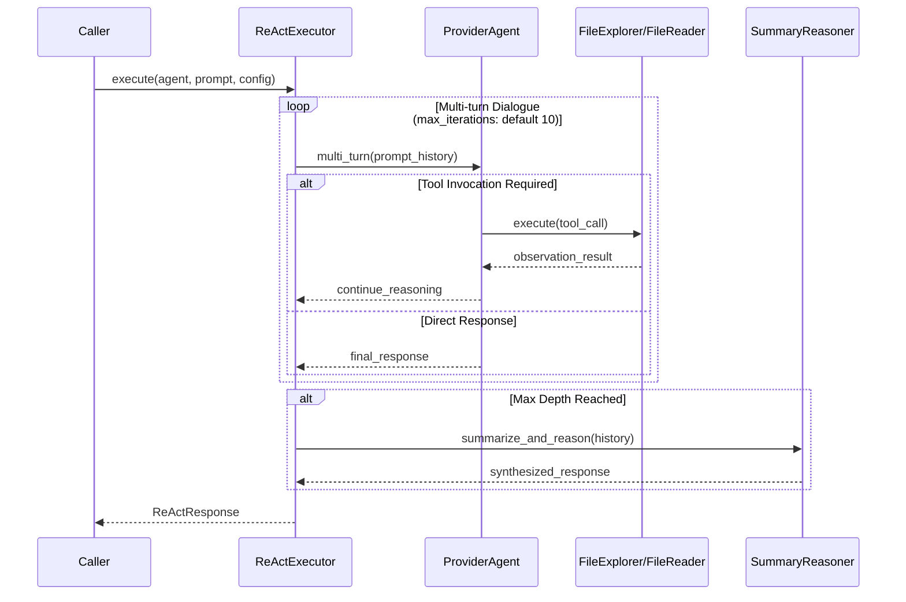
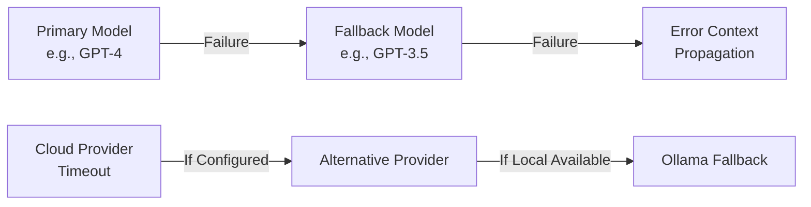
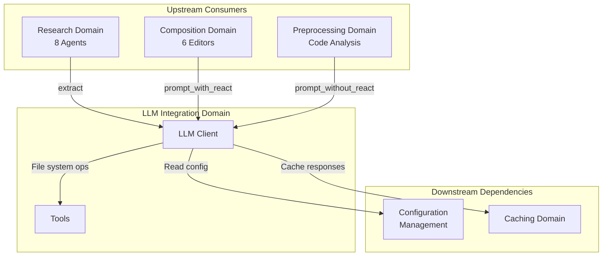

**LLM Integration Domain Technical Documentation**

**Version:** 1.0  
**Last Updated:** 2026-02-01 06:39:05 (UTC)  
**Classification:** Internal Technical Documentation  
**Scope:** Infrastructure Domain - Core AI Abstraction Layer

---

## 1. Executive Overview

The **LLM Integration Domain** provides the foundational AI abstraction layer for the deepwiki-rs documentation generation system. This domain encapsulates all interactions with Large Language Model (LLM) providers, implementing a unified interface over heterogeneous AI services while supporting advanced patterns such as ReAct (Reasoning + Acting), structured schema extraction, and tool-augmented dialogue.

### 1.1 Purpose and Responsibilities

- **Provider Abstraction**: Unifies 8 distinct LLM providers (OpenAI, Moonshot, DeepSeek, Mistral, OpenRouter, Anthropic, Gemini, and Ollama) behind common interfaces
- **Execution Patterns**: Supports simple prompt execution, multi-turn ReAct dialogues with tool integration, and type-safe structured extraction
- **Resilience**: Implements exponential backoff retry logic, automatic model fallback chains, and graceful degradation strategies
- **Cost Optimization**: Integrates with the Caching Domain to avoid redundant API calls and tracks token usage for cost estimation
- **Local Inference**: Provides specialized handling for Ollama deployments to enable air-gapped and privacy-sensitive environments

### 1.2 Domain Context



---

## 2. Architecture and Component Structure

The domain implements a layered architecture with clear separation between provider-specific implementations, execution patterns, and tool integrations.

### 2.1 Component Hierarchy

| Component | Location | Pattern | Responsibility |
|-----------|----------|---------|----------------|
| **LLMClient** | `src/llm/client/mod.rs` | Facade | Primary interface for all AI operations with retry and fallback logic |
| **ProviderClient** | `src/llm/client/providers.rs` | Adapter | Enum-based unification of 8 provider-specific clients |
| **AgentBuilder** | `src/llm/client/agent_builder.rs` | Builder | Constructs tool-augmented or bare agents with preset configurations |
| **ReActExecutor** | `src/llm/client/react_executor.rs` | Strategy | Implements multi-turn reasoning and acting loops with depth management |
| **Tool Registry** | `src/llm/tools/mod.rs` | Registry | File system and time-aware tools for agent augmentation |
| **OllamaExtractor** | `src/llm/client/ollama_extractor.rs` | Wrapper | Text-to-JSON conversion layer for local inference compatibility |

### 2.2 Provider Abstraction Architecture

The system uses a three-tier enum-based abstraction to hide provider heterogeneity:

```rust
// Unified interfaces across all providers
pub enum ProviderClient { /* 8 variants */ }
pub enum ProviderAgent { /* 8 variants */ }
pub enum ProviderExtractor<T> { /* 8 variants */ }
```

**Provider Support Matrix:**

| Provider | Structured Output | ReAct Tools | Fallback Support | Authentication |
|----------|------------------|-------------|------------------|----------------|
| OpenAI | Native | Yes | Yes | Bearer Token |
| Anthropic | Native | Yes | Yes | Bearer Token |
| Gemini | Native | Yes | Yes | API Key |
| Moonshot | Native | Yes | Yes | Bearer Token |
| DeepSeek | Native | Yes | Yes | Bearer Token |
| Mistral | Native | Yes | Yes | Bearer Token |
| OpenRouter | Native | Yes | Yes | Bearer Token |
| **Ollama** | **Emulated** | Yes | N/A | None (local) |

> **Note on Ollama**: Since Ollama lacks native JSON schema enforcement, the `OllamaExtractorWrapper` implements multi-strategy parsing (Markdown code block extraction, raw JSON parsing, regex extraction) with validation retry loops.

---

## 3. Core Components Deep Dive

### 3.1 LLMClient - The Primary Facade

The `LLMClient` struct serves as the central coordination point for all AI operations, implementing `Clone` for thread-safe sharing across async contexts.

**Key Capabilities:**

```rust
impl LLMClient {
    // Structured extraction with automatic retry and model fallback
    pub async fn extract<T: JsonSchema + DeserializeOwned>(
        &self,
        system_prompt: &str,
        user_prompt: &str
    ) -> Result<T, LLMError>;
    
    // Simple single-turn execution
    pub async fn prompt_without_react(
        &self,
        system_prompt: &str,
        user_prompt: &str
    ) -> Result<String, LLMError>;
    
    // Full ReAct execution with tool augmentation
    pub async fn prompt_with_react(
        &self,
        system_prompt: &str,
        user_prompt: &str,
        config: ReActConfig
    ) -> Result<ReActResponse, LLMError>;
}
```

**Resilience Mechanisms:**
- **Retry Logic**: All operations wrapped in `retry_with_backoff()` with configurable exponential backoff
- **Model Fallback**: Structured extraction automatically attempts secondary models on primary failure
- **Token Management**: Integrated token estimation for cost tracking and context window management
- **Caching**: Cache-aside pattern integration using MD5 hash keys of prompts

### 3.2 ReAct Execution Engine

The ReAct (Reasoning + Acting) implementation enables complex multi-step analysis workflows where agents can:
1. **Reason** about the current state and required actions
2. **Act** by invoking tools (file exploration, content reading)
3. **Observe** results and iterate until task completion

**Execution Flow:**



**Configuration Options:**
- `max_iterations`: Maximum reasoning steps (default: 10)
- `return_partial_on_max_depth`: Return accumulated results if limit reached (default: true)
- `enable_summary_reasoning`: Use summary agent when depth limit hit (default: true)

### 3.3 AgentBuilder - Construction Pattern

Provides factory methods for agent instantiation with appropriate tool configurations:

```rust
impl AgentBuilder {
    // Creates lightweight agent for simple reasoning tasks
    pub fn build_agent_without_tools(&self, system_prompt: &str) -> Agent;
    
    // Creates tool-augmented agent with file system capabilities
    pub fn build_agent_with_tools(&self, system_prompt: &str) -> Agent;
}
```

**Tool Preset Configuration:**
When `disable_preset_tools` is false, the builder automatically injects:
- **FileExplorer**: Directory traversal, glob pattern matching, file metadata inspection
- **FileReader**: Line-range reading, encoding detection, content extraction
- **Time**: Timestamp generation, UTC/local time queries for temporal context

### 3.4 Tool System

Tools implement the standard Rig `Tool` trait and enable agents to interact with the execution environment:

| Tool | Purpose | Key Operations |
|------|---------|----------------|
| **AgentToolFileExplorer** | File system navigation | `list_directory`, `search_files`, `get_file_metadata` |
| **AgentToolFileReader** | Content extraction | `read_file`, `read_lines`, `detect_encoding` |
| **AgentToolTime** | Temporal context | `current_timestamp`, `utc_now`, `local_time` |

**Tool Invocation Security:**
- All file operations respect `.gitignore` patterns and explicit exclusion lists
- Read-only access; no write or execute permissions granted to agents
- Path canonicalization prevents directory traversal attacks

---

## 4. Structured Extraction System

The domain provides type-safe JSON extraction using compile-time schema generation via `schemars`.

### 4.1 Schema-Aware Extraction

```rust
// Example: Extracting architectural components
#[derive(JsonSchema, Deserialize)]
struct ArchitectureAnalysis {
    domain_modules: Vec<DomainModule>,
    confidence_score: f32,
    patterns: Vec<String>,
}

// Usage
let analysis: ArchitectureAnalysis = llm_client
    .extract(system_prompt, code_context)
    .await?;
```

**Validation Pipeline:**
1. Generate JSON Schema from Rust type using `schemars`
2. Submit to provider with schema constraint (or format instructions for Ollama)
3. Parse response using multi-strategy approach
4. Validate against schema using `serde_json`
5. Return strongly-typed result or trigger retry with error context

### 4.2 Ollama Compatibility Layer

Since Ollama does not natively support structured output, the `OllamaExtractor` implements:

```rust
impl<T: JsonSchema + DeserializeOwned> OllamaExtractor<T> {
    pub async fn extract(&self, prompt: &str) -> Result<T, ExtractionError> {
        // Strategy 1: Request JSON in markdown code blocks
        // Strategy 2: Parse raw JSON from response
        // Strategy 3: Regex extraction for malformed responses
        // Strategy 4: Retry with clarification prompt on validation failure
    }
}
```

---

## 5. Configuration and Provider Management

### 5.1 Configuration-Driven Architecture

The LLMClient initializes from the global `Config` struct, supporting:

```toml
[llm]
provider = "OpenAI"
primary_model = "gpt-4"
fallback_model = "gpt-3.5-turbo"
temperature = 0.2
max_tokens = 4096

[llm.ollama]
base_url = "http://localhost:11434"
model = "llama2:13b"
```

**Provider Selection Logic:**
- Enum dispatch based on configuration at initialization
- Per-provider credential management (API keys, base URLs)
- Timeout and retry configuration per provider type

### 5.2 Fallback Strategy

For structured extraction operations, the system implements cascading fallback:



---

## 6. Error Handling and Observability

### 6.1 Error Taxonomy

| Error Type | Description | Recovery Strategy |
|------------|-------------|-------------------|
| `ProviderError` | API failure (5xx, 4xx) | Exponential backoff retry |
| `ExtractionError` | JSON parsing/validation failure | Retry with clarification |
| `RateLimitError` | API quota exceeded | Extended backoff with jitter |
| `ContextLengthError` | Token limit exceeded | Prompt compression and retry |
| `OllamaUnavailable` | Local service offline | Failover to cloud provider |

### 6.2 Localization

All user-facing error messages support internationalization through the `TargetLanguage` configuration:
- Error messages localized at the domain boundary
- Technical diagnostic details preserved in logs
- Bilingual support (EN/ZH) for primary error paths

---

## 7. Integration Patterns

### 7.1 Domain Dependencies

The LLM Integration Domain serves as infrastructure for higher-level domains:



### 7.2 Caching Integration

Implements cache-aside pattern for cost optimization:

```rust
async fn cached_operation(&self, prompt: &str) -> Result<String, Error> {
    let cache_key = generate_md5_hash(prompt, &self.config);
    
    if let Some(cached) = self.cache.get(&cache_key).await {
        return Ok(cached.value);
    }
    
    let response = self.provider.complete(prompt).await?;
    self.cache.set(cache_key, response.clone()).await?;
    Ok(response)
}
```

**Cache Key Composition:**
- MD5 hash of normalized prompt + model identifier + temperature
- Hierarchical directory structure in file system cache
- TTL support for cache invalidation

---

## 8. Implementation Details

### 8.1 Concurrency Model

- **Thread Safety**: `LLMClient` uses `Arc<InnerClient>` for cheap cloning across async tasks
- **Parallel Execution**: Research agents execute with controlled parallelism using semaphore-based limiting (see Threads utility)
- **Connection Pooling**: HTTP client (reqwest) maintains connection pools per provider

### 8.2 Prompt Engineering Framework

The domain collaborates with the `StepForwardAgent` trait in the Core Generation Domain to support:

1. **Data Source Resolution**: Dynamic context injection from Memory system
2. **Template Processing**: Prompt construction with variable substitution
3. **Compression**: Automatic prompt truncation using `PromptCompressor` utility when approaching token limits

### 8.3 Security Considerations

- **Credential Isolation**: API keys stored only in `Config` and passed to providers via headers
- **No Prompt Persistence**: User prompts never logged to disk (only cached if explicitly configured)
- **Sandboxed Tools**: File system tools respect project boundaries and exclusion patterns

---

## 9. Usage Examples

### 9.1 Simple Extraction

```rust
let client = context.llm_client.clone();
let system = "Analyze the following code and extract dependencies.";

let deps: Vec<Dependency> = client
    .extract(system, &code_content)
    .await?;
```

### 9.2 ReAct with Tools

```rust
let config = ReActConfig {
    max_iterations: 15,
    verbose: true,
    ..Default::default()
};

let response = client
    .prompt_with_react(system_prompt, user_prompt, config)
    .await?;

if response.tool_calls > 0 {
    println!("Agent used {} tools to complete analysis", response.tool_calls);
}
```

### 9.3 Custom Provider Configuration

```rust
// Runtime provider switching via configuration
let mut config = Config::default();
config.llm.provider = ProviderType::Ollama;
config.llm.ollama.base_url = "http://internal-ollama:11434";

let local_client = LLMClient::new(config);
```

---

## 10. Maintenance and Extension

### 10.1 Adding New Providers

To add support for a new LLM provider:

1. Extend the `ProviderType` enum in configuration
2. Implement the provider client in `providers.rs` following the adapter pattern
3. Add variant to `ProviderClient`, `ProviderAgent`, and `ProviderExtractor` enums
4. Implement conversion from configuration to provider-specific client
5. Update agent builder to handle provider-specific tool compatibility

### 10.2 Extending Tool Set

To add new capabilities to agents:

1. Implement the `Tool` trait for the new capability
2. Add tool to the `Tools` registry
3. Update `AgentBuilder` to include the tool in preset configurations (if applicable)
4. Update system prompts to document the new tool's usage

---

## Appendix: File Organization

```
src/llm/
├── client/
│   ├── mod.rs              # LLMClient facade and error types
│   ├── providers.rs        # Provider enum definitions and adapters
│   ├── agent_builder.rs    # Agent construction logic
│   ├── react.rs            # ReAct configuration types
│   ├── react_executor.rs   # Multi-turn execution engine
│   └── ollama_extractor.rs # Text-to-JSON wrapper for local inference
└── tools/
    ├── mod.rs              # Tool trait definitions and registry
    ├── file_explorer.rs    # Directory and file listing tools
    ├── file_reader.rs      # Content extraction tools
    └── time.rs             # Temporal context tools
```

**Dependencies:**
- **Rig Framework**: Core abstractions for agents and tools
- **Schemars**: JSON Schema generation
- **Reqwest**: HTTP client for API communication
- **Tokio**: Async runtime integration

---

**Document Control:**
- **Owner:** Architecture Team
- **Review Cycle:** Per major release or provider API change
- **Related Documents:** 
  - Core Generation Domain Documentation
  - Configuration Management Domain Documentation
  - Caching Domain Performance Specifications

**End of Document**