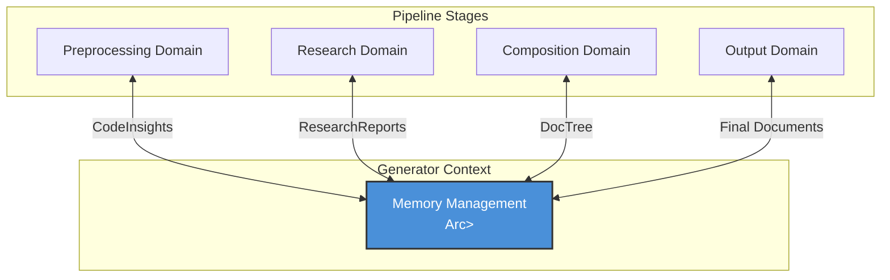
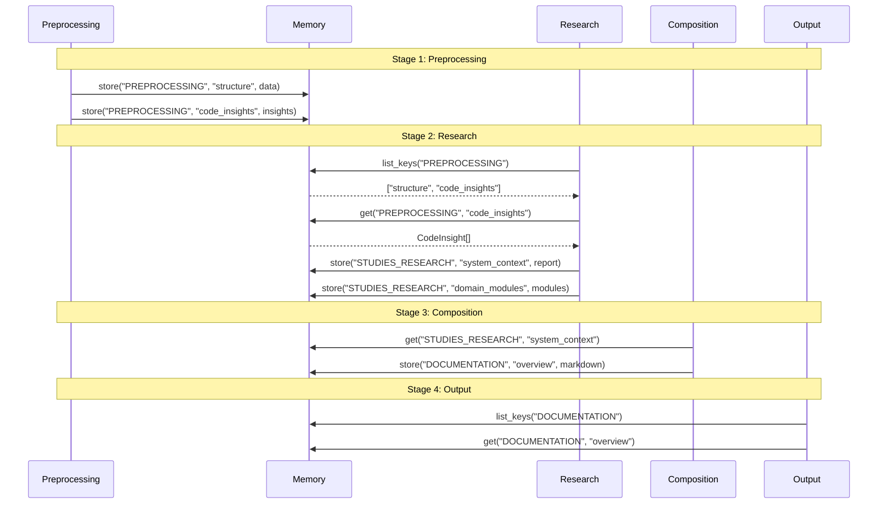

**Memory Management Domain Technical Documentation**

**Version:** 1.0  
**Module:** `src/memory/mod.rs`  
**Domain Type:** Infrastructure Domain  
**Last Updated:** 2026-02-01 06:38:26 (UTC)

---

## 1. Overview

The Memory Management Domain provides centralized, in-memory state persistence and inter-agent communication infrastructure for the deepwiki-rs documentation generation pipeline. It implements a type-safe, scope-organized key-value storage system that enables seamless data transfer between distinct processing stages while maintaining runtime state across the multi-agent AI workflow.

### 1.1 Purpose and Responsibilities

- **State Persistence**: Maintains transient data across pipeline stages (Preprocessing → Research → Composition → Output)
- **Inter-Agent Communication**: Facilitates data exchange between specialized AI agents without tight coupling
- **Type-Safe Storage**: Provides generic serialization/deserialization capabilities for complex data structures
- **Operational Metrics**: Tracks access patterns, data sizes, and usage statistics for performance monitoring
- **Scoped Organization**: Enforces logical separation of concerns through namespace-based data isolation

### 1.2 Business Context

Within the deepwiki-rs architecture, the Memory Management Domain serves as the transient data layer that bridges the gap between stateless AI agents. While the Caching Domain optimizes LLM API calls through persistent file storage, the Memory Domain manages the active working set of analysis results, research reports, and documentation artifacts during a single execution workflow.

---

## 2. Architecture & Design Principles

### 2.1 Architectural Position

The Memory Management Domain operates as a foundational infrastructure service within the Core Generation Domain's dependency container (`GeneratorContext`). It is instantiated once during workflow initialization and shared across all pipeline stages via thread-safe reference counting (`Arc<RwLock<Memory>>`).



### 2.2 Design Principles

**Scope-Based Isolation**  
Data is organized into three logical scopes that mirror the pipeline stages:
- `PREPROCESSING`: Raw code analysis results and structural metadata
- `STUDIES_RESEARCH`: Architectural analysis reports and domain insights  
- `DOCUMENTATION`: Generated markdown sections and document trees

**Type Safety Through Serialization**  
All data undergoes JSON serialization via `serde`, enabling storage of any type implementing `Serialize`/`Deserialize` traits while maintaining Rust's compile-time type safety through generic methods.

**Atomic Operations**  
Store and retrieval operations are atomic, ensuring metadata consistency (timestamps, access counts, size calculations) remains synchronized with the underlying data storage.

**Metadata Transparency**  
Operational metrics (access patterns, data sizes) are collected automatically without requiring client code instrumentation, supporting resource monitoring and debugging.

---

## 3. Core Components

### 3.1 Data Structures

#### Memory
The primary storage container implementing the in-memory database pattern.

```rust
pub struct Memory {
    /// Core key-value store using composite keys (scope:key)
    storage: HashMap<String, Value>,
    
    /// Operational metadata tracking
    metadata: MemoryMetadata,
}
```

#### MemoryMetadata
Tracks operational characteristics and resource utilization.

```rust
pub struct MemoryMetadata {
    /// Creation timestamp for each entry
    created_at: HashMap<String, DateTime<Utc>>,
    
    /// Last modification timestamp
    last_updated: HashMap<String, DateTime<Utc>>,
    
    /// Access frequency counters
    access_counts: HashMap<String, u64>,
    
    /// Individual entry sizes in bytes
    data_sizes: HashMap<String, usize>,
    
    /// Aggregate size across all entries
    total_size: usize,
}
```

### 3.2 Key Schema

**Composite Key Format**: `{scope}:{key}`  
- **Scope**: Logical namespace (e.g., `PREPROCESSING`, `STUDIES_RESEARCH`)
- **Key**: Domain-specific identifier (e.g., `code_insights`, `system_context`)
- **Example**: `STUDIES_RESEARCH:domain_modules`

**Value Storage**: JSON `Value` objects (via `serde_json::Value`) providing flexibility while maintaining serializable structure.

---

## 4. API Specification

### 4.1 Storage Operations

#### `store<T>()`
Persists typed data to a specific scope with automatic metadata updates.

```rust
pub fn store<T>(&mut self, scope: &str, key: &str, data: T) -> Result<()>
where
    T: Serialize
```

**Parameters:**
- `scope`: Logical namespace (e.g., "PREPROCESSING")
- `key`: Unique identifier within the scope
- `data`: Any type implementing `Serialize`

**Behavior:**
1. Serializes data to JSON Value
2. Calculates byte size of serialized representation
3. Updates `data_sizes` and `total_size` in metadata
4. Records `created_at` (new entries) or updates `last_updated` (existing entries)
5. Inserts into storage using composite key `{scope}:{key}`

**Error Conditions:**
- Serialization failures (rare, typically indicates non-serializable type)

---

### 4.2 Retrieval Operations

#### `get<T>()`
Type-safe retrieval with automatic deserialization and access tracking.

```rust
pub fn get<T>(&mut self, scope: &str, key: &str) -> Option<T>
where
    T: DeserializeOwned
```

**Parameters:**
- `scope`: Logical namespace
- `key`: Entry identifier

**Returns:**
- `Some(T)` on successful retrieval and deserialization
- `None` if key doesn't exist or deserialization fails

**Behavior:**
1. Constructs composite key `{scope}:{key}`
2. Increments `access_counts` for the key
3. Retrieves JSON Value from storage
4. Attempts deserialization to type `T`
5. Returns deserialized object or `None` on type mismatch

**Note**: Returns `None` on deserialization failure to allow graceful handling of type mismatches between storage and retrieval.

---

### 4.3 Query Operations

#### `list_keys()`
Returns all keys within a specific scope, stripped of scope prefix.

```rust
pub fn list_keys(&self, scope: &str) -> Vec<String>
```

**Use Case**: Discovering available data entries within a scope (e.g., listing all research reports).

**Implementation**: Filters storage keys by prefix `{scope}:`, returning suffixes only.

---

#### `has_data()`
Efficient existence check without data retrieval.

```rust
pub fn has_data(&self, scope: &str, key: &str) -> bool
```

**Use Case**: Conditional logic based on data availability without deserialization overhead.

---

### 4.4 Administrative Operations

#### `get_usage_stats()`
Aggregates memory consumption by scope.

```rust
pub fn get_usage_stats(&self) -> HashMap<String, usize>
```

**Returns**: Mapping of scope names to total bytes consumed.

**Use Case**: Resource monitoring, debugging memory bloat, and pipeline optimization.

---

## 5. Data Flow & Lifecycle

### 5.1 Pipeline Stage Integration



### 5.2 Data Lifecycle

1. **Creation**: Preprocessing agents store raw analysis results
2. **Consumption**: Research agents read preprocessing data, store refined analysis
3. **Transformation**: Composition agents read research data, store generated documentation
4. **Persistence**: Output agents read documentation data and write to filesystem
5. **Cleanup**: Memory is dropped when `GeneratorContext` goes out of scope (end of workflow)

---

## 6. Integration Patterns

### 6.1 Consumer Domains

| Domain | Interaction Pattern | Data Scope | Purpose |
|--------|-------------------|------------|---------|
| **Preprocessing** | Write-heavy | `PREPROCESSING` | Store code analysis results |
| **Research** | Read/Write | `PREPROCESSING` (read), `STUDIES_RESEARCH` (write) | Consume raw data, produce insights |
| **Composition** | Read/Write | `STUDIES_RESEARCH` (read), `DOCUMENTATION` (write) | Transform research into markdown |
| **Output** | Read-only | `DOCUMENTATION` | Retrieve final documents for persistence |

### 6.2 Thread Safety

The Memory Management Domain is accessed through `Arc<RwLock<Memory>>` within `GeneratorContext`:
- **Read Operations**: Multiple agents can read concurrently (e.g., parallel research agents)
- **Write Operations**: Exclusive lock required during store operations
- **Pattern**: Short-lived locks to minimize contention; clone data when necessary

### 6.3 Error Handling Strategy

- **Deserialization Failures**: Returns `None` rather than panicking, allowing fallback logic
- **Missing Keys**: Returns `None` or empty vectors, enabling optional data patterns
- **Serialization Failures**: Returns `Result::Err` for write operations (propagated to caller)

---

## 7. Implementation Details

### 7.1 Serialization Architecture

The module leverages `serde_json` for type erasure and recovery:

```rust
// Storage: Type -> JSON Value
let json_value = serde_json::to_value(&data)?;
self.storage.insert(full_key, json_value);

// Retrieval: JSON Value -> Type  
let value = self.storage.get(&full_key)?;
let typed_data: T = serde_json::from_value(value.clone())?;
```

This approach enables heterogeneous data storage within a single HashMap while maintaining type safety at the API boundary.

### 7.2 Metadata Tracking

**Size Calculation**: Uses `serde_json::to_string().len()` to estimate memory footprint in bytes.

**Access Patterns**: Maintains monotonic counters for read operations to identify hot data and optimization opportunities.

**Temporal Metadata**: Uses `chrono::DateTime<Utc>` for creation and update timestamps, supporting debugging and cache invalidation logic.

### 7.3 Memory Efficiency Considerations

- **Data Duplication**: JSON Values are cloned during retrieval (necessary for Rust ownership), implying double memory usage during active processing
- **Scope Cleanup**: Currently, scopes retain data until process termination; future optimizations could implement scope-specific clearing after stage completion
- **Large Data Handling**: For substantial datasets (e.g., large codebases), consider streaming or file-backed storage to prevent excessive heap growth

---

## 8. Usage Examples

### 8.1 Storing Analysis Results

```rust
// Preprocessing agent storing code insights
let insights = analyze_source_files(&project_path)?;
context.memory.write().await.store(
    "PREPROCESSING",
    "code_insights",
    &insights
)?;
```

### 8.2 Retrieving with Type Safety

```rust
// Research agent accessing preprocessing results
if let Some(insights) = context.memory.write().await
    .get::<Vec<CodeInsight>>("PREPROCESSING", "code_insights") {
    // Process insights
} else {
    // Handle missing or incompatible data
}
```

### 8.3 Conditional Processing

```rust
// Check for existing data before expensive computation
if !context.memory.read().await.has_data("STUDIES_RESEARCH", "system_context") {
    let report = generate_system_context().await?;
    context.memory.write().await.store(
        "STUDIES_RESEARCH",
        "system_context",
        &report
    )?;
}
```

### 8.4 Resource Monitoring

```rust
// Log memory usage statistics
let stats = context.memory.read().await.get_usage_stats();
for (scope, bytes) in stats {
    println!("Scope {}: {} KB", scope, bytes / 1024);
}
```

---

## 9. Best Practices

1. **Scope Consistency**: Always use predefined scope constants (`PREPROCESSING`, `STUDIES_RESEARCH`, `DOCUMENTATION`) to avoid fragmentation
2. **Type Stability**: Ensure stored types maintain backward compatibility when deserializing (consider versioning for evolving structures)
3. **Key Naming**: Use descriptive, hierarchical keys (e.g., `domain_modules_core`, `api_endpoints_auth`) to facilitate debugging
4. **Error Handling**: Always handle `None` returns gracefully; pipeline stages should be resilient to missing optional data
5. **Memory Awareness**: Monitor `get_usage_stats()` during development to identify memory bloat from excessive data retention

---

## 10. Dependencies

- **serde**: Serialization framework
- **serde_json**: JSON backend for value storage
- **chrono**: Timestamp handling for metadata
- **std::collections::HashMap**: Core storage implementation

---

**Related Documentation:**
- [Core Generation Domain](./core-generation-domain.md)
- [Preprocessing Domain](./preprocessing-domain.md)
- [Caching Domain](./caching-domain.md) (for persistent storage alternatives)

**End of Document**