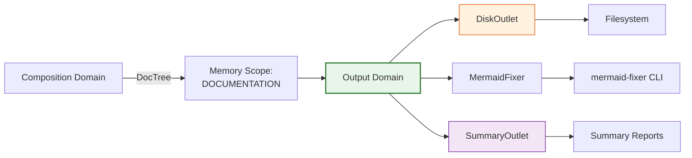
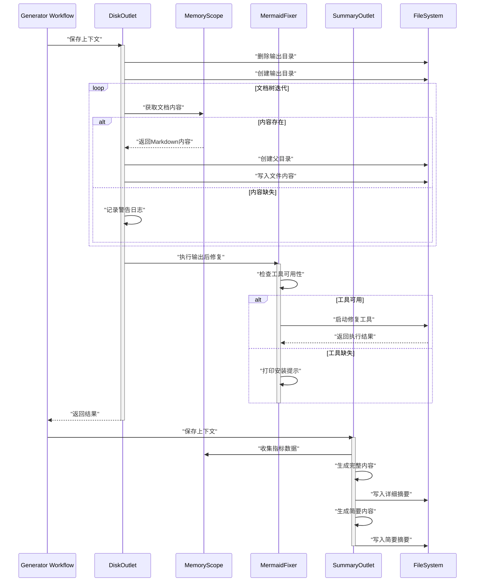

**Technical Documentation: Output Domain**

**Module:** `src/generator/outlet`  
**System:** deepwiki-rs  
**Classification:** Core Business Domain – Infrastructure Adapter Layer  
**Last Updated:** 2026-02-01 06:44:41 (UTC)

---

## 1. Overview

The **Output Domain** serves as the final persistence and delivery layer within the deepwiki-rs documentation generation pipeline. As the terminal stage of the four-phase workflow (Preprocessing → Research → Composition → Output), this domain is responsible for materializing generated documentation from transient memory structures to persistent storage, executing post-processing optimizations, and generating pipeline performance analytics.

Operating under the **Infrastructure Adapter Pattern**, the domain abstracts persistence mechanisms through a trait-based interface, enabling pluggable output destinations while providing concrete filesystem implementations. The domain ensures data integrity across internationalized output structures, orchestrates external tool integration for diagram optimization, and delivers comprehensive execution summaries.

---

## 2. Architectural Positioning

### 2.1 Domain Context
The Output Domain occupies the boundary between the documentation generation engine and the external filesystem. It receives structured document trees from the Composition Domain via the Memory Management Domain, transforms them into localized file artifacts, and manages the complete lifecycle of output directory operations.



### 2.2 Design Philosophy
- **Separation of Concerns**: Distinct submodules handle persistence (`outlet`), post-processing (`fixer`), and analytics (`summary_generator`)
- **Trait-Based Abstraction**: The `Outlet` trait enables polymorphic persistence strategies without coupling to concrete implementations
- **Async-First I/O**: Non-blocking filesystem operations using Tokio for concurrent document processing
- **Internationalization-Native**: Deep integration with the `TargetLanguage` system for locale-specific file naming and directory structures

---

## 3. Core Components

### 3.1 Outlet Subsystem (`src/generator/outlet/mod.rs`)

#### 3.1.1 Outlet Trait
The foundational abstraction defining the persistence contract:

```rust
pub trait Outlet {
    async fn save(&self, context: &GeneratorContext) -> Result<()>;
}
```

This minimal interface enables diverse persistence implementations (filesystem, cloud storage, API transmission) while maintaining uniform integration with the workflow orchestrator.

#### 3.1.2 DiskOutlet
The concrete filesystem implementation managing the complete persistence lifecycle:

**Responsibilities:**
- **Directory Lifecycle Management**: Atomic cleanup and recreation of output directories using `remove_dir_all` followed by `create_dir_all`
- **Document Tree Traversal**: Iterates the `DocTree` structure mapping `AgentType`-scoped memory keys to internationalized file paths
- **Content Hydration**: Retrieves markdown content from `MemoryScope::DOCUMENTATION` via `get_from_memory<T>()`
- **Hierarchical File Writing**: Constructs parent directories as needed and atomically writes markdown content to disk

**DocTree Structure:**
The domain maintains a `HashMap` associating scoped memory keys with internationalized output paths, supporting five documentation sections:
- **Overview** (C4 System Context)
- **Architecture** (C4 Container/Component views)
- **Workflow** (Business process documentation)
- **Boundary** (Interface documentation)
- **Database** (Schema documentation)

File localization is handled through `TargetLanguage::get_doc_filename()`, ensuring culturally appropriate directory names and filenames across 8 supported languages.

### 3.2 MermaidFixer (`src/generator/outlet/fixer.rs`)

A specialized post-processing utility implementing the **External Tool Orchestration Pattern** for diagram syntax correction.

#### 3.2.1 Functionality
- **Availability Detection**: Runtime probing for the `mermaid-fixer` CLI tool in system PATH
- **LLM Configuration Proxy**: Passes LLM parameters (`--llm-model`, `--llm-api-key`, `--llm-base-url`) to the external process for AI-powered diagram fixing
- **Directory-Scoped Execution**: Targets the entire output directory via `--directory` flag for batch processing
- **Graceful Degradation**: Continues pipeline execution with warning logs if the tool is unavailable

#### 3.2.2 Process Management
Utilizes `tokio::process::Command` for asynchronous process spawning with stdio inheritance, enabling real-time feedback from the external tool while maintaining non-blocking operation.

### 3.3 Summary Generation System

A two-phase analytics engine comprising `SummaryDataCollector` and `SummaryContentGenerator`, coordinated by `SummaryOutlet`.

#### 3.3.1 SummaryDataCollector
Aggregates metrics across four pipeline phases and four research material types:

**Data Sources:**
- **Timing Metrics**: Pipeline phase durations from `MemoryScope::TIMING`
- **Cache Performance**: Hit rates and cost savings via `cache_manager.generate_performance_report()`
- **Memory Utilization**: Storage statistics from memory system introspection
- **Research Artifacts**: 
  - System Context reports (`STUDIES_RESEARCH` scope)
  - Domain Modules analysis
  - Workflow definitions
  - Code Insights (`PREPROCESS` scope)

#### 3.3.2 SummaryContentGenerator
Transforms collected data into dual-format reports:

**Full Mode (`SummaryMode::Full`):**
- Detailed JSON data structures
- Raw statistical aggregations
- Complete research material references
- Granular timing breakdowns

**Brief Mode (`SummaryMode::Brief`):**
- Executive summary with visual indicators
- Efficiency ratios and cost estimates
- High-level pipeline health metrics
- Actionable insights for optimization

#### 3.3.3 SummaryOutlet
Implements the `Outlet` trait to persist both report variants:
- `__Litho_Summary_Detail__.md` – Comprehensive technical report
- `__Litho_Brief_Summary__.md` – Executive dashboard view

---

## 4. Data Flow & Execution Sequence

The Output Domain executes as the terminal pipeline stage with the following operational flow:



---

## 5. Integration Interfaces

### 5.1 GeneratorContext Dependency
All outlet implementations receive a reference to `GeneratorContext`, providing access to:
- **Configuration**: Output base paths, LLM settings, target language preferences
- **Memory System**: Typed retrieval methods for cross-scope data access
- **Cache Manager**: Performance metrics aggregation

### 5.2 Memory Scope Interactions
| Scope | Purpose | Content Type |
|-------|---------|--------------|
| `MemoryScope::DOCUMENTATION` | Source of generated markdown | AgentType-scoped markdown strings |
| `MemoryScope::PREPROCESS` | Code analysis insights | `CodeInsight` collections |
| `MemoryScope::STUDIES_RESEARCH` | Research phase outputs | Structured reports (SystemContext, DomainModules, etc.) |
| `TimingScope::TIMING` | Performance metrics | Phase duration timestamps |

### 5.3 Internationalization Interface
Integration with `TargetLanguage` enables:
- Locale-specific directory generation (e.g., `文档/` for Chinese, `dokumentation/` for German)
- Localized filename mapping using `get_doc_filename()`
- Language-aware summary report formatting

### 5.4 External System Interface
**MermaidFixer CLI Contract:**
- **Input**: Directory path containing markdown files with Mermaid diagrams
- **Configuration**: LLM provider parameters for AI-powered syntax correction
- **Output**: In-place modification of diagram definitions
- **Error Handling**: Non-zero exit status propagation with stderr capture

---

## 6. Implementation Details

### 6.1 Async Concurrency Model
The domain leverages Tokio's asynchronous runtime for:
- **Concurrent File I/O**: Parallel writing of independent documentation sections
- **Process Management**: Non-blocking execution of external CLI tools
- **Memory Access**: Async locking patterns via `Arc<RwLock<T>>` for context sharing

### 6.2 Error Handling Strategy
- **Propagation**: Comprehensive use of `anyhow::Result` for error context chaining
- **Resilience**: Graceful handling of missing content (warnings logged, pipeline continues)
- **Atomicity**: Directory operations use cleanup-before-recreate pattern to prevent partial states
- **External Tool Resilience**: Soft dependency on `mermaid-fixer` (optional enhancement, not critical path)

### 6.3 Serialization & Data Integrity
- **Serde Integration**: JSON serialization for research data within summary reports
- **Chrono Timestamps**: ISO 8601 formatting for all temporal metrics
- **Content Validation**: UTF-8 enforcement for markdown output with BOM handling for specific locales

### 6.4 Resource Management
- **Memory Efficiency**: Streaming file writes for large documents (avoiding in-memory buffering)
- **Directory Cleanup**: Pre-persistence removal ensures clean slate output (idempotent execution)
- **Handle Management**: Explicit drop patterns for file handles to ensure flush-before-rename operations

---

## 7. Configuration & Usage Patterns

### 7.1 Outlet Instantiation
```rust
// Standard filesystem outlet
let outlet = DiskOutlet::new();

// Summary outlet with dual-mode generation
let summary_outlet = SummaryOutlet::new();
```

### 7.2 MermaidFixer Configuration
The fixer automatically inherits LLM configuration from `GeneratorContext`:
```rust
fixer.configure()
    .with_model(config.llm.model)
    .with_api_key(config.llm.api_key)
    .with_base_url(config.llm.base_url)
    .execute_on(&output_directory)
    .await?;
```

### 7.3 Output Directory Structure
```
output_directory/
├── [language-specific-folders]/
│   ├── overview.md
│   ├── architecture.md
│   ├── workflow.md
│   ├── boundary.md
│   └── database.md
├── diagrams/ (generated by mermaid-fixer)
├── __Litho_Summary_Detail__.md
└── __Litho_Brief_Summary__.md
```

---

## 8. Observability & Monitoring

### 8.1 Performance Metrics
The Summary Generator exposes:
- **Throughput**: Documents processed per second
- **I/O Latency**: File system operation timing
- **Cache Efficiency**: Hit/miss ratios across pipeline phases
- **Cost Analysis**: Estimated API cost savings via caching

### 8.2 Logging Conventions
- **Info Level**: Pipeline stage transitions, file creation events
- **Warn Level**: Missing content references, unavailable external tools
- **Debug Level**: Directory traversal details, memory retrieval diagnostics
- **Error Level**: Filesystem I/O failures, serialization errors

### 8.3 Health Checks
- **Disk Space Validation**: Implicit via filesystem error handling
- **Write Permissions**: Early failure during directory creation phase
- **External Tool Presence**: Runtime detection with graceful degradation

---

## 9. Technical Constraints & Considerations

### 9.1 Filesystem Constraints
- **Read-Only Guarantee**: The domain strictly adheres to read-only analysis of source projects; all write operations target the designated output directory
- **Path Length Limits**: Cross-platform path handling respecting Windows MAX_PATH and Unix limits
- **Atomic Writes**: Temporary file creation followed by atomic rename to prevent partial file states

### 9.2 Concurrency Safety
- **Directory Locking**: No explicit file locking; relies on filesystem atomicity and cleanup-before-write patterns
- **Shared State**: Thread-safe access to `GeneratorContext` via `Arc<RwLock<T>>` wrappers

### 9.3 External Dependencies
- **Optional Enhancement**: `mermaid-fixer` CLI is a soft dependency; functionality degrades gracefully if absent
- **Process Isolation**: External tool execution occurs in separate OS processes with inherited stdio

---

## 10. Appendix: Module Structure

```
src/generator/outlet/
├── mod.rs                  # Outlet trait, DiskOutlet implementation, DocTree
├── fixer.rs               # MermaidFixer CLI orchestration
├── summary_generator.rs   # SummaryDataCollector, SummaryContentGenerator
└── summary_outlet.rs      # SummaryOutlet Outlet trait implementation
```

**Key Dependencies:**
- `tokio`: Async runtime and process management
- `anyhow`: Error handling and context propagation
- `serde` / `serde_json`: Data serialization for summary reports
- `chrono`: Timestamp generation for metrics

---

**End of Document**