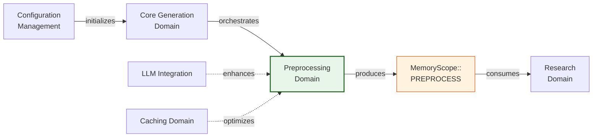
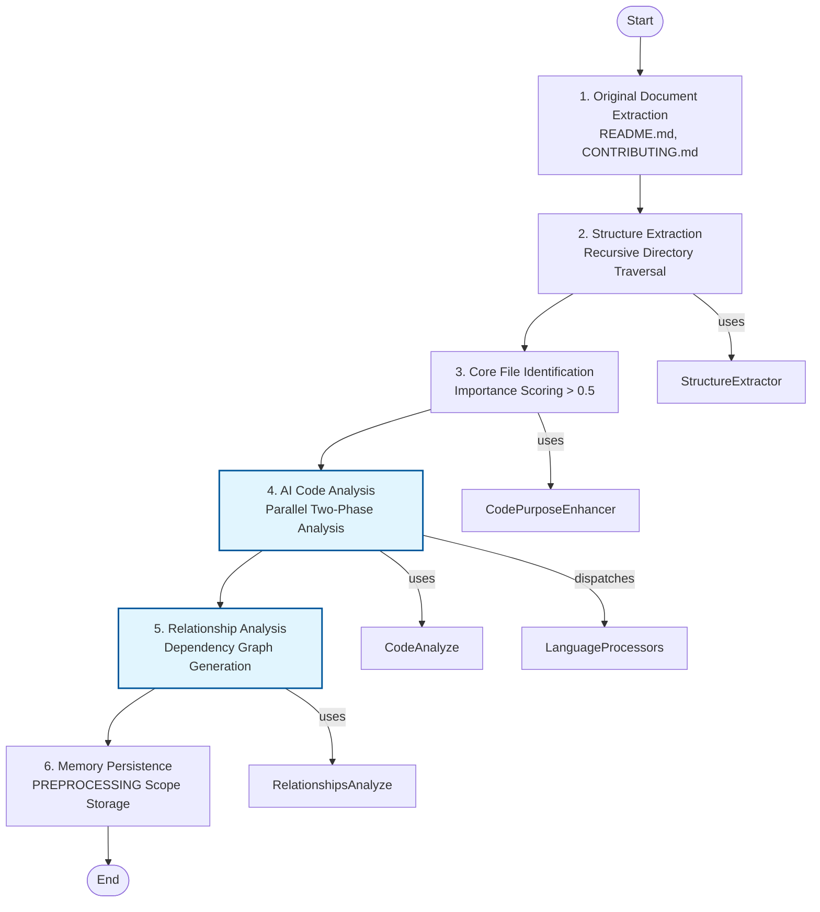

**Technical Documentation: Preprocessing Domain**

**Version:** 1.0  
**System:** deepwiki-rs  
**Classification:** Core Business Domain  
**Last Updated:** 2026-02-01 06:42:41 (UTC)

---

## 1. Overview

The **Preprocessing Domain** constitutes the foundational stage of the deepwiki-rs documentation generation pipeline. As the first executable phase in the four-stage workflow (Preprocessing → Research → Composition → Output), this domain is responsible for transforming raw source code repositories into structured, machine-readable analytical artifacts.

The domain implements a hybrid static-and-AI analysis strategy to extract project topology, code dependencies, interface definitions, and architectural relationships from 12+ programming languages. Its primary output—`Vec<CodeInsight>`—serves as the critical data substrate for downstream Research Domain agents performing C4-level architectural analysis.

**Key Characteristics:**
- **Language Agnostic**: Trait-based abstraction supporting Rust, Java, Python, JavaScript, TypeScript, C#, PHP, Kotlin, Swift, React, Vue, and Svelte
- **Hybrid Analysis**: Combines high-performance static regex parsing with LLM-enhanced semantic analysis
- **Parallel Execution**: Controlled concurrency using Tokio async runtime with semaphore-based resource limiting
- **Stateful Pipeline**: Persists results to scoped memory (`MemoryScope::PREPROCESS`) for cross-domain data transfer

---

## 2. Architectural Position

Within the system's Domain-Driven Design (DDD) architecture, the Preprocessing Domain resides in the **Core Business Domain** layer. It maintains strict upstream dependencies on Infrastructure Domains (Configuration, LLM Integration, Caching) and downstream data contracts with the Research Domain.



**Execution Pattern:**  
Unlike the Research and Composition domains that utilize the declarative `StepForwardAgent` trait framework, Preprocessing employs an **imperative execution pattern**. Agents in this domain directly invoke the `AgentExecutor` for fine-grained control over data transformation tasks that require complex filtering, parallelization, and staged persistence logic.

---

## 3. Core Components

### 3.1 PreProcessAgent (Orchestrator)
The central coordinator implementing the `Generator<PreprocessingResult>` trait. It executes a deterministic six-step workflow with structured progress logging and performance instrumentation.

**Key Responsibilities:**
- Pipeline sequencing and error boundary management
- Resource allocation (parallelism limits via `config.llm.max_parallels`)
- Cross-component data marshalling
- Final result aggregation and memory persistence

### 3.2 StructureExtractor
Performs recursive directory traversal with intelligent file filtering. Implements the `BoxFuture` pattern for async directory walking while respecting `.gitignore` semantics and exclusion patterns.

**Capabilities:**
- Importance scoring algorithm (multi-factor heuristic based on path depth, naming conventions, file size, and extension type)
- Hierarchical project structure serialization
- Integration with `LanguageProcessorManager` for early-stage language detection

### 3.3 Language Processing Subsystem
A trait-based strategy pattern implementation providing unified analysis across heterogeneous codebases.

**Architecture:**
- **Trait Definition**: `LanguageProcessor` with methods for `extract_dependencies()`, `extract_interfaces()`, `determine_component_type()`, and `complexity_metrics()`
- **Facade Pattern**: `LanguageProcessorManager` routes files to appropriate concrete processors based on extension matching
- **Concrete Implementations**: 12+ specialized processors utilizing pre-compiled regex patterns for efficient static analysis (e.g., `^\\s*import\\s+([^;]+);` for Java import extraction)

### 3.4 Analysis Agents

**CodePurposeEnhancer**  
Hybrid classification agent combining rule-based heuristics with AI fallback. Employs confidence thresholding (0.7) to determine whether to use LLM classification or deterministic pattern matching for file purpose identification.

**CodeAnalyze Agent**  
Implements two-phase analysis:
1. **Static Phase**: Regex-based extraction of imports, exports, function signatures, and complexity metrics
2. **AI Phase**: LLM enhancement using `extract::<CodeInsight>()` for semantic responsibilities and architectural role classification

**RelationshipsAnalyze Agent**  
Project-level architectural analysis component performing:
- Importance-filtered insight aggregation (retains scores ≥ 0.6, top 150 insights)
- Prompt compression via `PromptCompressor` to manage LLM token constraints
- Dependency graph generation with circular dependency detection

---

## 4. Processing Workflow

The Preprocessing Domain executes a strictly sequential six-step pipeline:



### Step 1: Original Document Extraction
Extracts high-level project metadata from `README.md`, `CONTRIBUTING.md`, and other documentation files using `OriginalDocumentExtractor`. Preserves original structure for later composition stages.

### Step 2: Structure Extraction
Recursively traverses the project directory, calculating importance scores for each file. Files scoring above 0.5 are flagged as `is_core` and prioritized for deep analysis. Filters exclude binary files, test directories, and hidden configuration files.

### Step 3: Core File Identification
Enhances file metadata with functional classification (e.g., Controller, Service, Model, Utility) using the `CodePurposeEnhancer`. Rule-based classification executes first; ambiguous cases escalate to LLM analysis.

### Step 4: AI Code Analysis (Parallel Execution)
The most computationally intensive phase. Executes `do_parallel_with_limit()` to process core files concurrently within configured resource constraints (`max_parallels`).

For each file:
- Language-specific processor extracts static dependencies and interfaces
- `AgentExecutor::extract::<CodeInsight>()` generates semantic analysis including:
  - Functional responsibilities
  - Architectural patterns detected
  - Complexity metrics (cyclomatic complexity, LOC)
  - Documentation comments (Javadoc, JSDoc, RustDoc)

### Step 5: Relationship Analysis
Aggregates individual file insights into project-level architectural views. Implements token management through:
- Importance-based filtering (excludes low-relevance files from context)
- Content compression strategies for large codebases
- Structured extraction of `RelationshipAnalysis` (dependency graphs, module boundaries)

### Step 6: Memory Persistence
Persists four primary data structures to `MemoryScope::PREPROCESS`:
- `PROJECT_STRUCTURE`: Hierarchical file tree with metadata
- `CODE_INSIGHTS`: Vector of analyzed code dossiers
- `RELATIONSHIPS`: Dependency and architectural relationship graphs
- `ORIGINAL_DOCUMENT`: Raw documentation extraction

---

## 5. Technical Implementation Details

### 5.1 Concurrency Model
Implements controlled parallelism to prevent resource exhaustion during LLM API calls:

```rust
// Pattern from implementation
do_parallel_with_limit(
    codes_to_analyze,
    context.config.llm.max_parallels,
    |code| async move {
        // Analysis logic with cloned context
    }
).await
```

**Thread Safety:**  
Components utilize `Arc<RwLock<T>>` for shared state access. `LanguageProcessorManager` implements `Clone` by recreating processor instances, ensuring thread-safe dispatch without cross-contamination of parser state.

### 5.2 Prompt Compression Strategy
To accommodate LLM context window limitations during relationship analysis:

1. **Filtering**: Retains only insights with `importance_score >= 0.6`
2. **Truncation**: Limits to top 150 insights and 20 dependencies per file
3. **Semantic Compression**: `PromptCompressor` with configurable `CompressionConfig` reduces token count while preserving architectural significance

### 5.3 Importance Scoring Algorithm
Multi-factor heuristic determining analysis priority:

```
Importance = f(location, naming, size, extension, content_type)

Factors:
- Location: src/, lib/ paths weighted higher (0.3)
- Naming: main.*, index.*, mod.rs receive bonus (0.25)
- Size: Optimal range 1KB-50KB (diminishing returns outside range)
- Extension: Core languages weighted 0.3 vs. configuration files
- Database: SQL-related paths flagged for conditional analysis
```

Files exceeding threshold 0.5 receive full AI analysis; others receive static analysis only.

### 5.4 Data Contracts

**PreprocessingResult** (Output DTO):
```rust
pub struct PreprocessingResult {
    pub original_document: OriginalDocument,
    pub project_structure: ProjectStructure,
    pub code_insights: Vec<CodeInsight>,
    pub relationships: RelationshipAnalysis,
}
```

**CodeInsight** (Core Artifact):
Aggregates static analysis (`CodeDossier`) with AI-generated semantic understanding:
- Interfaces (public APIs, exports)
- Dependencies (imports, external references)
- Complexity metrics (cyclomatic, cognitive)
- Responsibilities (natural language description of purpose)
- Component type classification (Domain Service, Repository, Controller, etc.)

---

## 6. Integration Interfaces

### 6.1 Upstream Dependencies
The domain receives execution context via the `Generator` trait:

```rust
pub trait Generator<T> {
    async fn execute(&self, context: GeneratorContext) -> Result<T>;
}
```

**GeneratorContext Provides:**
- `config`: Execution parameters (parallelism limits, exclusion patterns)
- `llm_client`: Arc-wrapped LLM client for AI operations
- `cache_manager`: Response caching for structure extraction
- `memory`: Scoped storage for result persistence

### 6.2 Downstream Consumption
Research Domain agents retrieve preprocessing results via memory scope access:

```rust
// Pattern used by Research agents
let insights: Vec<CodeInsight> = context
    .memory
    .get_scoped(MemoryScope::PREPROCESS, ScopedKeys::CODE_INSIGHTS)
    .await?;
```

**Contract Stability:**  
The `CodeInsight` schema serves as the stable interface between Preprocessing and Research domains. Changes to this structure require synchronized updates across both domains.

---

## 7. Configuration Parameters

Key configuration values affecting Preprocessing behavior:

| Parameter | Domain | Description | Default |
|-----------|--------|-------------|---------|
| `max_parallels` | LLM | Concurrent file analysis limit | 5 |
| `max_depth` | Preprocessing | Maximum directory traversal depth | Unlimited |
| `excluded_dirs` | Preprocessing | Patterns to exclude (e.g., `tests/`, `target/`) | `[".git", "node_modules"]` |
| `importance_threshold` | Preprocessing | Minimum score for core file designation | 0.5 |
| `ai_confidence_threshold` | Preprocessing | Minimum confidence for AI classification | 0.7 |

---

## 8. Error Handling and Resilience

**Fail-Fast Strategy:**  
Critical errors in code analysis (e.g., LLM API failures, parsing panics) propagate immediately via `anyhow::Result` to halt the pipeline, preventing corrupted state from reaching Research agents.

**Graceful Degradation:**
- Language processors fall back to generic text analysis for unsupported file types
- AI classification falls back to rule-based heuristics when confidence is insufficient
- Individual file analysis failures do not cascade (logged and skipped)

**Resource Protection:**
- Semaphore-based concurrency prevents LLM rate limit violations
- Token estimation prevents prompt overflow before LLM invocation
- Timeout handling on file system operations prevents hanging on deep directory structures

---

## 9. Performance Considerations

**Optimization Strategies:**
1. **Caching**: Structure extraction results cached via MD5 hash of directory state
2. **Lazy Evaluation**: Language processors only parse files flagged as core (importance > 0.5)
3. **Parallel I/O**: Async file operations throughout; blocking syscalls offloaded to `tokio::task::spawn_blocking` where necessary
4. **Memory Efficiency**: Streaming JSON serialization for large `CodeInsight` vectors; prompt compression reduces LLM token costs by 40-60%

**Bottlenecks:**
- LLM API latency dominates execution time (mitigated by parallelization)
- Deep recursive directories with thousands of files impact memory usage (mitigated by importance filtering)
- Regex compilation overhead in language processors (mitigated by lazy static initialization)

---

## 10. Extension Points

**Adding Language Support:**
1. Implement `LanguageProcessor` trait for new language
2. Register processor in `LanguageProcessorManager` extension map
3. Define file extension mappings and regex patterns for import/interface extraction

**Custom Analysis Agents:**
New analysis stages can be inserted between Step 4 and Step 5 by:
1. Implementing agent struct with `execute(context, inputs)` interface
2. Adding invocation in `PreProcessAgent::execute` workflow
3. Defining new `ScopedKeys` constant for memory persistence

---

**End of Document**