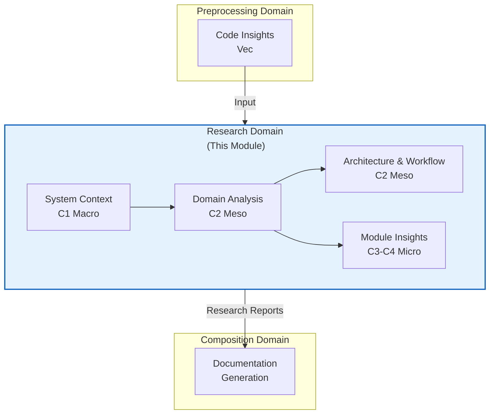
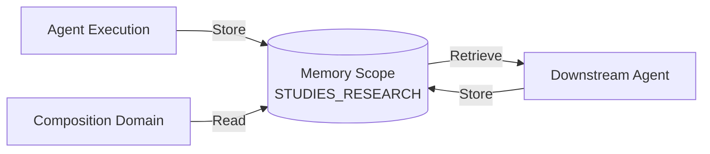
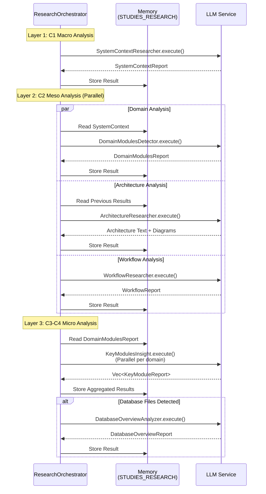

**Technical Documentation: Research Domain Module**

**Version:** 1.0  
**Last Updated:** 2026-02-01 06:43:25 (UTC)  
**Classification:** Internal Technical Documentation  
**Confidence Score:** 0.92 (High)

---

## 1. Executive Summary

The **Research Domain** is the analytical engine of the deepwiki-rs documentation generation pipeline, implementing a sophisticated multi-agent architecture that performs comprehensive architectural analysis of software projects. Operating as the second stage of the documentation generation workflow, this domain transforms raw code insights from the Preprocessing Domain into structured architectural intelligence through an 8-agent research pipeline aligned with the C4 Model abstraction levels.

The domain executes staged analysis progressing from macro system context (C1) through meso domain architecture (C2) to micro implementation details (C3-C4), ensuring high-level architectural context informs detailed technical analysis. By leveraging the `StepForwardAgent` trait framework and memory-scoped state management, the Research Domain enables declarative agent definitions, parallel execution where dependencies permit, and systematic context propagation through the research pipeline.

---

## 2. Architectural Overview

### 2.1 Position in System Architecture

The Research Domain sits at the center of the Core Generation pipeline, serving as the bridge between raw code analysis and documentation composition:



### 2.2 C4 Abstraction Layer Architecture

The Research Domain implements a three-layer analysis architecture corresponding to the C4 Model's abstraction levels:

| Layer | C4 Level | Agents | Abstraction Focus |
|-------|----------|--------|-------------------|
| **Macro** | C1 (System Context) | SystemContextResearcher | Business value, stakeholders, external systems, system boundaries |
| **Meso** | C2 (Containers/Components) | DomainModulesDetector, ArchitectureResearcher, WorkflowResearcher | Domain boundaries, architectural patterns, business workflows |
| **Micro** | C3-C4 (Components/Code) | KeyModulesInsight, BoundaryAnalyzer, DatabaseOverviewAnalyzer | Implementation details, interfaces, database schemas |

This layered approach ensures that downstream agents receive contextual foundation from upstream analysis, preventing disconnected architectural observations.

---

## 3. Core Components

### 3.1 Research Orchestrator

The `ResearchOrchestrator` serves as the central coordination hub, implementing staged dependency management and agent lifecycle orchestration.

**Key Responsibilities:**
- **Dependency-Driven Execution**: Manages agent execution order ensuring C1 analysis completes before C2, and C2 informs C3-C4
- **Conditional Logic**: Evaluates project characteristics (e.g., presence of `.sql` files) to trigger conditional agents like `DatabaseOverviewAnalyzer`
- **Resource Management**: Controls parallelism limits for `KeyModulesInsight` to prevent LLM rate limiting
- **State Aggregation**: Collects individual agent outputs into the unified `STUDIES_RESEARCH` memory scope

**Execution Flow:**
```rust
// Staged execution ensuring dependency satisfaction
execute_research_pipeline()
├── Layer 1: SystemContextResearcher (Sequential)
├── Layer 2: DomainModulesDetector → ArchitectureResearcher, WorkflowResearcher (Parallel)
└── Layer 3: KeyModulesInsight → BoundaryAnalyzer → DatabaseOverviewAnalyzer (Conditional)
```

### 3.2 The Eight Research Agents

The domain implements eight specialized agents, each targeting specific architectural concerns:

#### Layer 1: System Context (C1)
**SystemContextResearcher**
- **Purpose**: Establishes high-level system context following C4 Model standards
- **Inputs**: `PROJECT_STRUCTURE`, `CODE_INSIGHTS`, `README_CONTENT`
- **Outputs**: `SystemContextReport` containing business value, user personas, external systems, system boundaries
- **Execution Mode**: Structured extraction (JsonSchema validated)

#### Layer 2: Domain & Architecture (C2)
**DomainModulesDetector**
- **Purpose**: Performs Domain-Driven Design (DDD) analysis to identify bounded contexts and domain modules
- **Methodology**: Analyzes code organization patterns, namespace structures, and dependency graphs
- **Outputs**: `DomainModulesReport` with confidence-scored domain classifications and inter-domain relationships

**ArchitectureResearcher**
- **Purpose**: Validates implementation against documented patterns and generates architectural diagrams
- **Specialization**: Detects architectural drift, identifies design patterns, produces Mermaid diagrams
- **Execution Mode**: Tool-augmented analysis (`PromptWithTools`) for enhanced exploration

**WorkflowResearcher**
- **Purpose**: Identifies core business workflows and execution paths
- **Analysis Scope**: Main workflows, secondary processes, exception handling patterns
- **Outputs**: `WorkflowReport` with Mermaid sequence diagrams

#### Layer 3: Implementation Details (C3-C4)
**KeyModulesInsight**
- **Purpose**: Parallel deep-dive analysis of individual domain modules
- **Concurrency**: Processes multiple domains simultaneously with configurable parallelism
- **Token Management**: Implements file size limits (50KB exclusion, 10KB truncation) and importance-based filtering (top 50 insights)
- **Outputs**: `Vec<KeyModuleReport>` with technical implementation details

**BoundaryAnalyzer**
- **Purpose**: Extracts system boundary interfaces including CLI commands, API endpoints, and router definitions
- **Input Processing**: Filters code insights by boundary-related keywords (CLI, API, Router, Config)
- **Outputs**: `BoundaryAnalysisReport` with interface contracts and integration suggestions

**DatabaseOverviewAnalyzer** (Conditional)
- **Purpose**: SQL schema analysis for database-centric projects
- **Trigger Condition**: Presence of `.sql`, `.sqlproj` files, or `CodePurpose::Database` classifications
- **Token Protection**: Aggressive filtering to handle large SQL schemas within LLM context limits
- **Outputs**: `DatabaseOverviewReport` with ER diagrams, table relationships, and data flow analysis

---

## 4. Technical Implementation

### 4.1 StepForwardAgent Framework

All research agents implement the `StepForwardAgent` trait, providing a declarative, data-source-driven approach to agent definition:

```rust
pub trait StepForwardAgent {
    // Agent classification for routing and logging
    fn agent_type(&self) -> AgentType;
    
    // Data dependency declaration
    fn data_config(&self) -> AgentDataConfig;
    
    // Prompt engineering configuration
    fn prompt_template(&self) -> PromptTemplate;
    
    // Execution lifecycle
    async fn execute(&self, context: Arc<GeneratorContext>) -> Result<AgentOutput>;
}
```

**Key Design Patterns:**

1. **Data Source Abstraction**: Agents declare dependencies via `AgentDataConfig`, specifying required sources (`PROJECT_STRUCTURE`, `CODE_INSIGHTS`) and optional knowledge base categories (architecture, database, ADR)

2. **Memory Integration**: Agents retrieve previous research results via `DataSource::ResearchResult(agent_type)`, enabling contextual chaining where downstream agents consume upstream outputs

3. **Prompt Templating**: Standardized `PromptTemplate` with system prompts (defining analyst personas), opening/closing instructions, and formatter configurations controlling code inclusion and insight limits

### 4.2 Memory Management & State Transfer

The Research Domain utilizes the Memory Management Domain's scoped storage for inter-agent communication:

**Memory Scope:** `STUDIES_RESEARCH`

**State Flow:**


**Data Persistence Strategy:**
- **Transient Intermediate Results**: Individual agent outputs stored immediately after execution
- **Typed Retrieval**: Strongly-typed access patterns using Serde deserialization
- **Scope Isolation**: Research data isolated from `PREPROCESSING` (upstream) and `DOCUMENTATION` (downstream) scopes

### 4.3 LLM Integration Modes

Agents utilize two primary LLM interaction patterns:

**1. Structured Extraction (`Extract`)**
- Used for: SystemContextResearcher, DomainModulesDetector, BoundaryAnalyzer
- Mechanism: JSON schema-constrained generation with `JsonSchema` derive macros
- Benefits: Type-safe outputs, automated validation, deterministic structure

**2. Tool-Augmented Analysis (`PromptWithTools`)**
- Used for: ArchitectureResearcher (complex diagram generation)
- Mechanism: ReAct pattern with file exploration and content reading tools
- Benefits: Enhanced reasoning capabilities, dynamic context gathering

---

## 5. Data Flow & Execution Model

### 5.1 Pipeline Execution Sequence



### 5.2 Dependency Resolution

The orchestrator implements strict dependency management ensuring analytical coherence:

**Hard Dependencies (Sequential):**
- `SystemContextResearcher` → All other agents (provides foundational context)
- `DomainModulesDetector` → `KeyModulesInsight` (requires domain boundaries)

**Soft Dependencies (Parallel):**
- `ArchitectureResearcher` and `WorkflowResearcher` execute concurrently after C1 completion
- Individual `KeyModuleReport` generations execute in parallel with semaphore-controlled concurrency

---

## 6. Integration Interfaces

### 6.1 Upstream Dependencies (Preprocessing Domain)

The Research Domain consumes outputs from the Preprocessing Domain via memory scope `PREPROCESS`:

| Input | Source | Usage |
|-------|--------|-------|
| `PROJECT_STRUCTURE` | StructureExtractor | Directory hierarchy and file organization |
| `CODE_INSIGHTS` | CodeAnalyze Agent | Detailed file analysis with dependencies and classifications |
| `DEPENDENCY_ANALYSIS` | RelationshipsAnalyze | Architectural relationship graphs |

### 6.2 Downstream Consumers (Composition Domain)

Research outputs serve as primary inputs for Documentation Composition:

| Output | Consumer | Purpose |
|--------|----------|---------|
| `SystemContextReport` | OverviewEditor | C4 System Context documentation |
| `DomainModulesReport` | ArchitectureEditor | Domain organization and module hierarchy |
| `WorkflowReport` | WorkflowEditor | Process documentation and sequence diagrams |
| `KeyModuleReport[]` | KeyModulesInsightEditor | Technical module deep-dives |
| `BoundaryAnalysisReport` | BoundaryEditor | Interface documentation |
| `DatabaseOverviewReport` | DatabaseEditor | Schema documentation (conditional) |

### 6.3 Knowledge Integration

Agents optionally consume external knowledge bases via the Knowledge Integration Domain:

**Supported Categories:**
- `architecture`: Architectural Decision Records (ADRs), design documents
- `database`: Existing database documentation, ER diagrams
- `api`: API specifications, OpenAPI documents
- `workflow`: Business process documentation

**Access Pattern:**
```rust
AgentDataConfig {
    required: vec![DataSource::ProjectStructure, DataSource::CodeInsights],
    optional: vec![
        DataSource::KnowledgeBase("architecture"),
        DataSource::KnowledgeBase("database")
    ],
}
```

---

## 7. Configuration & Extensibility

### 7.1 Agent Configuration

Research agents support configuration through the `FormatterConfig` structure:

```rust
pub struct FormatterConfig {
    pub include_code: bool,           // Include source code snippets
    pub max_insights: usize,          // Limit CodeInsights per prompt (default: 50)
    pub directory_only: bool,         // Exclude file contents for large projects
    pub target_language: TargetLanguage, // Localization for AI prompts
}
```

### 7.2 Token Management Strategy

To prevent LLM context window overflow:

**File Size Thresholds:**
- **>50KB**: Excluded from analysis (logged as oversized)
- **>10KB**: Content truncated with ellipsis notation
- **Importance Scoring**: Only top-N most important files included (default: 50)

**Prompt Compression:**
Integration with the Utilities Domain's `PromptCompressor` for aggressive text compression when approaching token limits.

### 7.3 Extending the Research Pipeline

Adding new research agents requires:

1. **Implement `StepForwardAgent` trait**:
   - Define `agent_type()` for routing
   - Specify `data_config()` declaring upstream dependencies
   - Provide `prompt_template()` with system prompts and formatting rules

2. **Register in Orchestrator**:
   - Add agent instantiation in `ResearchOrchestrator`
   - Define execution order relative to existing agents
   - Specify conditional triggers if applicable

3. **Define Report Types**:
   - Implement `JsonSchema` derive for structured extraction
   - Add to `AgentOutput` enum variants
   - Implement display/formatting logic for Composition Domain consumption

---

## 8. Performance Characteristics

### 8.1 Concurrency Model

- **Layer 1**: Sequential (foundation building)
- **Layer 2**: Parallel (3 agents concurrently)
- **Layer 3**: Parallel with bounded concurrency (configurable semaphore, default: 3 concurrent domain analyses)

### 8.2 Caching Integration

Research agent outputs benefit from the Caching Domain's LLM response caching:
- **Cache Keys**: MD5 hash of prompt + model configuration
- **Scope**: Research results cached across pipeline executions
- **Invalidation**: Implicit via project structure changes (preprocessing cache invalidation)

### 8.3 Resource Utilization

**LLM Token Budget Allocation:**
- System Context: ~2-4k tokens (high-level analysis)
- Domain Detection: ~4-6k tokens (moderate code inspection)
- Module Insights: ~8-16k tokens (deep technical analysis, varies by module size)
- Database Analysis: Variable, with aggressive truncation for large schemas

**Execution Time Estimates** (varies by project size):
- Small projects (<100 files): 2-4 minutes
- Medium projects (100-1000 files): 5-10 minutes
- Large projects (>1000 files): 10-20 minutes (heavily parallelized)

---

## 9. Error Handling & Resilience

### 9.1 Graceful Degradation

- **Missing Dependencies**: If upstream research fails, downstream agents receive empty collections rather than failing
- **Knowledge Base Absence**: Optional knowledge sources silently skipped if not configured
- **Conditional Agents**: Database analyzer skipped gracefully for non-SQL projects

### 9.2 Retry Logic

Inherited from the LLM Integration Domain:
- **Automatic Retries**: Exponential backoff on rate limiting
- **Fallback Models**: Secondary model configuration for critical agents
- **Partial Success**: Individual agent failures logged but do not halt pipeline (where dependencies permit)

---

## 10. Best Practices & Usage Guidelines

### 10.1 For Agent Developers

1. **Declare Minimal Dependencies**: Only specify required upstream agents to maximize parallelization opportunities
2. **Implement Token Guards**: Always use importance-based filtering for projects with >50 significant files
3. **Schema Validation**: Leverage `JsonSchema` derive for all report types to ensure output consistency
4. **Idempotency**: Agent executions should be deterministic given the same inputs

### 10.2 For Configuration

1. **Parallelism Tuning**: Adjust `KeyModulesInsight` concurrency based on LLM provider rate limits (default: 3)
2. **Knowledge Base Targeting**: Use agent-specific knowledge base filtering to reduce token consumption
3. **Language Localization**: Set `TargetLanguage` early to ensure consistent AI prompt localization across all agents

---

## 11. Appendix: Data Structures

### 11.1 Core Types

```rust
// Research pipeline outputs stored in STUDIES_RESEARCH scope
pub enum ResearchResult {
    SystemContext(SystemContextReport),
    DomainModules(DomainModulesReport),
    Architecture(String, Vec<MermaidDiagram>),
    Workflows(WorkflowReport),
    KeyModules(Vec<KeyModuleReport>),
    Boundaries(BoundaryAnalysisReport),
    Database(DatabaseOverviewReport),
}
```

### 11.2 Agent Types

```rust
pub enum AgentType {
    SystemContextResearcher,
    DomainModulesDetector,
    ArchitectureResearcher,
    WorkflowResearcher,
    KeyModulesInsight,
    BoundaryAnalyzer,
    DatabaseOverviewAnalyzer,
}
```

---

**Document Control:**
- **Authors:** Architecture Team
- **Reviewers:** Core Generation Domain Leads
- **Status:** Validated against v1.0 implementation
- **Next Review:** Upon addition of new research agents or C4 level modifications

**End of Document**