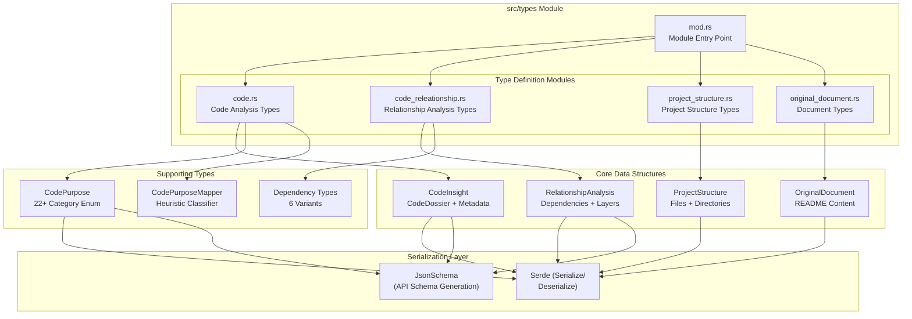
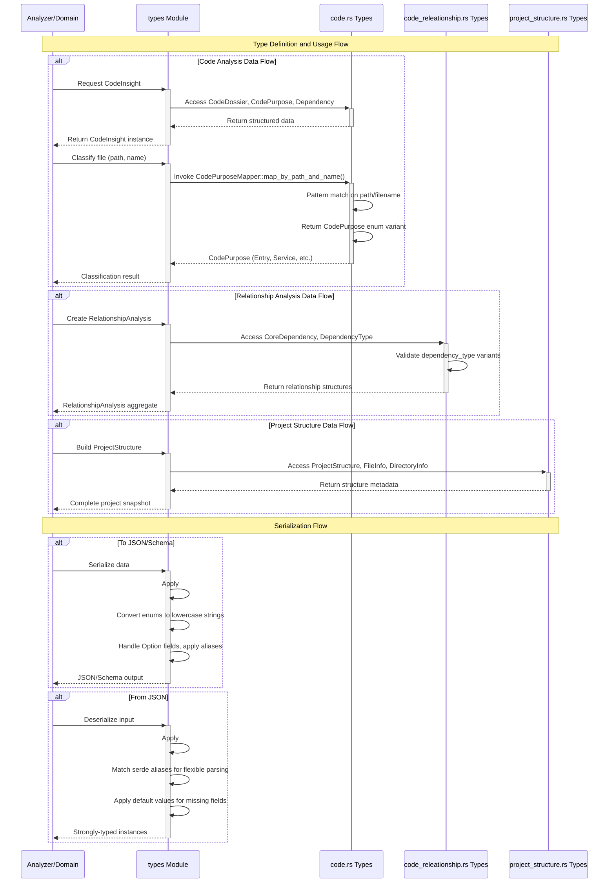

**Types Domain**
=============

**Location:** `src/types/`  
**Domain Type:** Tool Support Domain (Shared Kernel)  
**Version:** 1.0  
**Last Updated:** 2026-02-01 06:41:18 (UTC)

## 1. Overview

The **Types Domain** serves as the foundational data layer and **shared type contract** across the entire deepwiki-rs system. It provides comprehensive data structures for representing code analysis results, architectural relationships, project hierarchies, and extracted documentation. 

As a critical component of the Shared Kernel in the system's Domain-Driven Design (DDD) architecture, this domain enables type-safe communication between the Preprocessing, Research, and Composition domains while maintaining strict serialization contracts for persistence and API interoperability.

### Key Responsibilities

- **Code Analysis Representation**: Deep semantic modeling of source code through `CodeInsight` and supporting structures
- **Architectural Relationship Modeling**: Dependency tracking and architecture layer representation
- **Project Structure Abstraction**: Hierarchical file system modeling with metadata and scoring
- **Document Extraction**: Structured storage for external documentation (README, etc.)
- **Serialization Infrastructure**: JSON marshaling and OpenAPI schema generation via Serde and JsonSchema

## 2. Module Structure

The domain is organized into four specialized submodules, each addressing a specific aspect of the analysis data model:



### File Organization

| File | Responsibility | Key Exports |
|------|---------------|-------------|
| `mod.rs` | Public API aggregation and module re-exports | Public submodules |
| `code.rs` | Code analysis data structures and purpose classification | `CodeInsight`, `CodePurpose`, `CodePurposeMapper` |
| `code_releationship.rs` | Dependency and architectural relationship models | `RelationshipAnalysis`, `CoreDependency`, `ArchitectureLayer` |
| `project_structure.rs` | Project hierarchy and file metadata | `ProjectStructure`, `FileInfo`, `DirectoryInfo` |
| `original_document.rs` | External documentation containers | `OriginalDocument` |

## 3. Core Data Structures

### 3.1 Code Analysis Types (`code.rs`)

The `code.rs` module provides comprehensive structures for representing static analysis results:

**`CodeInsight`**  
The primary aggregate for code file analysis, combining:
- **`CodeDossier`**: File metadata (name, path, source summary, purpose classification, importance score)
- **`InterfaceInfo`**: API surface definitions (name, type, visibility, parameters, return types)
- **`Dependency`**: External and internal dependencies with provenance tracking (name, path, `is_external` flag, line numbers, dependency type, version constraints)
- **`CodeComplexity`**: Static metrics including cyclomatic complexity, lines of code, and function/class counts
- **Detailed descriptions and responsibility assignments**

**`CodePurpose` Enum**  
A 22-tier hierarchical taxonomy for architectural classification:
```
Entry, Agent, Page, Widget, Controller, Service, Database, Dao, 
Middleware, Config, Util, Tool, Module, Lib, Api, Types, Model, 
Plugin, Router, Test, Doc, Command, Other, SpecificFeature, Context
```

**`CodePurposeMapper`**  
Intelligent heuristic classifier implementing path-based and filename-based pattern matching:
- Pattern-based detection (e.g., `/pages/` → `Page`, `/utils/` → `Util`, `main.rs` → `Entry`)
- Case-insensitive matching
- Extension-based recognition (e.g., `.sql` → `Database`)

### 3.2 Relationship Analysis Types (`code_releationship.rs`)

Models architectural dependencies and system layering:

**`RelationshipAnalysis`**  
Container for architectural insights including:
- **`CoreDependency`**: Directional dependencies with importance scoring (1-5), type classification, and descriptive metadata
- **`ArchitectureLayer`**: Hierarchical system layers with component aggregation and level-based ordering
- **Key architectural insights and pattern classifications**

**`DependencyType` Enum**  
Six variants capturing relationship semantics:
```rust
Import, FunctionCall, Inheritance, Composition, DataFlow, Module
```

### 3.3 Project Structure Types (`project_structure.rs`)

**`ProjectStructure`** (Aggregate Root)  
Complete project snapshot containing:
- **`FileInfo`**: Path, size, extension, `is_core` flags, importance/complexity scores
- **`DirectoryInfo`**: Path, recursive file/subdirectory counts, total size, aggregate importance scores
- **Statistical distributions**: File type distribution, size histograms, language breakdowns

### 3.4 Document Types (`original_document.rs`)

**`OriginalDocument`**  
Structured container for extracted project documentation:
- README content preservation
- Provenance tracking (source path, extraction timestamp)
- Format metadata (Markdown, plain text)

## 4. Serialization Architecture

All types in the domain implement a comprehensive serialization strategy supporting multiple consumption patterns:

### 4.1 Serde Integration

**Standard Derives:**
- `Serialize` / `Deserialize`: JSON marshaling for API responses and persistence
- `JsonSchema` (via `schemars`): Automatic OpenAPI schema generation
- Standard Rust traits: `Debug`, `Clone`, `PartialEq`, `Eq`, `Hash`

**Serialization Configuration:**
```rust
#[serde(rename_all = "lowercase")]  // Consistent JSON naming conventions
#[serde(alias = "configuration", alias = "Config")]  // Backward compatibility
#[serde(default)]  // Graceful handling of missing fields
#[schemars(skip)]  // Schema exclusion for internal fields (e.g., source_summary)
```

### 4.2 Flexible Deserialization

The type system accommodates multiple input formats through extensive aliasing:
- **40+ Serde aliases** across enums and structs for legacy format support
- **Case-insensitive enum deserialization** for robust parsing
- **Default value fallbacks** using `Option<T>` and `#[serde(default)]`

### 4.3 Display and Conversion Traits

- **`Display`**: Human-readable formatting for `Dependency` and `CodePurpose`
- **Static string conversions**: Zero-allocation `&'static str` returns for enum variants
- **Type-safe classification**: Exhaustive matching enforcement for the 22-tier `CodePurpose` taxonomy

## 5. Design Patterns & Characteristics

### 5.1 Data Transfer Object (DTO) Pattern
All structs expose public fields for direct serial access, optimized for:
- JSON serialization pipelines
- Inter-domain communication via the Memory system
- API response construction

### 5.2 Aggregate Root Pattern
- **`ProjectStructure`** serves as the aggregate root for file system representation
- **`CodeInsight`** aggregates dossier, complexity, and dependency data

### 5.3 Type Safety & Classification
- **Exhaustive Enums**: 22-purpose taxonomy prevents invalid architectural states
- **Importance Scoring**: 1-5 scale enables filtering and prioritization in large codebases
- **Core File Identification**: `is_core` flags distinguish critical path components

### 5.4 API-First Design
- **JsonSchema Generation**: Automatic OpenAPI documentation support
- **Schema Validation**: Structured extraction validation in LLM integration layer
- **Cross-Language Compatibility**: Serde aliases accommodate various source formats

## 6. Integration Flow

The Types Domain operates as the data contract layer between system components:



### 6.1 Cross-Domain Dependencies

**Consumers of Types Domain:**
- **Preprocessing Domain**: Produces `CodeInsight` and `ProjectStructure` instances
- **Research Domain**: Consumes preprocessing outputs; produces `RelationshipAnalysis`
- **Composition Domain**: Transforms research data into documentation structures
- **Memory Management Domain**: Handles serialization for scoped storage

**Data Flow:**
1. **Preprocessing** creates `CodeInsight` → Stored in Memory (PREPROCESSING scope)
2. **Research** reads insights → Creates `RelationshipAnalysis` → Stored in Memory (STUDIES_RESEARCH scope)
3. **Composition** reads relationships → Generates documentation metadata

### 6.2 Public API Surface

The module exposes a unified public interface through `mod.rs`:

```rust
pub mod code;
pub mod code_releationship;
pub mod project_structure;
pub mod original_document;
```

**Key Public Interfaces:**
```rust
// Intelligent classification
impl CodePurposeMapper {
    pub fn map_by_path_and_name(file_path: &str, file_name: &str) -> CodePurpose
}

// Enum conversions
impl DependencyType {
    pub fn as_str(&self) -> &'static str
}

impl CodePurpose {
    pub fn display_name(&self) -> &'static str
}
```

## 7. Implementation Characteristics

### 7.1 Performance Considerations
- **Zero-Cost Abstractions**: Static string returns for display names
- **Efficient Serialization**: Serde's derive macros optimized for compilation speed
- **Memory Layout**: Struct fields ordered for optimal cache locality

### 7.2 Extensibility
- **New Language Support**: Adding language processors requires no changes to Types Domain
- **Additional Classifications**: `CodePurpose` enum supports feature-gated extensions
- **Custom Metadata**: `Option<T>` fields allow sparse data without breaking changes

### 7.3 Validation & Constraints
- **No Circular Dependencies**: Clean module boundaries prevent type recursion issues
- **Immutable Data**: Types are designed for construction-then-consumption patterns
- **Thread Safety**: All types implement `Send` and `Sync` for concurrent pipeline processing

## 8. Usage Guidelines

### 8.1 Adding New Code Classifications
When extending the `CodePurpose` enum:
1. Add variant to the enum definition
2. Update `display_name()` implementation
3. Add mapping logic in `CodePurposeMapper::map_by_path_and_name()`
4. Update Serde aliases if supporting legacy formats

### 8.2 Serialization Compatibility
- Use `#[serde(default)]` for new optional fields to maintain backward compatibility
- Prefer `rename_all = "lowercase"` for consistent JSON output
- Leverage `alias` attributes when supporting multiple input formats

### 8.3 Memory Scope Integration
Types are designed for specific Memory scopes:
- **PREPROCESSING**: `CodeInsight`, `ProjectStructure`
- **STUDIES_RESEARCH**: `RelationshipAnalysis`
- **DOCUMENTATION**: Documentation tree structures (defined in Composition Domain)

---

**Technical Contacts:** Architecture Team  
**Related Documentation:** Preprocessing Domain, Research Domain, Memory Management Domain