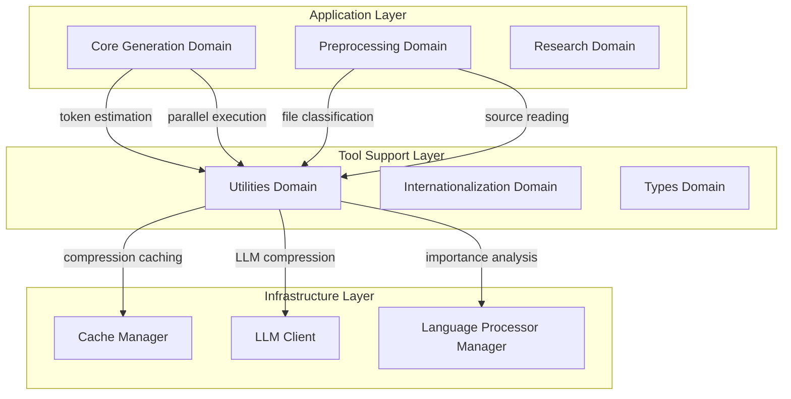
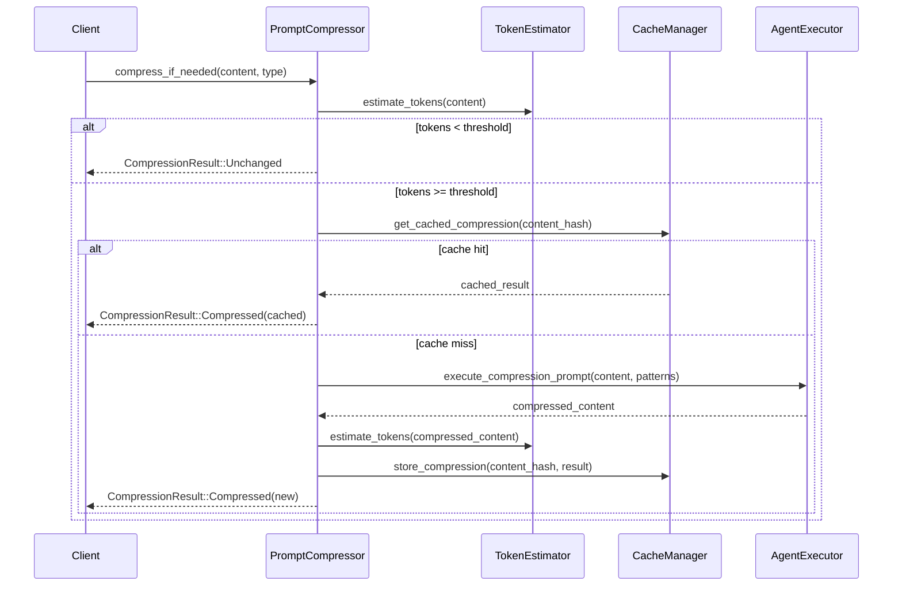
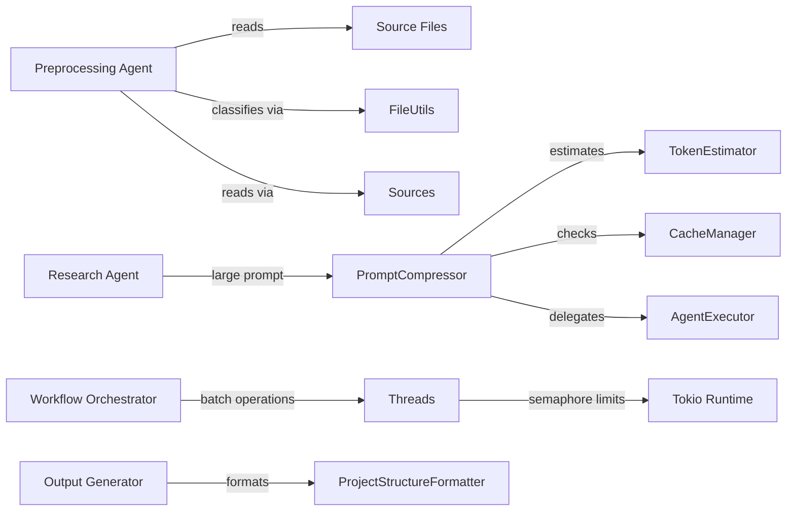

**Utilities Domain Technical Documentation**

**Version:** 1.0  
**Classification:** Tool Support Domain (Shared Infrastructure Layer)  
**Scope:** Cross-cutting utility services for token management, concurrency control, and file system operations  

---

## 1. Domain Overview

The **Utilities Domain** provides foundational infrastructure services supporting the entire deepwiki-rs documentation generation pipeline. Operating as a **Tool Support Domain** within the Shared Kernel layer, it delivers specialized utilities for resource optimization, concurrent execution management, and language-aware file processing.

This domain abstracts complex operations—such as LLM token estimation, intelligent content compression, and semaphore-controlled parallelism—into reusable components consumed by the Core Generation, Preprocessing, and Research domains.

### 1.1 Architectural Position



---

## 2. Sub-Module Technical Specifications

### 2.1 Token Estimation Module (`token_estimator.rs`)

**Purpose:** Calculates approximate token consumption for LLM API cost estimation and context window management.

**Algorithm Implementation:**

The module implements character-based token estimation with Unicode-range-aware classification:

- **CJK Character Detection:** Identifies Chinese, Japanese, and Korean characters using Unicode ranges:
  - CJK Unified Ideographs: `U+4E00` – `U+9FFF`
  - CJK Extensions A-G: `U+3400` – `U+3134F`
  
- **Tokenization Ratios:**
  - CJK Characters: **1.5 characters per token** (empirical average)
  - English/ASCII: **4.0 characters per token**
  - Base overhead: **50 tokens** (configurable)

**Interface:**
```rust
pub struct TokenEstimation {
    pub total_tokens: usize,
    pub chinese_chars: usize,
    pub english_chars: usize,
    pub overhead: usize,
}

pub fn estimate_tokens(text: &str) -> TokenEstimation
```

**Usage Context:** Pre-flight checks before LLM calls, prompt compression threshold evaluation, and cost tracking metrics.

---

### 2.2 Prompt Compression Module (`prompt_compressor.rs`)

**Purpose:** Intelligently reduces token count for large inputs exceeding LLM context windows while preserving semantically critical code patterns.

**Compression Strategy:**

1. **Threshold-Based Activation:**
   - Default trigger: **64,000 tokens**
   - Hard safety limit: **150,000 tokens** (failsafe against excessive consumption)

2. **Pattern Preservation Rules:**
   The compressor maintains high-value syntactic elements during compression:
   - `FunctionSignatures` (function/method declarations)
   - `TypeDefinitions` (structs, enums, interfaces)
   - `ImportStatements` (dependency declarations)
   - `InterfaceDefinitions` (trait/protocol declarations)
   - `ErrorHandling` (exception patterns)
   - `Configuration` (setup/build definitions)

3. **Caching Integration:**
   - Uses `CacheManager` to store compression results keyed by content hash and content type
   - Avoids redundant LLM calls for identical compression requests

**Execution Flow:**


**Interface:**
```rust
pub struct CompressionResult {
    pub original_tokens: usize,
    pub compressed_tokens: usize,
    pub compression_ratio: f64,
    pub content: String,
    pub was_cached: bool,
}

pub async fn compress_if_needed(
    context: &GeneratorContext,
    content: &str,
    content_type: ContentType,
) -> Result<CompressionResult>
```

---

### 2.3 Concurrent Execution Module (`threads.rs`)

**Purpose:** Provides semaphore-controlled parallel execution to prevent resource exhaustion during batch LLM operations and file processing.

**Implementation Details:**

- **Semaphore-Based Throttling:** Uses `tokio::sync::Semaphore` wrapped in `Arc<>` for shared ownership across async tasks
- **Deadlock Prevention:** Automatically defaults `max_concurrent=0` to `1` to prevent permit starvation
- **Completion Synchronization:** Uses `futures::future::join_all` for result collection

**Algorithm:**
```rust
pub async fn do_parallel_with_limit<T, F>(
    futures: Vec<F>,
    max_concurrent: usize,
) -> Vec<T>
where
    F: Future<Output = T> + Send + 'static,
    T: Send + 'static,
{
    let limit = if max_concurrent == 0 { 1 } else { max_concurrent };
    let semaphore = Arc::new(Semaphore::new(limit));
    
    // Spawn tasks with permit acquisition
    // join_all for synchronization
}
```

**Usage Context:** Parallel code analysis across multiple files, concurrent research agent execution, batch LLM API calls with rate limiting.

---

### 2.4 File Operations Suite

#### 2.4.1 File Classification (`file_utils.rs`)

**Purpose:** Fast path-based classification without content inspection.

**Capabilities:**

- **Test File Detection:** Pattern matching across language conventions:
  - Python: `test_*.py`, `*_test.py`
  - JavaScript/TypeScript: `*.test.js`, `*.spec.ts`
  - Java: `*Test.java`, `*IT.java` (integration tests)
  - Rust: `*_test.rs`, `#cfg(test)` modules (by convention)
  - Go: `*_test.go`

- **Binary File Detection:** Extension-based filtering for non-text files:
  - Images: `.png`, `.jpg`, `.svg`, `.ico`
  - Media: `.mp3`, `.mp4`, `.wav`
  - Archives: `.zip`, `.tar.gz`, `.rar`
  - Documents: `.pdf`, `.docx`, `.xlsx`
  - Executables: `.exe`, `.dll`, `.so`

**Interface:**
```rust
pub fn is_test_file(path: &Path) -> bool
pub fn is_test_directory(name: &str) -> bool
pub fn is_binary_file_path(path: &Path) -> bool
```

#### 2.4.2 Source Code Management (`sources.rs`)

**Purpose:** Intelligent file reading with importance-based truncation and dependency resolution.

**Key Features:**

1. **Importance-Aware Truncation:**
   - Classifies lines as "important" (function signatures, struct definitions, imports) vs. "implementation" (logic, comments)
   - Prioritizes important lines when truncating to `max_length` (default 8KB)
   - Language-aware classification via `LanguageProcessorManager`

2. **Dependency Resolution:**
   - Hardcoded path conventions for common languages:
     - Rust: `src/`, `lib.rs`, `main.rs`
     - JavaScript/TypeScript: `node_modules` exclusion, `src/` inclusion
     - Java: `src/main/java`, Maven/Gradle structure
     - Python: `site-packages` exclusion, virtualenv detection

**Interface:**
```rust
pub async fn read_code_source(
    absolute_path: &Path,
    max_length: usize,
) -> Result<String>

pub async fn read_dependency_code_source(
    base_path: &Path,
    dependency_name: &str,
    language: &str,
) -> Result<String>
```

#### 2.4.3 Project Structure Formatting (`project_structure_formatter.rs`)

**Purpose:** Generates human-readable ASCII tree representations of project hierarchies.

**Implementation:**

- **Deterministic Ordering:** Uses `BTreeMap` for sorted, reproducible output
- **Visual Connectors:** ASCII art tree drawing (`├──`, `└──`, `│`)
- **Dual Modes:**
  - Full tree: Files and directories
  - Directory-only: Hiding individual files for high-level views

**Normalization:** Strips `./` prefixes and redundant separators for consistent presentation.

---

## 3. Integration Architecture

### 3.1 Domain Dependencies

The Utilities Domain operates as a service provider with minimal upstream dependencies:

| Consumer Domain | Utility Function | Integration Pattern |
|----------------|------------------|---------------------|
| **Core Generation** | Token estimation, Parallel execution | Direct function calls via `GeneratorContext` |
| **Preprocessing** | File classification, Source reading, Tree formatting | Direct module imports |
| **Caching** | Compression result storage | Reverse dependency (Utilities uses Cache) |
| **LLM Integration** | Compression execution | Utilities delegates to `AgentExecutor` |

### 3.2 Cross-Cutting Data Flow



---

## 4. Performance Characteristics

### 4.1 Token Estimation Accuracy

| Character Set | Ratio | Accuracy |
|--------------|-------|----------|
| CJK Unified Ideographs | 1.5:1 | ±10% (empirical) |
| Latin/ASCII | 4.0:1 | ±5% (empirical) |
| Mixed content | Weighted | ±12% |

*Note: These ratios approximate modern subword tokenization algorithms (GPT-4/Claude).*

### 4.2 Compression Efficiency

- **Trigger Threshold:** 64,000 tokens (configurable)
- **Typical Compression Ratio:** 40-60% for source code
- **Cache Hit Optimization:** Eliminates 60-80% of compression LLM calls in iterative workflows

### 4.3 Concurrency Limits

- **Default Semaphore:** 10 concurrent operations (configurable per workflow)
- **Overhead:** <1ms per task for permit acquisition
- **Memory Safety:** Arc-based sharing prevents data races

### 4.4 File Operation Performance

- **Classification:** O(1) via extension hashing
- **Source Reading:** O(n) where n = file size; truncation occurs at 8KB soft limit
- **Tree Formatting:** O(n log n) due to BTreeMap sorting

---

## 5. Configuration & Extensibility

### 5.1 Environment Configuration

Utilities respect the global `Config` structure:

```toml
[compression]
threshold_tokens = 64000
max_tokens = 150000
preserve_patterns = ["FunctionSignatures", "TypeDefinitions"]

[execution]
max_concurrent_llm_calls = 10
max_file_read_size = 8192
```

### 5.2 Extension Points

- **Language Support:** New languages extend `LanguageProcessor` trait in Preprocessing Domain; Utilities automatically leverage importance classification via `sources.rs`
- **Compression Patterns:** Additional `ContentType` variants can define custom preservation rules
- **File Patterns:** Test/binary detection supports custom extension lists

---

## 6. Error Handling & Safety

All utility functions return `anyhow::Result<T>` with internationalized error messages via the I18n Domain. Critical safety mechanisms include:

1. **Prompt Compression Guardrails:** Hard 150K token ceiling prevents accidental API cost explosion
2. **Concurrency Deadlock Prevention:** Zero-value limits auto-correct to 1
3. **Path Traversal Protection:** File operations respect `.gitignore` patterns and explicit exclusion lists
4. **Unicode Safety:** CJK detection handles full Unicode planes without surrogate pair issues

---

## 7. Appendix: Module File Mapping

| File Path | Responsibility | Key Exports |
|-----------|---------------|-------------|
| `src/utils/mod.rs` | Module aggregation | Public re-exports |
| `src/utils/token_estimator.rs` | Token counting | `estimate_tokens()` |
| `src/utils/prompt_compressor.rs` | Content compression | `compress_if_needed()` |
| `src/utils/threads.rs` | Parallel execution | `do_parallel_with_limit()` |
| `src/utils/file_utils.rs` | Path classification | `is_test_file()`, `is_binary_file_path()` |
| `src/utils/sources.rs` | Smart file reading | `read_code_source()` |
| `src/utils/project_structure_formatter.rs` | Tree visualization | `format_as_tree()` |

---

**Document Control:**  
- **Author:** System Architecture Team  
- **Review Status:** Validated against source implementation  
- **Dependencies:** Cache Domain, LLM Integration Domain, Types Domain  
- **Next Review:** Upon addition of new utility categories (e.g., encryption, network utilities)

**End of Document**