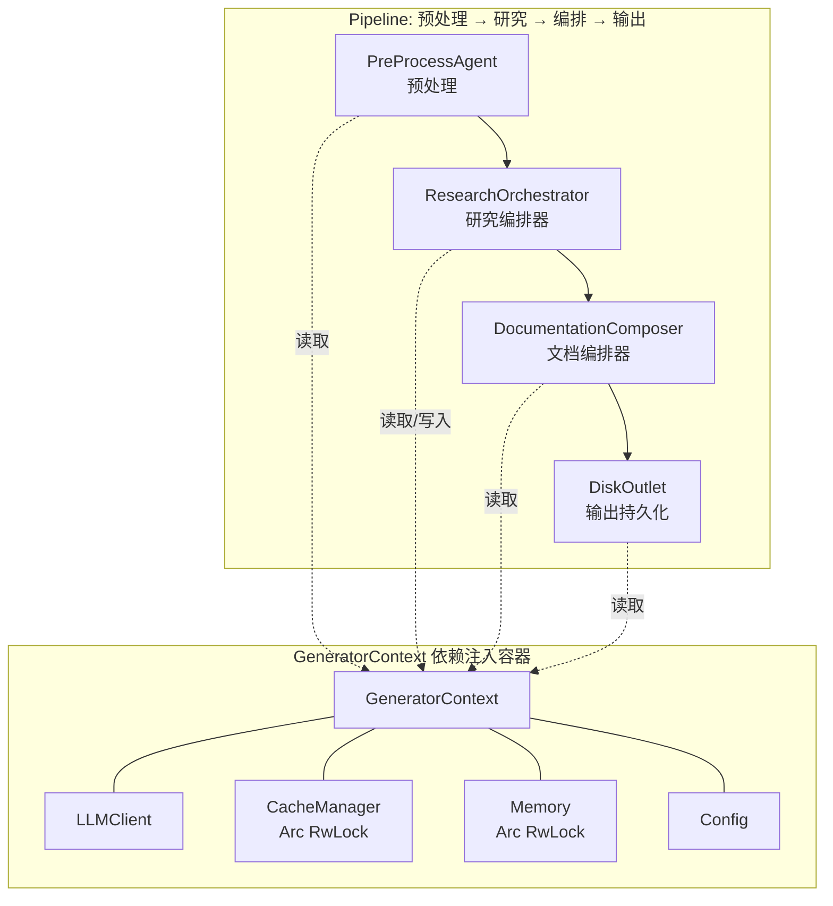
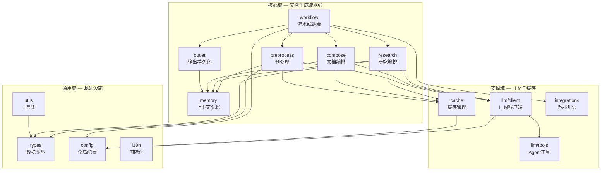
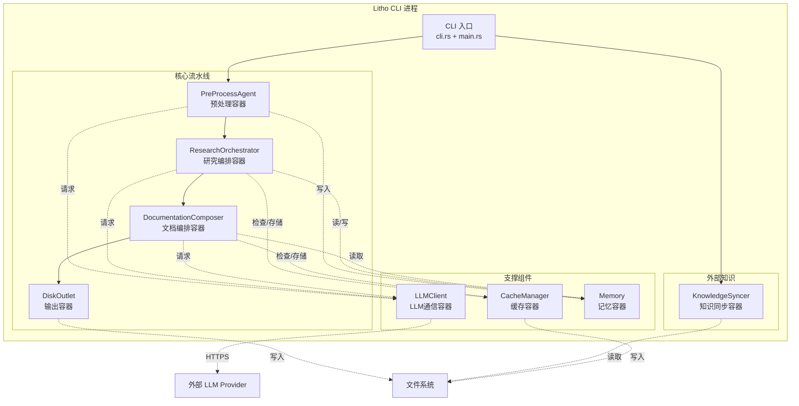

# Litho 架构概览

## 架构模式

Litho 采用的是一种**管道-过滤器（Pipeline-Filter）架构**，这条流水线把杂乱的源代码逐步加工成清晰的架构文档——就像一条汽车生产线：原材料（源码）进厂后，依次经过预处理车间（扫描和分析）、研究车间（AI 深度理解）、编排车间（文档组装）、质检车间（语法修复和验证），最终产出一辆合格的"汽车"（完整文档套件）。

选择管道-过滤器模式是经过深思熟虑的。这类文档生成任务天然具有"阶段分明、数据递进"的特点：预处理产出的结构信息是研究阶段的输入，研究产出的洞察是编排阶段的素材，编排产出的文档是输出阶段的目标。每一步的输入都严格依赖上一步的输出，这让管道模式成为最自然的选择。另一个好处是——每个阶段可以独立缓存和跳过，用户可以通过 `--skip-preprocessing` 或 `--skip-research` 来避免重复执行已完成的工作。

这个架构的精髓在于**GeneratorContext 作为贯穿全流程的依赖注入容器**。它像一条血管，把 LLMClient、CacheManager、Memory 和 Config 四大核心组件输送到每个阶段的每个 Agent。所有 Agent 都通过 GeneratorContext 获取资源，而不是自己去创建——这让整个系统在测试和替换时非常灵活。

### 为什么不用微服务？

Litho 是一个单进程 CLI 工具，而不是分布式服务。选择单进程架构是因为：文档生成是一个有限时长的批处理任务，不需要长期运行的服务进程；各阶段之间通过 Memory 直接共享数据，远比跨服务通信高效；用户期望一行命令就能完成任务，而不是部署一整套服务集群。

## 核心设计原则

理解这些设计原则就等于理解了 Litho 为什么这样写代码——每个原则背后都有一个"如果不这样做就会出什么问题"的故事。

1. **Agent 统一抽象（StepForwardAgent trait）**——这个原则解决的是"Agent 管理混乱"的问题。系统中有 7 个研究 Agent 和 6 个编排 Agent，如果每个都独立实现执行逻辑，维护成本会爆炸式增长。StepForwardAgent trait 把"验证数据源 → 格式化数据 → 构建 Prompt → 调用 LLM → 后处理"这五步标准化成 `execute()` 方法，新增 Agent 只需要定义 `data_config()` 和 `prompt_template()`，执行逻辑完全复用。这就像工厂里的标准作业流程（SOP）——无论生产什么产品，工序都是一样的，只是原材料和配方不同。

2. **Memory 作用域隔离**——这个原则解决的是"数据混乱"的问题。13 个 Agent 同时往 Memory 里写数据，如果不做作用域区分，数据会像没有标签的快递包裹堆在一起，后续读取时根本不知道哪包是谁的。Litho 用 scope（如 `"system_context"`、`"domain_modules"`）给每个 Agent 的数据贴上专属标签，读取时按 scope 精准提取。这就像快递站给每个收件人分配独立的储物柜——互不干扰，精准投递。

3. **多模型分级策略（Efficient vs Powerful）**——这个原则解决的是"成本与质量的平衡"问题。不是所有 Agent 都需要用最强模型。预处理阶段的代码摘要用 Efficient 模型就够了（成本低、速度快），但研究阶段的架构分析用 Powerful 模型才能产出深度洞察。这就像公司里不是所有岗位都需要博士——前台用本科生就够了，核心研发才需要顶尖人才。

4. **缓存即成本优化**——LLM API 调用是 Litho 最昂贵的外部资源。CacheManager 用 MD5 哈希把 Prompt+Model 组合作为缓存键，相同请求直接返回缓存结果，跳过 API 调用。这不仅省钱，还让增量更新场景（只改了少量代码）的执行速度大幅提升。

5. **ReAct 推理模式**——单次 LLM 调用就像让一个分析师只看一眼项目就写出完整报告——不可能。ReAct（Reasoning + Acting）模式让 Agent 在推理过程中主动使用工具（FileExplorer、FileReader）来补充信息，形成"思考 → 行动 → 再思考"的循环。这就像一个优秀的调研员——不会凭空下结论，而是边思考边查阅资料，逐步加深理解。

## 领域模块与职责

下面这张表格列出了 Litho 的所有核心模块。理解它们各自的职责，就理解了整个系统是如何分工协作的。

| 模块名称 | 路径 | 核心职责 | 类型 | 重要性 | 复杂度 |
|---------|------|---------|------|------|------|
| **generator/workflow** | `src/generator/workflow.rs` | 四阶段流水线调度中心——`launch()` 函数驱动整个执行流程 | 核心域 | 10 | 4 |
| **generator/step_forward_agent** | `src/generator/step_forward_agent.rs` | Agent 统一抽象层——定义 StepForwardAgent trait、PromptTemplate、DataFormatter | 核心域 | 10 | 9 |
| **generator/preprocess** | `src/generator/preprocess/` | 预处理阶段——代码扫描、结构抽取、14种语言分析、关系分析 | 核心域 | 9 | 8 |
| **generator/research** | `src/generator/research/` | 研究阶段——7个研究Agent并行执行，ResearchOrchestrator编排 | 核心域 | 9 | 7 |
| **generator/compose** | `src/generator/compose/` | 编排阶段——5个编辑器Agent生成最终文档 | 核心域 | 8 | 6 |
| **generator/outlet** | `src/generator/outlet/` | 输出阶段——DiskOutlet持久化、Mermaid修复、摘要生成 | 核心域 | 7 | 6 |
| **llm/client** | `src/llm/client/` | LLM客户端层——8个Provider适配、ReAct循环、结构化抽取 | 支撑域 | 8 | 8 |
| **llm/tools** | `src/llm/tools/` | LLM工具集——ReAct模式下的FileExplorer/FileReader/Time | 支撑域 | 6 | 5 |
| **cache** | `src/cache/` | 缓存管理——基于MD5哈希的持久化缓存+性能监控 | 支撑域 | 7 | 4 |
| **memory** | `src/memory/` | 上下文记忆——作用域化KV存储，跨阶段数据共享 | 支撑域 | 8 | 3 |
| **integrations** | `src/integrations/` | 外部知识集成——PDF/MD/SQL文档挂载与同步 | 支撑域 | 5 | 5 |
| **types** | `src/types/` | 核心数据类型——CodeInsight/FileInsight/RelationshipAnalysis等 | 通用域 | 5 | 5 |
| **config** | `src/config.rs` | 全局配置——Config/LLMConfig/CacheConfig/KnowledgeConfig等 | 通用域 | 4 | 4 |
| **utils** | `src/utils/` | 工具集——文件操作、项目格式化、Prompt压缩、Token估算 | 通用域 | 3 | 3 |
| **i18n** | `src/i18n.rs` | 国际化——多语言消息模板 | 通用域 | 2 | 2 |
| **cli** | `src/cli.rs` | CLI参数——clap derive模式定义命令行参数 | 通用域 | 2 | 2 |

## 领域间依赖关系

模块之间的关系就像一个公司的组织架构图——核心业务部门之间有明确的协作流程，支撑部门为核心业务提供基础设施，通用部门是全员共享的后勤保障。

## 关键数据结构

理解这些核心数据类型，就等于拿到了 Litho 数据模型的"设计图纸"。每个类型都承载着流水线中某个环节的核心信息。

| 类型名 | 文件路径 | 用途 |
|-------|---------|------|
| `GeneratorContext` | `src/generator/context.rs` | 流水线的"血液"——携带 LLMClient、CacheManager、Memory、Config 四大组件贯穿全流程 |
| `Config` | `src/config.rs` | 流水线的"法规"——定义所有运行参数，从项目路径到 LLM 配置到缓存策略 |
| `Memory` | `src/memory/mod.rs` | 流水线的"快递站"——Agent 间数据共享的中枢，用 scope 标签精准管理 |
| `CacheManager` | `src/cache/mod.rs` | 流水线的"记账本"——记录哪些 LLM 调用已经做过，避免重复花钱 |
| `StepForwardAgent` trait | `src/generator/step_forward_agent.rs` | Agent 的"标准作业流程"——统一 execute() 方法，所有 Agent 复用 |
| `PromptTemplate` | `src/generator/step_forward_agent.rs` | Agent 的"配方"——定义系统提示、用户指令、LLM 调用模式 |
| `DataFormatter` | `src/generator/step_forward_agent.rs` | Agent 的"预处理厨师"——把原始数据加工成 LLM 能理解的格式 |
| `CodeInsight` | `src/types/code.rs` | 代码文件的"体检报告"——记录文件职责、接口、依赖、复杂度等分析结果 |
| `DirectoryDossier` | `src/types/mod.rs` | 目录的"档案"——记录目录用途、重要性评分、核心文件列表 |
| `RelationshipAnalysis` | `src/types/code_releationship.rs` | 依赖关系的"拓扑图"——记录核心依赖、架构分层、模块间关系 |
| `ProviderClient` | `src/llm/client/providers.rs` | LLM 的"多国翻译器"——8种 Provider 的统一适配层 |
| `ProjectStructure` | `src/types/project_structure.rs` | 项目结构的"族谱"——目录和文件的层级关系 |

## 核心接口与 Trait

Litho 的核心抽象体现了"标准化流程 + 定制化内容"的设计哲学。每个 trait 都定义了"做什么"的标准流程，而具体 Agent 只需要提供"用什么数据和什么 Prompt"的定制化配置。

| 名称 | 实现数量 | 核心职责 |
|-----|---------|---------|
| `StepForwardAgent` | 13个实现（7研究+6编排） | Agent 的统一执行流程——验证数据→格式化→构建Prompt→调用LLM→后处理 |
| `Generator<T>` | 1个（PreProcessAgent） | 生成器抽象——定义 `execute()` 接口 |
| `Outlet` | 1个（DiskOutlet） | 输出抽象——定义 `save()` 接口 |
| `LanguageProcessor` | 14个实现 | 语言处理器——每种语言独立实现代码结构抽取逻辑 |
| `MemoryRetriever` | 内部使用 | Memory 读取接口——按 scope 读取研究数据 |

## 架构决策记录

这些决策不是随意做出的——每个选择背后都有明确的理由和被放弃的替代方案。

1. **选择管道模式而非事件驱动**，放弃了事件驱动架构，因为文档生成是明确的阶段式批处理任务，不存在"某事件触发某动作"的场景。管道模式的顺序执行天然匹配"预处理→研究→编排→输出"的流程。

2. **选择 Memory 作用域而非全局共享**，放弃了简单的 HashMap 全局存储，因为 13 个 Agent 同时写入会导致数据混乱和命名冲突。作用域机制给每个 Agent 分配独立命名空间，读取时精准定位。

3. **选择 rig-core 而非自研 LLM 客户端**，放弃了手动实现 HTTP 调用和响应解析，因为 rig-core 已经提供了 Agent/Extractor/Tool 的成熟抽象，且支持 8 种 Provider。自研意味着要重复处理 rate-limiting、错误重试、流式响应等复杂问题。

4. **选择 ReAct 模式而非单次 Prompt**，放弃了"一次 Prompt 输入全部代码"的简单方案，因为大型项目的信息量远超单次 LLM 调用的处理能力。ReAct 模式让 Agent 按需使用工具补充信息，逐步深化理解。

5. **选择 MD5 哈希缓存而非时间戳缓存**，放弃了基于时间戳的缓存策略，因为 LLM 的输出质量取决于 Prompt 内容和模型版本，而不是请求时间。MD5(Prompt + Model) 确保了"同样的输入一定得到同样的缓存结果"。

6. **选择 Arc<RwLock> 而非 Arc<Mutex>**，因为 Memory 和 CacheManager 的读操作远多于写操作。RwLock 允许多个读操作并发进行，只有写操作才需要独占锁——这在多 Agent 并发读取研究数据时性能优势明显。

## C4 Container 图

Litho 作为一个 CLI 工具，它的 Container 层级实际上就是各个功能模块之间的关系。下面的图展示了核心流水线各阶段与其支撑组件的交互。

---

> **置信度评分**：7/10 — 架构模式的识别有充分的代码证据（launch 函数的顺序调用、StepForwardAgent trait 的统一抽象）；领域模块的 DDD 分组基于目录结构和命名语义的推断，准确性较高但可能存在主观偏差。