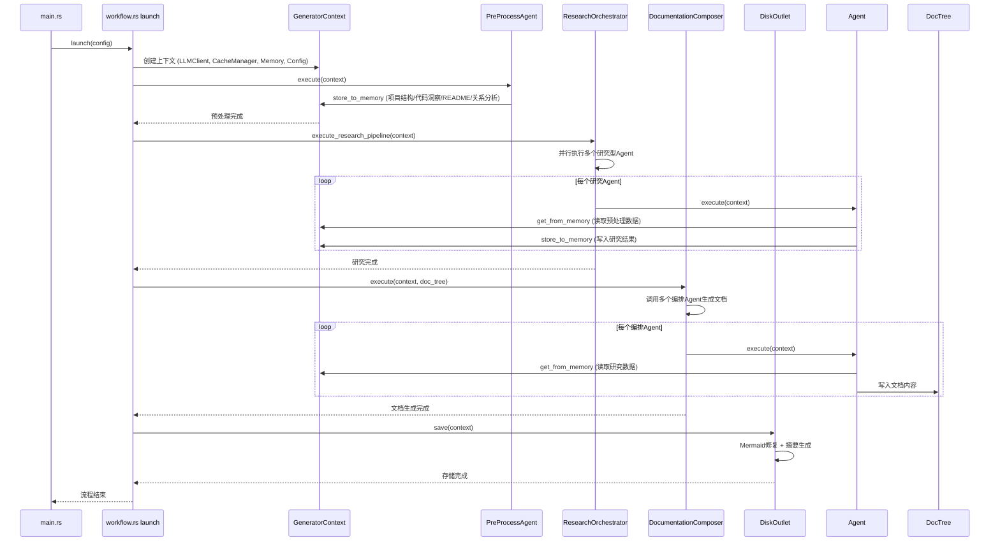
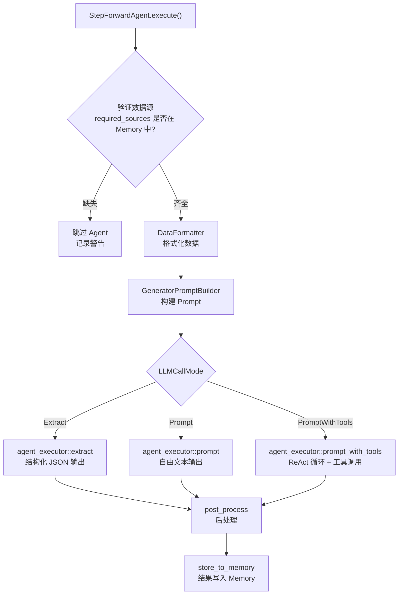

# Litho 工作流程

## 总体流程

如果把 Litho 比作一家报纸——预处理就是记者的采访阶段（收集素材），研究就是编辑的深度分析阶段（提炼观点），编排就是排版阶段（组装版面），输出就是印刷发行阶段（质检出厂）。每一步都为下一步提供不可或缺的输入，缺了任何一步，最终的"报纸"都不完整。

Litho 的执行流程遵循一个清晰的管道模式：`预处理` → `深度研究` → `文档编排` → `输出存储`。整个流程由 `launch` 函数驱动，通过 `GeneratorContext` 注入所有依赖。这个设计的核心思想是"每一步的产出都是下一步的输入"——Memory 在这个链条中扮演数据传递中枢的角色。

## 工作流1：文档生成主流程

这是 Litho 的"一号流程"——绝大多数用户的使用场景都是通过这个流程完成的。从用户在终端输入 `deepwiki-rs` 开始，到最终在输出目录看到完整文档集，中间经历了四个阶段、十多个 Agent 的接力协作。

**触发方式**：用户在终端执行 `deepwiki-rs` 命令（或指定参数变体）
**入口**：`launch()` 函数 in `src/generator/workflow.rs`

### 执行步骤

1. **初始化依赖注入容器**（`GeneratorContext::new`）——创建 LLMClient、CacheManager、Memory 三大核心组件，并将 Config 注入。这一步是整个流程的基础设施搭建，相当于工厂开工前先确保水电气供应正常。

2. **外部知识同步**（可选）——如果配置了外部知识挂载（PDF/MD/SQL），先检查缓存是否过期，如需要则调用 `KnowledgeSyncer` 更新本地缓存。这一步的设计意图是"让 AI 看到人类写过的文档"——架构决策记录、设计文档等外部知识能大幅提升分析的准确性。

3. **预处理阶段**（`PreProcessAgent::execute`）——扫描项目目录结构、读取 README、调用各语言处理器抽取代码结构信息、分析依赖关系。这是流水线的"原材料准备车间"——把杂乱的源码变成结构化的 CodeInsight、DirectoryDossier、RelationshipAnalysis 等数据，存入 Memory 供后续阶段使用。

4. **研究阶段**（`ResearchOrchestrator::execute_research_pipeline`）——依次执行 7 个研究型 Agent，每个 Agent 从 Memory 读取预处理数据，通过 LLM 深度分析后将结果写回 Memory。这相当于流水线的"核心技术车间"——每个 Agent 都是从不同角度对项目进行深度剖析的专业分析师。

5. **编排阶段**（`DocumentationComposer::execute`）——5 个编排 Agent 从 Memory 读取研究数据，生成各章节文档内容并写入 DocTree。这是"排版车间"——把各分析师的报告组装成结构化的文档体系。

6. **输出阶段**（`DiskOutlet::save`）——将 DocTree 持久化到磁盘，修复 Mermaid 图表语法，生成执行摘要报告。这是"质检与出厂"环节——确保文档质量合格后才交付给用户。

**输出/结果**：一套完整的 C4 模型文档（概述、架构、工作流、模块深度研究、边界接口、数据库概览），存放在用户指定的输出目录中。

## 工作流2：外部知识同步

这个流程是为"知识挂载"功能服务的——用户可以把项目外部的文档（如架构设计 PDF、数据库 SQL 文件）作为补充知识源提供给 Litho，让 AI 的分析更具上下文。

**触发方式**：用户执行 `deepwiki-rs sync-knowledge` 子命令，或在文档生成主流程中自动触发（当缓存过期时）
**入口**：`sync_knowledge()` 函数 in `src/main.rs`

### 执行步骤

1. **加载配置**——读取 litho.toml 中的 `knowledge.local_docs` 配置，确定知识源分类（architecture/database/api/deployment/adr/workflow/general）和文件路径 glob 模式。
2. **检查缓存**——如果缓存未过期且非强制模式，跳过同步。这个设计节省了不必要的重复处理。
3. **文件匹配与处理**——遍历 glob 模式匹配的文件，根据文件类型（PDF/MD/SQL/YAML/JSON）调用对应的处理器提取内容。
4. **分块处理**——大文档（超过 min_size_for_chunking）按策略（semantic/paragraph/fixed）分割成多个 chunk，避免超出 LLM 的处理窗口。
5. **缓存存储**——将处理后的内容存入 `.litho/cache/knowledge/local_docs/` 目录，后续文档生成时按分类和目标 Agent 定向传递。

## 工作流3：单个 Agent 的执行流程

所有 13 个 Agent（7个研究 + 6个编排）都遵循同一个标准化执行流程——这是 StepForwardAgent trait 的核心设计。理解这个流程就理解了每个 Agent 的"工作方式"。

**触发方式**：由编排器（ResearchOrchestrator 或 DocumentationComposer）调用 `agent.execute(context)`
**入口**：`StepForwardAgent::execute()` in `src/generator/step_forward_agent.rs`

### 执行步骤

1. **验证数据源**（`validate_data_sources`）——检查 Memory 中是否已存在必需的数据（如项目结构、代码洞察）。如果缺少必需数据，跳过此 Agent 并记录警告。这个设计避免了"没有原材料就开始生产"的空转浪费。

2. **格式化数据**（`DataFormatter::format_*`）——把 Memory 中存储的原始数据（JSON 格式）转化为 LLM 可读的文本格式。DataFormatter 支持"紧急截断"机制——当数据量超过 token 限制时，智能裁剪低优先级内容（如降低依赖分析的详细度），确保核心信息不丢失。

3. **构建 Prompt**（`GeneratorPromptBuilder::build_prompts`）——将格式化后的数据填充到 PromptTemplate 中，生成完整的系统提示和用户提示。支持时间占位符替换（`{current_time}`），让 Agent 知道当前分析的时间点。

4. **调用 LLM**——根据 `LLMCallMode` 选择三种调用方式之一：
   - **Extract 模式**：LLM 返回结构化 JSON，直接反序列化为目标类型。用于需要精确输出的场景（如领域模块检测、代码洞察）。
   - **Prompt 模式**：LLM 返回自由文本，直接作为文档内容。用于需要叙述性输出的场景（如概述文档、工作流描述）。
   - **PromptWithTools 模式**：ReAct 循环——Agent 在推理过程中可以调用 FileExplorer/FileReader/Time 等工具补充信息。用于需要自主探索的场景（如系统上下文研究、架构分析）。

5. **后处理**（`post_process`）——部分 Agent 需要对 LLM 输出进行额外处理。例如 DomainModulesDetector 会解析 JSON 输出并补充 importance 评分，KeyModulesInsight 会筛选核心模块。

## 并发/异步模型

Litho 选择的是"稳优先而非快优先"的并发策略。整个流水线是严格的顺序执行——预处理完成才开始研究，研究完成才开始编排。但在每个阶段内部，有适度的并发优化：

- **研究阶段内部**：7 个研究 Agent 不是完全并行执行的，而是有一定的顺序依赖。SystemContextResearcher 和 DomainModulesDetector 先执行，因为它们的结果是后续 Agent 的上下文。之后的 Architecture/Workflow/Boundary/KeyModules Agent 可以适度并行，由 `max_parallels` 配置控制并发度。
- **LLM 调用**：`ProviderClient` 和 `LLMClient` 的所有方法都是异步的，支持并发请求。但实际并发度受 `max_parallels`（默认 3）和 `tool_concurrency`（默认 5）的限制，避免超出 LLM Provider 的 rate-limiting 窗口。
- **Memory 和 CacheManager**：使用 `Arc<RwLock>` 而不是 `Arc<Mutex>`，因为读操作远多于写操作。RwLock 允许多个 Agent 同时读取研究数据，只在写入时才需要独占锁。
- **缓存命中时的短路**：如果 CacheManager 发现某个 Agent 的 Prompt+Model 组合已有缓存结果，直接返回缓存，跳过 LLM 调用——这相当于"这道题已经做过了，直接抄答案"，节省大量时间和成本。

## 错误处理策略

Litho 的错误处理遵循"局部失败不应导致全局中断"的核心理念。具体策略如下：

1. **Agent 跳过而非崩溃**：如果某个 Agent 的必需数据源缺失，它不会 panic 或返回错误，而是跳过执行并记录警告。这意味着即使预处理阶段某个语言处理器失败了，其他语言的代码分析仍然可以正常进行。
2. **LLM 调用重试**：`retry_with_backoff` 方法实现了指数退避重试机制——第一次失败后等 1 秒重试，第二次失败后等 2 秒，最多尝试 `retry_attempts` 次。这避免了因为 LLM Provider 临时不可用而导致整个流程崩溃。
3. **缓存容错**：如果缓存文件损坏或过期，CacheManager 会静默忽略并重新发起 LLM 调用，不会因为缓存问题阻断流程。
4. **外部知识容错**：如果外部知识同步失败（如 PDF 解析错误），只打印警告信息，不影响主流程继续执行。
5. **Mermaid 修复容错**：如果 mermaid-fixer 工具不可用，`launch` 函数会直接 bail（因为 Mermaid 图质量是文档交付的标准要求）。但如果修复过程中某个图表修复失败，只标记该图表，不影响其他图表和文档内容。
6. **anyhow + thiserror 组合**：应用层使用 anyhow 处理错误链（方便错误上下文传播），自定义错误类型使用 thiserror（方便错误分类和匹配）。

## 关键时序交互

从上面的主流程时序图中，可以读出一个非常清晰的模式：**每个 Agent 都经历"读 Memory → 调 LLM → 写 Memory"的三步循环**。这个模式贯穿预处理、研究、编排三个阶段，是整个系统的核心交互节奏。

另一个重要模式是**缓存插入**：在"调 LLM"这一步之前，Agent 会先检查 CacheManager 是否已有相同 Prompt+Model 的缓存结果。如果有，直接返回缓存，跳过 LLM 调用。这意味着在增量更新场景下，大部分 Agent 可以在秒级完成，只有涉及新增代码的 Agent 才需要真正调用 LLM。

还有一个容易被忽略但很重要的交互：**外部知识定向传递**。编排阶段中的 Agent 通过 `load_external_knowledge_by_categories` 方法，可以按分类（architecture/database/api 等）精准加载与自己职责相关的外部文档——这避免了把所有外部知识一股脑塞给每个 Agent，既节省了 token 又提升了分析精度。

---

> **置信度评分**：8/10 — 工作流描述基于 workflow.rs 的 launch 函数和 StepForwardAgent trait 的 execute 方法的直接分析，准确性高。Agent 执行顺序的推断基于 ResearchOrchestrator 的代码逻辑，有明确的代码证据。