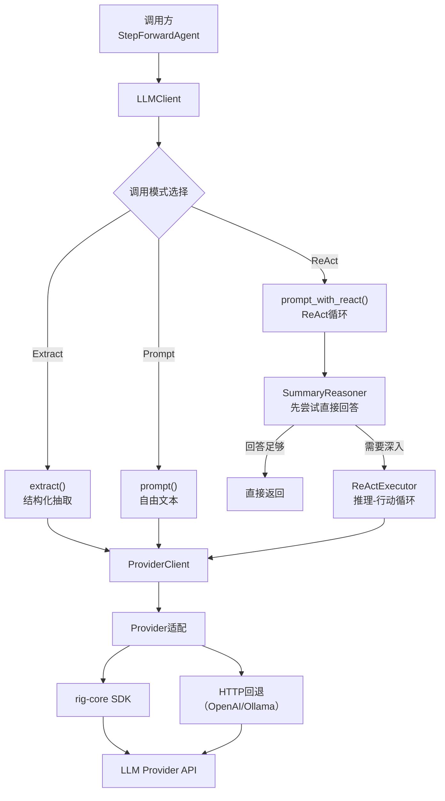

# LLM客户端模块 (llm/client)

## 这个模块在做什么

LLM 客户端模块是 Litho 的"嘴和耳朵"——它是系统与外部 LLM 服务通信的唯一桥梁。所有的智能分析能力都来自这里——无论是代码洞察生成、架构模式识别、还是文档内容编排，最终都需要通过这个模块把 Prompt 发送给 LLM Provider，再把响应拿回来。可以说，如果没有这个模块，Litho 就只是一个静态代码分析器——有了它，才真正拥有了"理解"项目的能力。

这个模块的设计挑战在于"多 Provider 适配"。LLM 市场百花齐放，每个 Provider 的 API 细节都有微妙差异（OpenAI 的结构化输出 vs Anthropic 的消息格式 vs Ollama 的本地调用）。Litho 的解决方案是"统一接口 + 适配器模式"——用 rig-core 的抽象层屏蔽差异，同时在 ProviderClient enum 中为每种 Provider 实现特定的适配逻辑。

## 核心功能点

1. **多 Provider 创建与适配**——`ProviderClient::new()` 根据 LLMProvider enum 创建对应的 rig-core 客户端实例。`create_agent`/`create_agent_with_tools`/`create_extractor` 为每种 Provider 构建 Agent/Extractor，处理各 Provider 的 API base URL、模型名称、工具定义等差异。它解决的是"不同 Provider 的 API 不能用同一套代码直接调用"的问题。

2. **三种 LLM 调用模式**——`LLMClient` 提供三种调用入口：
   - `extract()`：结构化抽取——LLM 返回 JSON，反序列化为目标类型（如 `DirectoryDossier`）
   - `prompt()`：自由文本——LLM 返回叙述性文本（如文档内容）
   - `prompt_with_react()`：ReAct 循环——Agent 在推理过程中可以调用工具
   这解决的是"不同任务需要不同类型的 LLM 输出"的问题。

3. **ReAct 推理执行**——`prompt_with_react()` 启动 ReAct 循环，Agent 可以在推理过程中使用 FileExplorer/FileReader/Time 等工具自主探索项目。它解决的是"单次 LLM 调用的信息量不足以理解复杂项目"的问题——ReAct 让 Agent 像调研员一样边思考边查阅资料。

4. **Summary Reasoning 回退策略**——`try_summary_reasoning()` 在 ReAct 循环之前尝试直接用 Prompt 获取回答，如果足够清晰则跳过 ReAct。它解决的是"不是所有问题都需要工具探索"的问题——简单问题直接回答更高效。

5. **指数退避重试**——`retry_with_backoff()` 在 LLM 调用失败时自动重试，等待时间指数增长。它解决的是"LLM Provider 临时不可用"的问题——避免一次 API 错误导致整个流程崩溃。

6. **模型分级选择**——`evaluate_befitting_model()` 根据 Agent 的复杂度需求选择 Efficient 或 Powerful 模型。它解决的是"成本与质量的平衡"问题。

## 关键组件

| 组件/类型 | 文件路径 | 一句话职责 |
|---------|---------|----------|
| `LLMClient` | `src/llm/client/mod.rs` | LLM调用的统一入口——提供extract/prompt/prompt_with_react三种模式 |
| `ProviderClient` | `src/llm/client/providers.rs` | 8种Provider的适配器——屏蔽各Provider的API差异 |
| `ProviderAgent` | `src/llm/client/providers.rs` | Agent的多Provider包装——统一prompt()接口 |
| `ProviderExtractor` | `src/llm/client/providers.rs` | Extractor的多Provider包装——统一extract()接口 |
| `ReActExecutor` | `src/llm/client/react_executor.rs` | ReAct循环执行器——推理+行动+工具调用 |
| `SummaryReasoner` | `src/llm/client/summary_reasoner.rs` | 简化推理策略——先尝试直接回答再决定是否ReAct |
| `AgentBuilder` | `src/llm/client/agent_builder.rs` | Agent构建器——封装create_agent的配置逻辑 |
| `OpenAICompatibleExtractorWrapper` | `src/llm/client/openai_compatible_extractor.rs` | OpenAI结构化输出的HTTP回退——当SDK调用失败时直接HTTP请求 |
| `OllamaExtractorWrapper` | `src/llm/client/ollama_extractor.rs` | Ollama结构化输出适配——Ollama的API与OpenAI有差异需特殊处理 |

## 内部数据流

关键步骤：
1. **LLMClient 选择调用模式**：根据 Agent 的 `LLMCallMode` 决定调用路径
2. **ProviderClient.create_agent_with_tools**：为 ReAct 模式构建带工具的 Agent，定义 FileExplorer/FileReader/Time 的描述和参数 schema
3. **ReActExecutor 执行循环**：Agent 发送 Prompt → LLM 返回推理结果 → 如果需要使用工具，调用工具获取信息 → 再次 Prompt → 直到得出最终回答
4. **OpenAICompatibleExtractorWrapper**：当 rig-core 的 SDK 调用失败时（如 OpenAI 的 structured output 不支持），回退到直接 HTTP POST 请求，绕过 SDK 限制

## 扩展点

最核心的扩展点是 **ProviderClient enum**。要支持新的 LLM Provider，需要：
1. 在 `LLMProvider` enum 中添加新的 variant
2. 在 `ProviderClient::new()` 中创建该 Provider 的 rig-core 客户端
3. 在 `ProviderAgent` 和 `ProviderExtractor` enum 中添加对应的 variant
4. 在 `ProviderAgent::prompt()` 和 `ProviderExtractor::extract()` 中实现该 Provider 的调用逻辑

当前的 8 个 Provider 已经覆盖了主流 LLM 服务，但 rig-core 框架本身的扩展性使得添加新 Provider 的工作量相对可控。

## 性能考量

LLM 调用是 Litho 最大的性能瓶颈和成本来源。几个关键的优化：

- **缓存优先**：每次 LLM 调用前先检查 CacheManager，命中则直接返回，避免重复调用
- **模型分级**：Efficient 模型用于简单任务（代码摘要、评分），Powerful 模型用于复杂任务（架构分析、文档编排），在保证质量的同时节省成本
- **重试机制**：指数退避重试避免因临时 API 错误导致的流程中断
- **Prompt 压缩**：当数据量超限时自动压缩 Prompt 内容，减少 token 消耗
- **Summary Reasoning 优化**：简单问题不走 ReAct 循环，直接 Prompt 获取答案，节省工具调用和多次推理的成本

---

> **置信度评分**：8/10 — ProviderClient 的 8 种 variant 和 LLMClient 的三种调用模式基于代码的直接分析，准确性高。