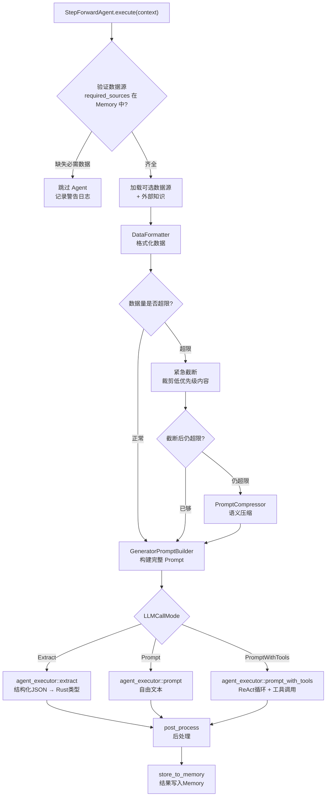

# StepForwardAgent 抽象层 (generator/step_forward_agent)

## 这个模块在做什么

StepForwardAgent 抽象层是 Litho 整个 Agent 系统的"灵魂"——它定义了所有 Agent 的标准作业流程（SOP），让 13 个 Agent（7个研究 + 6个编排）共享同一套执行逻辑，而只需各自提供定制化的"配方"（数据配置和 Prompt 模板）。这个设计的核心价值是"标准化流程 + 定制化内容"——就像麦当劳的标准化制作流程，每个汉堡的工序是一样的（烤面包→加肉饼→加配料→包装），只是配料不同（牛肉饼 vs 鸡肉饼 vs 鱼肉饼）。

如果没有这个抽象层，每个 Agent 都需要独立实现"验证数据→格式化→构建Prompt→调用LLM→写Memory"的完整流程——13个 Agent 就会有13套几乎相同的代码，维护成本爆炸式增长。有了 StepForwardAgent trait，新增一个 Agent 只需要定义三个配置方法（`data_config()`、`prompt_template()`、`memory_scope_key()`），执行逻辑完全复用 trait 的默认实现。

## 核心功能点

1. **统一执行流程**——`StepForwardAgent::execute()` 定义了所有 Agent 的标准执行步骤：验证数据源 → 格式化数据 → 构建 Prompt → 调用 LLM → 后处理 → 写入 Memory。这解决的是"Agent 执行逻辑重复"的问题——13 个 Agent 共享同一套流程代码。

2. **数据源配置**——`AgentDataConfig` 定义每个 Agent 需要哪些必需数据源（如项目结构、代码洞察）和可选数据源（如外部知识、README）。`DataSource` enum 提供了 4 种数据类型：MemoryData（Memory 中的预处理数据）、ResearchResult（研究结果）、ExternalKnowledgeByCategory（外部知识）。这解决的是"每个 Agent 需要不同的输入数据"的问题。

3. **Prompt 模板系统**——`PromptTemplate` 定义每个 Agent 的系统提示（system_prompt）、开场指令（opening_instruction）、收尾指令（closing_instruction）和 LLM 调用模式（Extract/Prompt/PromptWithTools）。这解决的是"每个 Agent 有不同的分析和输出方式"的问题。

4. **智能数据格式化**——`DataFormatter` 把 Memory 中的原始数据转化为 LLM 可读的文本格式，支持"紧急截断"机制——当数据量超限时，智能裁剪低优先级内容（先砍依赖分析，再砍 README，保留核心代码洞察），确保不超出 token 限制。

5. **Prompt 压缩**——`PromptCompressor` 在数据量极端超限时，通过 LLM 对 Prompt 内容进行语义压缩，保留核心信息、去除冗余描述。这是"最后的防线"——当紧急截断都不够时，压缩机制确保流程不会因为 token 超限而崩溃。

6. **LLM 调用模式选择**——三种模式覆盖所有 Agent 的输出需求：
   - **Extract**：返回结构化 JSON → 反序列化为 Rust 类型（如 `DirectoryDossier`）
   - **Prompt**：返回自由文本 → 直接作为文档内容
   - **PromptWithTools**：ReAct 循环 → Agent 自主使用工具探索项目

## 关键组件

| 组件/类型 | 文件路径 | 一句话职责 |
|---------|---------|----------|
| `StepForwardAgent` trait | `src/generator/step_forward_agent.rs` | Agent的统一SOP——定义标准化的5步执行流程 |
| `PromptTemplate` | `src/generator/step_forward_agent.rs` | Agent的"配方"——定义提示词和LLM调用模式 |
| `DataFormatter` | `src/generator/step_forward_agent.rs` | Agent的"预处理厨师"——把原始数据加工成LLM可读格式 |
| `GeneratorPromptBuilder` | `src/generator/step_forward_agent.rs` | Prompt构建器——把模板和数据合成完整的Prompt |
| `AgentDataConfig` | `src/generator/step_forward_agent.rs` | 数据需求声明——定义每个Agent需要什么输入 |
| `DataSource` enum | `src/generator/step_forward_agent.rs` | 数据源类型——Memory数据/研究结果/外部知识 |
| `LLMCallMode` enum | `src/generator/step_forward_agent.rs` | LLM调用模式——Extract/Prompt/PromptWithTools |
| `FormatterConfig` | `src/generator/step_forward_agent.rs` | 格式化配置——控制截断策略、代码限制、压缩参数 |

## 执行流程详解

关键设计细节：
1. **数据源验证**是 Agent 自保护机制——如果 Memory 中没有必需数据（如项目结构），跳过执行比强行执行更合理
2. **紧急截断的优先级排序**：代码洞察 > 目录洞察 > README > 依赖分析——保留最核心的信息，砍最不重要的
3. **时间占位符替换**：`replace_time_placeholders()` 把 Prompt 中的 `{current_time}` 替换为实际时间，让 Agent 知道分析的时效性
4. **post_process 可选覆写**：DomainModulesDetector 用它做 importance 评分补充，其他 Agent 大多数不需要后处理

## 性能考量

StepForwardAgent 抽象层的性能影响主要来自两个地方：

- **Prompt 压缩**：当数据量极端超限时，PromptCompressor 本身需要一次额外的 LLM 调用来做语义压缩。这是"花一次小钱省一次大钱"的策略——压缩后的 Prompt 调用 LLM 的成本远低于超限重试。
- **数据格式化**：DataFormatter 的格式化操作是纯计算（不含 LLM 调用），性能开销极小。紧急截断是字符串操作，复杂度可控。

---

> **置信度评分**：9/10 — 这个模块是整个系统的核心抽象，描述基于722行的代码的直接分析，信息准确性极高。