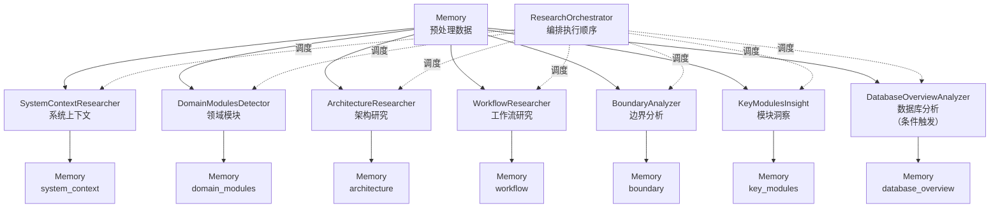

# 研究模块 (generator/research)

## 这个模块在做什么

研究模块是 Litho 的"大脑"——它负责对项目进行真正的深度理解。如果说预处理只是把源码拆成碎片（项目结构、代码洞察、依赖关系这些"原材料"），那么研究的工作就是把这些碎片拼成完整图景：这个项目在做什么？它的核心模块有哪些？架构模式是什么？关键的工作流是怎样的？边界接口在哪里？这些深层次的理解是后续编排阶段生成高质量文档的前提。

这个模块的设计哲学是"专业分工、各司其职"——7 个研究 Agent 分别从不同角度审视同一个项目，就像一个公司派出了 7 个不同领域的分析师：系统分析师看宏观格局，模块分析师看组织结构，架构分析师看设计模式，工作流分析师看执行路径，边界分析师看对外接口，模块洞察官看核心实现，数据库分析师看数据架构。每个分析师都独立工作，但最终通过 Memory 共享研究结果。

## 核心功能点

1. **系统上下文研究**（`SystemContextResearcher`）——识别项目的系统边界、用户角色、外部依赖、业务价值。它解决的是"这个项目在整个技术生态中处于什么位置"的问题——有了宏观定位，后续的微观分析才不会迷失方向。

2. **领域模块检测**（`DomainModulesDetector`）——用 DDD 思想识别项目的限界上下文和模块边界，评估每个模块的重要性。它解决的是"项目的内部组织架构是怎样的"问题——模块划分直接影响架构图的质量。

3. **架构深度研究**（`ArchitectureResearcher`）——识别整体架构模式、核心设计决策、技术选型理由。它解决的是"项目选择了什么架构策略、为什么这样选择"的问题——这往往是架构文档中最有价值的内容。

4. **工作流研究**（`WorkflowResearcher`）——追踪核心业务执行流程，从输入到输出的完整路径。它解决的是"项目是怎么运转的"问题——工作流是连接所有模块的"纽带"。

5. **边界接口分析**（`BoundaryAnalyzer`）——全面枚举系统对外暴露的接口（CLI、API、配置）。它解决的是"系统的对外边界在哪里"的问题——理解边界就理解了系统的对外承诺。

6. **关键模块深度洞察**（`KeyModulesInsight`）——对核心领域模块逐一深度分析，为 Deep-Exploration 文档提供素材。它解决的是"核心模块的内部实现是怎样的"问题——这是最深层的分析。

7. **数据库概览分析**（`DatabaseOverviewAnalyzer`）——条件触发，仅在检测到 SQL 项目时执行。分析数据表、视图、存储过程、表关系。它解决的是"数据库架构是怎样的"问题。

## 关键组件

| 组件/类型 | 文件路径 | 一句话职责 |
|---------|---------|----------|
| `ResearchOrchestrator` | `src/generator/research/orchestrator.rs` | 研究阶段的总指挥——编排7个Agent的执行顺序和并发策略 |
| `SystemContextResearcher` | `src/generator/research/agents/system_context_researcher.rs` | 系统宏观分析师——识别用户、外部依赖、业务价值 |
| `DomainModulesDetector` | `src/generator/research/agents/domain_modules_detector.rs` | 组织结构分析师——用DDD识别模块边界和重要性 |
| `ArchitectureResearcher` | `src/generator/research/agents/architecture_researcher.rs` | 设计模式分析师——识别架构模式和技术选型 |
| `WorkflowResearcher` | `src/generator/research/agents/workflow_researcher.rs` | 流程路径分析师——追踪核心执行流程 |
| `BoundaryAnalyzer` | `src/generator/research/agents/boundary_analyzer.rs` | 边界守护者——枚举对外接口 |
| `KeyModulesInsight` | `src/generator/research/agents/key_modules_insight.rs` | 深度洞察官——逐一分析核心模块内部实现 |
| `DatabaseOverviewAnalyzer` | `src/generator/research/agents/database_overview_analyzer.rs` | 数据架构师——分析SQL项目（条件触发） |

## 内部数据流

研究阶段的数据流遵循"读预处理数据 → LLM深度分析 → 写研究结果"的循环模式。ResearchOrchestrator 负责编排这个循环的执行顺序。

关键步骤：
1. **ResearchOrchestrator.execute_research_pipeline**：先执行 SystemContext 和 DomainModules（它们为后续 Agent 提供宏观上下文），然后执行其余 Agent——这是"先画大局再填细节"的策略
2. **每个 Agent 的 execute**：从 Memory 读取预处理数据 + 外部知识（如有），通过 LLM 分析后将结果写回 Memory
3. **DomainModulesDetector.post_process**：额外对 LLM 输出的 JSON 进行 importance 评分补充——这是"LLM 给了模块列表，但重要性评分不够精确，需要算法辅助"

## 执行编排策略

ResearchOrchestrator 的编排策略是"先宏观后微观"。具体执行顺序：

1. **Phase 1**：`SystemContextResearcher` → `DomainModulesDetector`（宏观定位先行）
2. **Phase 2**：`ArchitectureResearcher` + `WorkflowResearcher` + `BoundaryAnalyzer` + `KeyModulesInsight` + `DatabaseOverviewAnalyzer`（微观分析并行/顺序执行）

Phase 2 的 Agent 可以适度并行执行（受 `max_parallels` 控制），但每个 Agent 内部的 LLM 调用仍然是串行的。DatabaseOverviewAnalyzer 只在检测到 SQL 项目时才执行（由 `has_database_files` 方法判断）。

## 性能考量

研究阶段是整个流水线中 LLM 调用次数最多的阶段（7个 Agent 各至少一次调用）。几个关键的性能优化：

- **缓存命中**：相同 Prompt+Model 的研究结果会被缓存，增量更新时大幅减少 LLM 调用
- **数据源验证**：Agent 在执行前先验证必需数据是否存在，缺失时直接跳过，避免空转
- **外部知识定向加载**：每个 Agent 只加载与自己职责相关的外部知识分类，避免 token 浪费
- **Prompt 紧急截断**：DataFormatter 在数据量超限时自动裁剪低优先级内容，确保核心信息不丢失

---

> **置信度评分**：7/10 — Agent 的职责描述基于 trait 实现的 prompt_template 内容推断；执行顺序基于 orchestrator.rs 的代码逻辑直接分析。