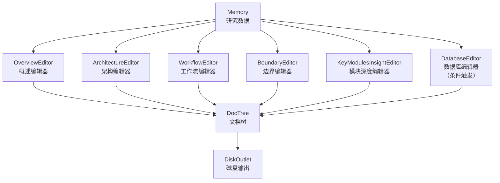

# 编排模块 (generator/compose)

## 这个模块在做什么

编排模块是 Litho 的"排版车间"——它把研究阶段 7 个 Agent 的分析成果组装成人类可读的文档。如果说研究阶段产出了大量的"素材"（系统上下文报告、领域模块报告、架构分析报告等），那么编排模块的工作就是把这些素材"缝"成一件完整的衣服——每件衣服对应一个文档章节，缝纫的方式（模板和风格）由各个编辑器 Agent 决定。

这个模块的设计哲学与研究模块类似——"专业分工"：5 个编辑器 Agent 分别负责不同的文档章节。OverviewEditor 写概述，ArchitectureEditor 写架构，WorkflowEditor 写工作流，BoundaryEditor 写边界接口，KeyModulesInsightEditor 写模块深度研究。还有一个 DatabaseEditor 在检测到 SQL 项目时负责数据库概览文档。每个编辑器都从 Memory 读取相关的研究数据，通过 LLM 生成叙述性文档内容，然后写入 DocTree。

## 核心功能点

1. **概述文档编排**（`OverviewEditor`）——从系统上下文和领域模块的研究数据中提炼项目的核心功能、用户角色、业务价值、技术栈等概述信息。它解决的是"读者第一眼应该看到什么"的问题——概述文档是读者理解项目的入口。

2. **架构文档编排**（`ArchitectureEditor`）——从架构研究和领域模块的数据中生成 C4 模型架构图和架构模式分析。它解决的是"项目的骨架是什么样的"问题——架构图是技术文档中最直观的认知工具。

3. **工作流文档编排**（`WorkflowEditor`）——从工作流研究的数据中生成执行流程图和步骤描述。它解决的是"项目是怎么运转的"问题——工作流图把抽象的"运行"变成具体的"步骤"。

4. **边界接口文档编排**（`BoundaryEditor`）——从边界分析的数据中生成 CLI 接口、配置结构、对外 API 的完整清单。它解决的是"系统的对外承诺是什么"问题——边界文档是使用者与系统之间的契约。

5. **模块深度研究编排**（`KeyModulesInsightEditor`）——从关键模块洞察的数据中为每个核心模块生成独立的深度文档。它解决的是"核心模块的内部世界是怎样的"问题——Deep-Exploration 文档集是项目最深层的技术剖析。

6. **数据库概览编排**（`DatabaseEditor`）——条件触发，从数据库分析数据中生成 ER 图和表结构文档。它解决的是"数据是如何组织的"问题。

## 关键组件

| 组件/类型 | 文件路径 | 一句话职责 |
|---------|---------|----------|
| `DocumentationComposer` | `src/generator/compose/mod.rs` | 编排阶段的总调度——决定哪些编辑器需要执行 |
| `OverviewEditor` | `src/generator/compose/agents/overview_editor.rs` | 概述编辑器——把宏观信息组装成概述文档 |
| `ArchitectureEditor` | `src/generator/compose/agents/architecture_editor.rs` | 架构编辑器——把架构数据组装成架构文档 |
| `WorkflowEditor` | `src/generator/compose/agents/workflow_editor.rs` | 工作流编辑器——把流程数据组装成工作流文档 |
| `BoundaryEditor` | `src/generator/compose/agents/boundary_editor.rs` | 边界编辑器——把接口数据组装成边界文档 |
| `KeyModulesInsightEditor` | `src/generator/compose/agents/key_modules_insight_editor.rs` | 模块深度编辑器——把模块洞察组装成Deep-Exploration文档 |
| `DatabaseEditor` | `src/generator/compose/agents/database_editor.rs` | 数据库编辑器——把数据库数据组装成数据库概览文档 |
| `DocTree` | `src/generator/outlet/mod.rs` | 文档树——所有文档内容的容器，最终写入磁盘 |

## 内部数据流

编排阶段的数据流是"读研究数据 → LLM生成文档 → 写入DocTree"的循环。每个编辑器都独立工作，只读取自己需要的研究数据。

关键步骤：
1. **DocumentationComposer.execute**：检查是否需要执行 DatabaseEditor（根据 SQL 项目检测），然后依次调用各编辑器
2. **每个编辑器的 execute**：从 Memory 读取对应的研究数据（通过 `data_config()` 定义），通过 LLM Prompt 生成叙述性文档，写入 DocTree 的对应章节
3. **KeyModulesInsightEditor 的特殊处理**：它为每个核心模块生成独立的文档文件，这些文件最终存放在 `4.Deep-Exploration/` 目录中

---

> **置信度评分**：7/10 — 编排模块的描述基于 compose/mod.rs 和各编辑器 Agent 的代码结构推断。