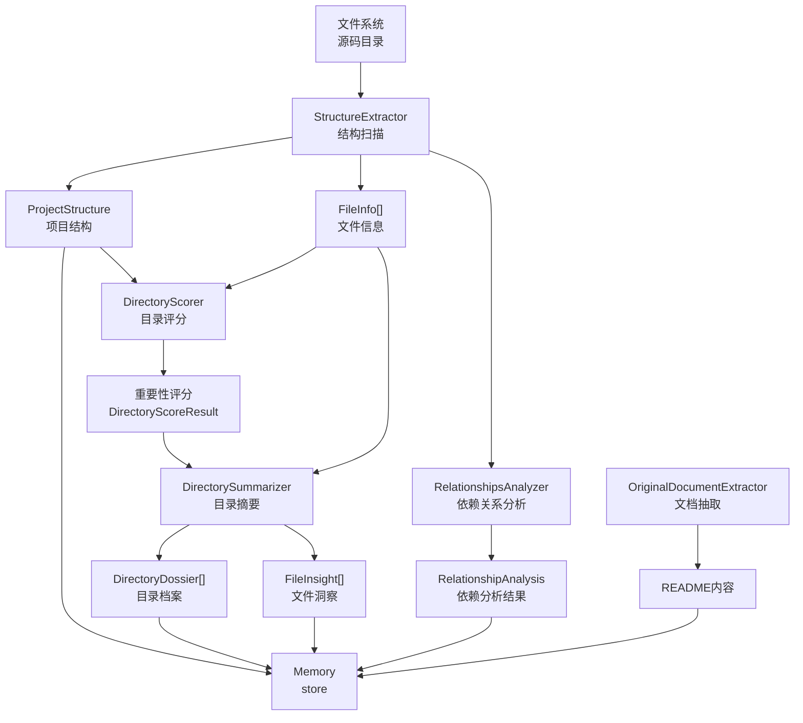

# 预处理模块 (generator/preprocess)

## 这个模块在做什么

预处理模块是 Litho 四阶段流水线的第一步，它的使命是把一堆杂乱的源码文件变成 AI 能够理解和分析的结构化信息。想象一下，你面前有一堆散落的砖块——预处理的工作就是给每块砖贴上标签（这是什么类型的砖、它属于哪一面墙、它的重要性如何），然后把它们按墙分组、按重要性排序。后续的研究和编排能否产出高质量分析，很大程度上取决于这一步的准确性——如果砖块标签贴错了，再厉害的建筑师也盖不出好房子。

这个模块不直接产出文档内容，但它产出的数据（项目结构、代码洞察、目录档案、依赖关系）是所有后续 Agent 的"原材料"。没有它，研究阶段的 Agent 就像没有食材的厨师。

## 核心功能点

1. **项目结构扫描与抽取**——由 `StructureExtractor` 负责，它遍历项目目录树，计算每个文件和目录的重要性评分，识别核心目录和边缘目录。这个功能解决的是"哪些文件值得分析、哪些可以忽略"的问题——大型项目可能有上千个文件，不可能全部交给 LLM 处理，需要智能筛选。

2. **多语言代码结构分析**——由 14 个 `LanguageProcessor` 实现（Rust/Python/Java/Go/C#/JS/TS/Kotlin/PHP/Swift/React/Vue/Svelte），每种语言独立解析其代码结构（类、函数、接口、模块）。这个功能解决的是"不同语言有不同的代码组织方式"的问题——Rust 的 trait 和 Java 的 interface 结构完全不同，不能用同一套解析逻辑。

3. **目录重要性评分**——由 `DirectoryScorer` 负责，它通过 LLM 对每个目录的重要性进行评分，区分核心目录（如 `src/`）和辅助目录（如 `assets/`）。这个功能解决的是"分析资源有限时应该优先关注哪些目录"的问题。

4. **目录摘要生成**——由 `DirectorySummarizer` 负责，它对每个核心目录内的文件进行深度分析，生成 DirectoryDossier（目录档案）和 FileInsight（文件洞察）。这是预处理阶段最耗时的环节——需要调用 LLM 对每个核心文件逐一分析其职责、接口、依赖关系。

5. **代码依赖关系分析**——由 `RelationshipsAnalyzer` 负责，它识别文件间的依赖关系（import/use 语句），绘制模块间的依赖拓扑图，标注架构分层。这个功能解决的是"模块之间是如何连接的"问题——理解依赖关系是理解架构的关键。

## 关键组件

这些组件各自承担不同的"原材料加工"职责——有的负责扫描，有的负责分析，有的负责评分，最终把所有加工结果汇入 Memory。

| 组件/类型 | 文件路径 | 一句话职责 |
|---------|---------|----------|
| `PreProcessAgent` | `src/generator/preprocess/mod.rs` | 预处理阶段的总调度——协调各子组件的执行顺序 |
| `StructureExtractor` | `src/generator/preprocess/extractors/structure_extractor.rs` | 项目结构扫描器——遍历目录树、计算重要性评分 |
| `DirectoryScorer` | `src/generator/preprocess/agents/directory_scoring.rs` | 目录评分员——通过 LLM 评估每个目录的业务重要性 |
| `DirectorySummarizer` | `src/generator/preprocess/agents/directory_summary.rs` | 目录摘要生成器——深度分析每个核心目录的文件和职责 |
| `RelationshipsAnalyzer` | `src/generator/preprocess/agents/relationships_analyze.rs` | 依赖关系分析器——追踪模块间的 import/use 依赖 |
| `LanguageProcessorManager` | `src/generator/preprocess/extractors/language_processors/mod.rs` | 语言处理器调度器——根据文件扩展名选择合适的处理器 |
| `OriginalDocumentExtractor` | `src/generator/preprocess/extractors/original_document_extractor.rs` | 原始文档抽取器——读取 README 等项目文档 |

## 内部数据流

数据在预处理模块内的流动路径非常清晰：从文件系统读取源码 → 结构扫描 → 评分筛选 → 深度分析 → 关系分析 → 写入 Memory。

关键步骤：
1. **StructureExtractor.scan_directory**：递归遍历项目目录，为每个文件和目录创建 FileInfo/DirectoryInfo，计算初始重要性评分——这是"原材料清单"的建立过程
2. **DirectoryScorer.score_directories**：把目录列表交给 LLM 评分，区分核心目录和边缘目录——这是"筛选值得深度分析的目录"
3. **DirectorySummarizer.summarize_batch**：对核心目录中的文件批量调用 LLM 生成 DirectoryDossier 和 FileInsight——这是最耗时的步骤，因为要逐一分析每个核心文件
4. **RelationshipsAnalyzer**：扫描代码中的 import/use 语句，构建依赖拓扑图——这是"绘制模块间连接关系"

## 扩展点

预处理模块最重要的扩展点是 **LanguageProcessor trait**。要支持一种新的编程语言，只需要实现这个 trait 的 `supported_extensions()` 和 `analyze_structure()` 方法。当前的 14 个语言处理器就是各自独立实现的——它们共享同一个 trait 接口，但内部解析逻辑完全不同。例如 Rust 处理器解析 `pub trait` 和 `impl`，Python 处理器解析 `class` 和 `def`，Java 处理器解析 `interface` 和 `extends`。

另一个扩展点是 **should_ignore_directory/should_ignore_file**。StructureExtractor 内置了一套忽略规则（排除 test 目录、隐藏文件等），但用户可以通过 Config 的 `excluded_dirs`、`excluded_files`、`excluded_extensions` 参数自定义忽略规则——这在分析特定类型的项目时非常灵活。

## 性能考量

预处理是整个流水线中最耗时的阶段之一（主要耗时在 LLM 调用上）。几个关键的性能设计：

- **批量处理（Batch）**：DirectorySummarizer 使用 `split_into_batches` 把文件分组，每组不超过 `MAX_BATCH_SIZE` 个文件。这避免了单次 LLM 调用的输入过长导致的超时或截断。
- **重要性筛选**：不是所有文件都会交给 LLM 分析——低重要性的文件（如 test 文件、配置文件）被快速跳过，只分析核心源码文件。
- **缓存利用**：所有 LLM 调用都经过 CacheManager，相同目录的摘要分析在增量更新时可以直接复用缓存。
- **并发策略**：目录摘要采用批量并发调用，受 `max_parallels` 配置限制并发度。

---

> **置信度评分**：7/10 — 模块功能描述基于代码结构的直接分析，准确性较高。语言处理器数量的精确统计基于目录扫描。